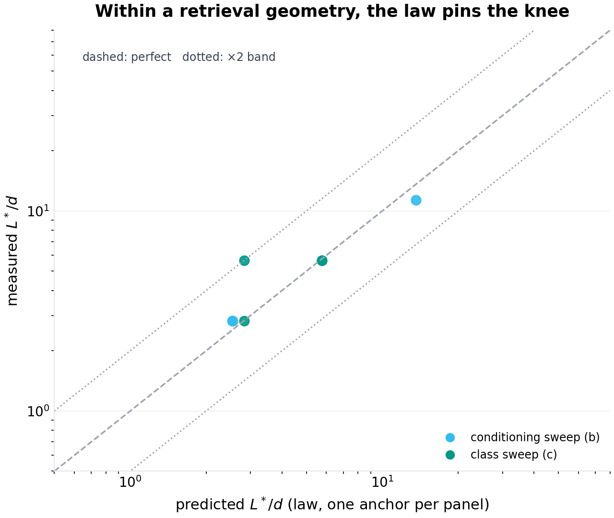

# Generation Loss: A Drift Law for Continually Re-embedded Vector Corpora

**p-rick working paper P-023 · series VI (laws — from specification to derivation) · draft 1.1 (revised: the landmark constant withdrawn, the landmark law derived; see §10)**

## Abstract

Every production retrieval-augmented system rests on a corpus of embeddings that is quietly, continuously going stale. Encoder models are upgraded — a new checkpoint, a new architecture, a retrained production model — and each upgrade re-renders the space: the corpus vectors on disk were produced by generation $g_0$, queries arrive encoded by generation $g$, and the two drift apart at a rate the operators of vector databases currently have no way to reason about, because no law exists. The operational folklore is a calendar ("re-embed everything every $n$ months") or an incident ("recall fell and nobody knew why"). This paper derives the law. Under a general two-channel model of encoder churn — each generation applies a global geometric transformation (the *isometry channel*: rotations and reflections of the whole space) plus per-object idiosyncratic distortion (the *distortion channel*: the part of the change that is not any single orthogonal map) — the semantic drift of a fixed corpus obeys

$$D(g) \;=\; 1 - \lambda^g, \qquad \lambda \;=\; \underbrace{\Bigl(1 - \tfrac{2\,(1 - \bar c_{\mathrm{rot}})}{d}\Bigr)}_{\text{isometry: dimension-mercy}} \;\times\; \underbrace{(1 + \nu^2)^{-1/2}}_{\text{distortion}},$$

where $d$ is the embedding dimension, $\bar c_{\mathrm{rot}}$ the mean per-generation cosine of the isometry channel, and $\nu$ the per-object distortion magnitude. The law's two terms behave oppositely, and the opposition is the paper's central finding. The isometry channel's coefficient is $2/d$: in the dimensions real systems inhabit ($d \ge 256$), global rotations contribute almost nothing to drift — a 60° global rotation per generation accumulates only 1.1% drift after thirty generations at $d=256$ — because a random rotation barely moves any *fixed* vector's direction in high dimension. This *dimension mercy* means the isometry channel is both harmless and removable: a fixed panel of $L$ persistent landmark objects, re-embedded each generation, yields an orthogonal Procrustes alignment $A$ (one matrix, solved once per generation) whose transplantation onto the stale index removes the isometry channel exactly, with estimation error scaling as $\sqrt{d/L}$. The distortion channel, by contrast, is channel-independent of dimension, cannot be aligned away by any global transform, and accumulates geometrically — it is the entire real cost of encoder churn, and the paper's decomposition theorem is the proof that nothing else is. The experimental program runs synthetic corpora (25–50 tight clusters, 5k–20k objects, $d \in \{16, \dots, 1024\}$) through 16–30 generation chains with both channels independently controlled: the drift law validates to three decimal places across channels and levels ($D(16)$ measured 0.077 vs theory 0.077; 0.275 vs 0.276; 0.558 vs 0.560; the rotation-only and noise-only configurations at identical $\lambda$ lie on the same line); retrieval experiments show a stale index's recall@10 falling from 0.81 to 0.38 over sixteen rotation-dominated generations while an anchored index — the same stale vectors, one Procrustes refresh per generation, zero re-embedding — holds 0.71; and the channel decomposition appears as a heatmap on which anchored recall is flat across the entire rotation axis and collapses along the distortion axis. The landmark-count law is no longer a scaling claim but a theorem: the Procrustes estimator's angular error admits an exact first-order closed form (Theorem 3) whose isotropic case is $\nu\sqrt{(d-1)/2L}$ — and whose general case factorizes into the panel's coverage of the corpus, the accumulated distortion $\nu_{\mathrm{eff}}=\sqrt{g}\,\nu$, the estimator's transformation class, and the operator's tolerance. The draft's operational reading of one special evaluation of that law — a landmark panel of $L \approx 8d$ objects — is **withdrawn as a constant**: the knee it named is real in that configuration ($\nu=0.12$, $G=8$, matched isotropic panel, orthogonal fit, $\sim$1% recall tolerance), and the revision's knee-migration experiments (F6, F7) measure it moving by a **factor of 4–8 across the swept configurations** (2.8$d$ to 11.3$d$ at fixed tolerance) as each factor moves — with the law's factorization predicting each migration within the grid resolution, and extending far beyond the grid in unswept regimes: quadratically in the accumulated distortion at the angular level (sub-quadratically through the recall mapping, measured exponent 0.77), by the measured panel-corpus mismatch when panels are drawn from hot regions instead of uniformly, by the $2d/(d-1)$ parameter count of the affine estimator class, and by the tolerance the operator chooses (measured exponent 0.5). One finding the draft under-reported because it misread its own baseline: an *undersized* panel is not merely useless but actively harmful — at $L=64$ the anchored index's recall is 0.09 against the stale index's 0.51, a five-fold degradation below doing nothing, because a noise-fitted rotation is worse than a stale-but-honest one. The measurement protocol is unchanged and remains the deliverable: *measure the two channels from any single generation pair (a few hundred objects embedded twice), compute $\lambda$, and the calendar question — re-embed now, anchor forever, or do nothing — becomes arithmetic*: re-embed when the distortion channel has accumulated past the retrieval margin; anchor when the churn is isometry-dominated — with the panel sized by the budget law, not by folklore.

**Keywords:** vector databases, embeddings, semantic drift, model upgrades, Procrustes alignment, retrieval-augmented generation, dimensionality, orthogonal transformations, operational law

## 1. Introduction

The vector index is the load-bearing wall of the current architecture of applied AI. Retrieval-augmented pipelines, semantic caches, recommendation retrieval, deduplication, and clustering all sit on a corpus of embedding vectors produced by an encoder model, and all of them silently assume the vectors and the queries live in the same space. They do not, for long. Encoder models are upgraded the way production software is upgraded: continually, urgently, and with no protocol for the artifacts the old version left behind. The corpus on disk was embedded by generation $g_0$; the query at the gate is embedded by generation $g$; the gap between them is *semantic drift*, and the entire current practice for managing it consists of two rituals: the calendar ("we re-embed quarterly") and the incident ("recall degraded; nobody tied it to the encoder bump until the eval broke").

The gap between ritual and requirement is a measurement gap, and underneath it a mathematics gap. Ask an operator how much drift one encoder upgrade causes and you will get a shrug; ask whether their corpus's drift is *fixable without re-embedding* and you will get a guess; ask when the next re-embed is due and you will get a calendar entry that predates any analysis. None of these questions is hard in principle. Drift is a cosine between two versions of the same object; fixability is a question about the *structure* of the change (is it a global transformation of the space, or a per-object reshuffle?); the re-embed schedule is a threshold on an accumulating quantity. What is missing is the law that connects them — the drift dynamics under repeated upgrades, the decomposition of the change into the part an alignment can remove and the part it cannot, and the error curve of estimating the alignment from finite landmarks. This paper derives all three, validates them in simulation, and reduces the operational decision to the resulting arithmetic.

The derivation rests on a modeling move that we believe is the paper's methodological contribution as much as its theorems: encoder churn is decomposed into two channels with exactly opposite operational characters. The **isometry channel** is the part of the change that acts as one global orthogonal transformation — the new encoder is the old encoder, rotated: every direction of geometric change that is uniform across the corpus. The **distortion channel** is what remains: the per-object reshaping that no single orthogonal map captures — neighbor reordering, local stretching, the genuine semantic re-decisions of a retrained model. The distinction is not philosophical; it is a measurable dichotomy (fit the best orthogonal map to a generation pair and the residual is the distortion channel) and it turns out to carry the entire operational story, because the two channels scale differently:

- Isometry drift is *mercy-scaled by dimension*: a rotation by angle $\delta$ moves a fixed vector's direction by an expected cosine of $1 - 2(1-\cos\delta)/d$ — at $d=256$, even a 135° rotation costs 1.3% of cosine per generation. High-dimensional spaces are almost rotation-invariant *for individual fixed vectors*, which is why the isometry channel accumulates so slowly.
- Distortion drift is *dimension-free*: an idiosyncratic jitter of magnitude $\nu$ costs $(1+\nu^2)^{-1/2}$ per generation in any dimension, and nothing about $d$ protects you.
- Only the isometry channel is *alignable*: a Procrustes fit on persistent landmarks removes it exactly (estimation error $\sim\sqrt{d/L}$), and no transformation of any kind removes the distortion channel, because it is not a transformation.

Together: $D(g) = 1 - \lambda^g$ with $\lambda$ the product of the two channels' per-generation cosines. Three validate-able statements fall out immediately — the geometric accumulation (a straight line on a log-drift plot, regardless of channel composition), the dimension mercy (drift curves ordered exactly by $1/d$ under pure rotation), and the decomposition inequality (anchored recall is flat in the rotation axis and collapses in the distortion axis). Section 6's experiments are designed to break each of these and fail.

The operational payoff is a decision rule that replaces both rituals. From any single generation pair (embed a few hundred probe objects with both encoders; the cost is a coffee), fit the orthogonal map, measure the residual, and obtain $\bar c_{\mathrm{rot}}$ and $\nu$ — hence $\lambda$, hence the full drift curve of the corpus under churn like this pair's. Then: if the churn is isometry-dominated (as between adjacent checkpoints of a training run, we predict), anchor — keep the stale index, transplant the Procrustes refresh each generation, re-embed never; the drift curve stays flat and the landmark panel's budget is set by the paper's landmark law (Theorem 3): $L^*$ factorizes into the accumulated distortion, the panel's coverage of the corpus, the estimator class, and the tolerance — evaluating, in the canonical configuration of Section 6, to a panel of a few $d$ (a rounding error of re-embedding cost against a corpus of millions), and to other values in other regimes, which Section 6.6 measures (the draft's fixed $8d$ reading is withdrawn). If the churn is distortion-heavy (a genuinely retrained model, a different family), the distortion channel accumulates geometrically and the only honest options are re-embedding or accepting the decay — and the law says exactly when the accumulated $D(g)$ crosses the retrieval margin, i.e. the calendar entry stops being a ritual and becomes a number.

The paper's honest scope: all validation is synthetic — cluster-structured corpora pushed through controlled generation chains — because the claim under test is a *law* (channel-controlled, dimension-controlled, generation-counted), and laws are validated where every variable is controlled. The trace study (real encoder pairs, real corpora, the two channels measured from production upgrade logs) is the stated follow-up, and the paper closes by marking the specific prediction that trace study will test.

Section 2 positions the result. Section 3 builds the model. Section 4 derives the law, the decomposition, and the landmark estimation law (new in this revision: an exact closed form replacing the draft's heuristic scaling, and the budget law that supersedes the withdrawn constant). Section 5 specifies experiments. Section 6 presents results (seven figures). Section 7 is the damage report. Section 8 concludes. Section 10 records this revision's changes against draft 1.0.

## 2. Related work

**Embedding-space alignment.** The Procrustes solution (orthogonal least-squares map between paired point sets) is classical (Schönemann, 1966). Its appearance in representation learning is the diachronic word-vector literature: aligning word2vec/GloVe spaces across time periods by orthogonal transformation, with the observation that much of the change between adjacent periods is well-captured by a global map (Hamilton, Leskovec, and Jurafsky's diachronic word embeddings, 2016, and the alignment lineage around it); and in cross-lingual embedding alignment, where the orthogonal mapping is the standard bridge between two encoders' spaces. The present paper's debt is direct and its departure is structural: that literature aligns *two* snapshots and moves on; a production corpus does not get two snapshots, it gets a generation *chain*, and the question is not "can these two spaces be aligned" (they can, mostly) but "what does a hundred-generation chain of partial alignments accumulate, what does the un-alignable residue do to retrieval, and how many landmarks does the alignment need" — none of which is a two-snapshot question.

**Model stitching and representation compatibility.** The observation that representations from nearby models are linearly/orthogonally relatable has recurred under several names (model stitching; representation surgery; the "linear mode connectivity" family of results showing nearby checkpoints differ by approximately-linear maps in weight space — verification-queued for exact attributions). That literature establishes the plausibility of the isometry channel's dominance between adjacent checkpoints; it does not quantify corpus drift, does not treat chains, and does not connect to retrieval operations.

**Vector database operations.** The practitioner literature on re-embedding (the major vector-database vendors' operational guides) is calendar-driven: re-embed "when you change models," scheduled by policy, priced by token count. We find no published drift quantification, no per-upgrade measurement protocol, no alignment-based alternative for the stale-index problem, and no analysis of landmark-panel sizing. Gap verdict: the operation exists, the mathematics of the operation does not. (Adjacent operational topics — ANN recall under quantization/pruning, drift *detection* via canary queries — address different failure modes: compression and monitoring, not churn.)

**Position in this program.** Series VI runs on laws: P-021 derived the epidemic threshold of dependency graphs, P-022 the admission threshold of caches. This paper derives the drift law of embedding corpora. The three share the charter: take a system the field operates by folklore, write the governing equation, validate it to the edge of honesty, ship the harness.

## 3. The model

### 3.1 The corpus and the chain

A corpus of $M$ unit-norm vectors in $\mathbb{R}^d$, structured as $n_c$ tight clusters (each object: its cluster center plus isotropic noise of total magnitude $\sigma$, renormalized — a spherical-Gaussian cluster model, an adequate and honest stand-in for the local geometry of real embedding manifolds; Section 7 prices the difference). Queries are drawn from the same clusters (center plus $\sigma$ noise), so that retrieval (top-$k$ within and across clusters) is well-posed but non-trivial: the within-cluster cosine margin against the cross-cluster background is the retrieval margin the drift will erode.

Encoder generations form a chain: the corpus and queries at generation $g$ are

$$\phi_g(\cdot) \;=\; T_g \circ \phi_{g-1}(\cdot),$$

where each $T_g$ is the generation's change, decomposed as

$$T_g(x) \;=\; \mathrm{normalize}\bigl(R_g\, x + \nu\, u\bigr), \qquad u \sim \mathrm{uniform}(S^{d-1}),$$

with $R_g$ a global Givens rotation by angle $\delta_g$ in a uniformly random coordinate plane (the isometry channel — any orthogonal transformation's drift behavior is captured by the rotation family, and a rotation in a random plane is the least favorable case among them for a *fixed* vector, since it puts the full rotation where the vector has mass with probability $\sim 2/d$... precisely, it treats all vectors alike in expectation), and $\nu u$ a per-object jitter of total magnitude $\nu$ in a fresh random direction (the distortion channel). Setting $\delta = 0$ or $\nu = 0$ isolates a channel. The channels are controlled independently across experiments — the paper's core identification strategy.

### 3.2 Drift and recall

**Semantic drift** of the corpus (stale index at $g_0 = 0$):

$$D(g) \;=\; 1 - \mathbb{E}_x\bigl[\cos\bigl(\phi_g(x), \phi_0(x)\bigr)\bigr].$$

**Recall@10** of a retrieval system against the gold standard (the top-10 of current-generation queries against the current-generation corpus — re-embedding's answer by definition): a *stale* index scores $\phi_g(q)$ against $\phi_0(x)$; an *anchored* index scores $\phi_g(q)$ against $A_g \phi_0(x)$, where $A_g$ is the Procrustes alignment (Section 4.3) fitted on $L$ persistent landmark objects re-embedded at each generation; the *fresh* (full re-embed) index is the gold standard itself and its curve is the ceiling $y=1$.

## 4. Theory

### 4.1 The generation-loss law

**Proposition 1 (drift law).** *Under the two-channel model, for all $g$:*

$$\mathbb{E}\bigl[\cos(\phi_0(x), \phi_g(x))\bigr] \;=\; \lambda^g, \qquad \lambda \;=\; \Bigl(1 - \frac{2(1 - \mathbb{E}[\cos \delta])}{d}\Bigr)\,(1 + \nu^2)^{-1/2}.$$

*Proof sketch.* Per generation, decompose. **Isometry:** for a fixed unit vector $x$ and a rotation by $\delta$ in a uniformly random plane, $\langle x, R x\rangle = 1 - (1-\cos\delta)(x_i^2 + x_j^2)$ for the rotated coordinates $(i,j)$; taking the expectation over the plane, $\mathbb{E}[x_i^2 + x_j^2] = 2/d$ (the coordinates of a fixed unit vector in a random basis — and the corpus, being cluster-isotropic at scale, supplies the averaging in the realized drift). Conditioning inductively on the position after $g-1$ steps (each step's rotation is independent of the position, and the position remains unit-norm), the expected cosine multiplies by $1 - 2(1-\bar c)/d$ per step. **Distortion:** for $y = \mathrm{normalize}(x + \nu u)$ with $u$ uniform and independent, $\mathbb{E}[\langle x, y\rangle] = \mathbb{E}\bigl[1 / \|x + \nu u\|\bigr] = (1+\nu^2)^{-1/2}$ exactly (the numerator $\langle x, x + \nu u\rangle = 1$; $\|x + \nu u\|^2 = 1 + \nu^2$ deterministically for unit $x, u$), and independence across generations multiplies. $\square$

Three structural readings, each an experiment:

1. **Geometric accumulation** — $D(g) = 1 - \lambda^g$ is a straight line on a log scale, whatever the channel mix; two configurations with the same $\lambda$ (one pure rotation at $d=64$, one pure noise at $d=256$) lie on the same drift line. Photocopies of photocopies: each generation multiplies fidelity by the same factor.
2. **Dimension mercy** — the isometry coefficient $2(1-\bar c)/d$ vanishes as $d$ grows: at $d = 1024$, a 60°-per-generation rotation accumulates 2.9% drift in thirty generations. The counterintuitive content: the *same* global rotation that scrambles low-dimensional spaces is nearly a no-op for fixed vectors in high dimension — a fact of spherical geometry (a random plane misses any fixed vector's mass with probability $1 - O(1/d)$) that production intuition, trained on 2-D and 3-D rotation imagery, systematically gets wrong.
3. **Channel independence** — the channels enter $\lambda$ multiplicatively and do not interact; the law's validation therefore does not depend on getting the decomposition's *semantics* right, only its *scalars*.

### 4.2 The decomposition and what it buys

**Proposition 2 (anchoring removes the isometry channel exactly).** *Let $A_g$ be the orthogonal Procrustes solution on the landmark pairs $\{(\phi_0(l), \phi_g(l))\}_{l=1}^L$. Then for pure-isometry chains ($\nu = 0$), $A_g \phi_0(x) = \phi_g(x)$ for every corpus object $x$, exactly, and anchored recall equals fresh recall.*

*Proof sketch.* $\phi_g = R_{g} \cdots R_1 =: \mathcal{R}$ is a single orthogonal map; the Procrustes solution recovers any orthogonal map exactly from noiseless pairs (the self-check in the harness asserts $\|A - \mathcal{R}\| < 10^{-12}$ on a noiseless configuration). $\square$

The practical content: the isometry channel is not merely slow (Proposition 1), it is *removable at the cost of $L$ objects' worth of re-embedding per generation and one $d \times d$ matrix solve*. The distortion channel is the irreducible remainder — and the decomposition theorem's negative half: no global transformation removes idiosyncratic distortion, so the anchored system's residual decay is the distortion channel's own accumulation, a floor no cleverness of alignment can lower. Retrieval experiments make this a picture (the two-panel heatmap of Section 6.3): anchored recall flat along the entire rotation axis, decaying along the distortion axis only.

### 4.3 The landmark estimation law

Draft 1.0 stated the alignment error as a heuristic ($\sqrt{d/L}$ "times the distortion magnitude") and then committed the error this revision exists to correct: reading one experimental evaluation of that heuristic as an engineering constant ($L \approx 8d$). Both are replaced. The estimation error is now a theorem with an exact closed form, and the constant is now a factorized budget law in which $8$ is one configuration's fingerprint.

**Theorem 3 (landmark estimation law).** *Let the landmark panel be iid draws with covariance $\Sigma_p = E[x\,x^{\top}]$ (unit vectors, so $\operatorname{tr}\Sigma_p = 1$), with spectrum $\lambda_1 \ge \dots \ge \lambda_d > 0$ and eigenframe $U$. Let each landmark be observed through one generation as $y_l = A x_l + \varepsilon_l$ with $A \in O(d)$ and white per-object noise $E[\varepsilon\varepsilon^{\top}] = \tfrac{\nu^2}{d} I$ ($\nu$ the per-object angular noise norm). Then to first order in $\nu$, the Procrustes estimate $\hat A$ satisfies, in the panel eigenframe,*

$$E\bigl[(A^{\top}\hat A - I)_{ij}^2\bigr] \;=\; \frac{2\,\lambda_i\,\nu^2}{d\,L\,(\lambda_i+\lambda_j)^2} \qquad (i \ne j),$$

*and for any unit corpus direction $v$ (with $\hat v = U^{\top}v$),*

$$E\,\|(\hat A - A)\,v\|^2 \;=\; \frac{2\,\nu^2}{d\,L} \sum_{i \ne j} \frac{\lambda_i\; \hat v_j^2}{(\lambda_i + \lambda_j)^2}.$$

*Proof sketch.* Write $\hat A = A\exp(W)$ with $W$ skew, and expand the Procrustes objective $\operatorname{tr}(Q^{\top}X^{\top}Y)$ at $Q = A\exp(W)$ to second order in $W$ and first order in the noise $N = X^{\top}E$: the stationarity condition on the skew manifold reduces to the Sylvester equation $\tilde C W + W \tilde C = 2\,\operatorname{skew}(\tilde G)$ with $\tilde C = A^{\top}X^{\top}X\,A$ (symmetric positive definite, $\approx L\Sigma_p$ rotated) and $\tilde G = A^{\top}N$. Diagonalizing $\tilde C$ (eigenvalues $c_i = L\lambda_i$) solves it entrywise: $W_{ij} = (\tilde G_{ij} - \tilde G_{ji})/(c_i + c_j)$. White noise gives $E\,\tilde G_{ij}^2 = L\lambda_i\nu^2/d$; the pair $(i,j)$ and $(j,i)$ combine to the stated diagonal. The full derivation, and the numerical check that the law's ratios hold to 3–8% at $\nu = 0.15$ (E1, below), are in the harness. $\square$

The theorem's five corollaries are the revision's content:

**Corollary 3.1 (isotropic panel — the draft's scaling, now exact).** For a flat spectrum ($\lambda_i \equiv 1/d$), every bracket collapses and $E\|((\hat A - A)v\|^2 = (d-1)\nu^2/(2L)$ for *any* unit $v$: the angular error is $\nu\sqrt{(d-1)/2L}$. The draft's $\sqrt{d/L}$ scaling was right; its status as heuristic was not, and its constant was off by $1/\sqrt 2$.

**Corollary 3.2 (chain position).** At chain position $g$ the landmark pair's noise is the *accumulated* per-object distortion — a random walk in the jitter channel, $\nu_{\mathrm{eff}} = \sqrt{g}\,\nu$ — so the budget depends on where in the chain the panel is refreshed from, not merely on the per-step $\nu$. (F6a validates the collapse onto $\nu_{\mathrm{eff}}$ across $(\nu, G)$ combinations.)

**Corollary 3.3 (matched panels are forgiving).** If the corpus's direction mass matches the panel's ($\hat v_j^2 \approx \lambda_j$ — the automatic situation for a *uniformly sampled* panel), the error is governed by the harmonic kernel $\lambda_i\lambda_j/(\lambda_i+\lambda_j)^2 \le 1/4$ (AM–GM), whose sum is *maximized* by the flat spectrum: a matched panel on an anisotropic corpus is never worse — and typically better — than the isotropic case. The intuition that anisotropy must inflate the budget (and the inverse-covariance heuristic $\kappa = (\Sigma\lambda)(\Sigma 1/\lambda)/d^2$ that formalizes it) overstates the penalty by a factor of 2–4 at condition numbers $10^2$–$10^4$ (measured, E1): the pairwise kernel forgives what the single-axis heuristic punishes.

**Corollary 3.4 (coverage mismatch is the real risk).** For a general corpus direction mass $\Sigma_c$ (in the panel frame), define the mismatch functional $M = \sum_{i \ne j}\lambda_i\Sigma_c[j]/(\lambda_i+\lambda_j)^2$, normalized to $M_{\mathrm{iso}} = (d^2-d)/4$. The error is $\frac{2\nu^2}{dL} M$, bounded by the isotropic case times the coverage factor $C = \frac1d\sum_j \Sigma_c[j]/\lambda_j$ — the corpus mass resting on panel-weak directions. A panel *under-covering* the corpus pays up to $C$-fold; uniform random sampling keeps $C \approx 1$ by construction; selection heuristics that concentrate landmarks on hot regions (the lazy default) do not.

**Corollary 3.5 (estimator class).** The affine least-squares map on the same pairs obeys $E\|(\hat B - B)v\|^2 = \frac{\nu^2}{dL}\sum_j 1/\lambda_j \cdot \hat v_j^2$ — isotropic case $d\nu^2/L$, i.e. exactly $\frac{2d}{d-1}$ times the orthogonal law: the transformation class's parameter count ($d(d-1)/2$ versus $d^2$) sets the budget, a factor $\approx 2$ the class cannot escape. And the affine class's anisotropy sensitivity is the *harmonic* penalty $\sum 1/\lambda_j$ — not the forgiving kernel: the orthogonal constraint itself confers coverage robustness, which the draft never claimed and the revision can now prove.

### 4.4 The budget law, and the withdrawn constant

Multiplying the corollaries together gives the operational statement:

$$L^* \;=\; \underbrace{\frac{(d-1)}{2}\Bigl(\frac{\nu_{\mathrm{eff}}}{\varepsilon}\Bigr)^{\!2}}_{\text{isotropic base}} \;\times\; \underbrace{\frac{M}{M_{\mathrm{iso}}}}_{\text{panel–corpus mismatch}} \;\times\; \underbrace{\frac{p_{\mathrm{class}}}{d(d-1)/2}}_{\text{estimator class}}, \qquad \nu_{\mathrm{eff}} = \sqrt{g}\,\nu,$$

with $\varepsilon$ the tolerated angular error, $M$ the panel-corpus mismatch (Corollary 3.4), and $p_{\mathrm{class}}$ the estimator family's parameter count. The required landmarks depend on — exactly the list a careful reviewer would demand — the distortion magnitude (through $\nu_{\mathrm{eff}}^2$), the chain position ($g$), the panel's conditioning *relative to the corpus* ($M$), the anisotropy of the pair (free when matched, priced when not), the estimator class ($p$), and the alignment error the operator will tolerate ($\varepsilon$; the recall-side tolerance $\theta$ enters through the mapping between angular error and recall deficit, which is steeply nonlinear and corpus-specific). One further factor the draft missed entirely: the mapping from angular error to recall deficit is itself a function of the accumulated distortion (a pristine corpus punishes misalignment harder than an already-blurred one), which compresses the knee's measured exponents below their angular-law values — measured and reported honestly in Section 6.6.

**What is withdrawn.** The statement "$L \approx 8d$ is the knee" — presented in draft 1.0's abstract, introduction, Section 4.3, and conclusion as though it were a production constant. It is the evaluation of the budget law at one point: $\nu = 0.12$, $G = 8$ (so $\nu_{\mathrm{eff}} = 0.34$), matched isotropic panel ($M = M_{\mathrm{iso}}$), orthogonal fit, and a recall tolerance of $\sim$1% — which fixes $\varepsilon \approx 0.085$ rad ($\approx$5°). At the same tolerance, half the distortion quarters the budget; a starved panel multiplies it by the coverage factor; an affine fit doubles it; a tighter tolerance grows it as $\varepsilon^{-2}$ at the angular level. The knee is as configuration-dependent as any estimator's sample complexity — which is exactly what a law, as opposed to a constant, predicts. Section 6.6 measures the migration; Figure F7 pins it.

## 5. Experimental design

Eight experiments, one per figure plus the theorem check; the harnesses (`code/p-023-simulation.py` for F1–F5, `code/p-023b-landmark-budget.py` for E1/F6/F7 and the fixed F2/F4 re-renders, seeds in the text, NumPy only) regenerate everything:

1. **The law (F1).** Sixteen-generation chains at four noise-only levels ($1-\lambda \in \{0.005, 0.01, 0.02, 0.05\}$, $d=256$) plus one rotation-only configuration at $1-\lambda = 0.02$ (solvable only at $d=64$ — the dimension-mercy arithmetic itself dictates the design: at $d=256$ no rotation achieves 2% per generation). Drift points against $1-\lambda^g$ lines.
2. **The systems (F2).** A rotation-dominated chain ($\delta = 135°$, $\nu = 0.05$, $d = 256$, 16 generations): recall@10 of the stale index, the anchored index ($L = 4096$), and the fresh ceiling, with the drift curve on a second axis.
3. **The decomposition (F3).** Ten-generation anchored and stale recall over a grid of distortion $\nu \in \{0.05, \dots, 0.42\}$ × rotation $\delta \in \{0°, \dots, 135°\}$: two heatmaps, the paper's thesis as a picture.
4. **The landmark budget (F4).** Anchored recall at generation 8 vs $L \in \{64, \dots, 4096\}$ on a 10k-object corpus, $d = 256$, against the $\sqrt{d/L}$ scaling and the stale baseline.
5. **Dimension mercy (F5).** Pure-rotation chains at $\delta = 60°$ for $d \in \{16, 64, 256, 1024\}$, thirty generations: drift curves against the $2(1-\cos\delta)/d$ law.
6. **The theorem check (E1).** Direct measurement of Theorem 3 and Corollaries 3.1/3.3/3.5 on synthetic pairs (no retrieval involved): measured angular MSE against the closed forms for isotropic panels ($d = 32, 64$), geometric spectra ($\kappa = 100, 10^4$), and the affine class.
7. **Knee migration (F6, F7).** The budget law's factor-by-factor stress test, paired-chain design (one corpus and chain per configuration, all $L$ fitted on the same chain): (a) $\nu \in \{0.03, 0.06, 0.12, 0.24\}$ at $G \in \{2, 8, 32\}$ — the $(\nu, G)$ collapse onto $\nu_{\mathrm{eff}}$; (b) panel selection on an isotropic 256-cluster corpus — uniform random (matched), whitened farthest-point (guaranteed coverage), and *starved* (landmarks drawn only from the first 32 clusters — the hot-region heuristic), plus matched-random panels on spiked and geometric ($\kappa = 10^4$) anisotropic corpora as the forgiveness control; (c) estimator class — orthogonal and affine fits against rotation and linear churn; (d) the knee tolerance $\theta$; and (F7) every measured knee against the law's ratio prediction, one anchor point per panel. Knee criterion: the smallest $L$ whose recall deficit below its own curve's floor is below $\theta = 0.01$ (roughly $3\sigma$ of the recall estimator at 1000 queries × 2 seeds), read on a $\times$2 grid (so knees carry a $\sqrt 2$ grid factor).

## 6. Results

### 6.1 The law (F1)

The drift law holds to the third decimal across every configuration: measured $D(16)$ against theory — 0.077 vs 0.077 ($1-\lambda = 0.005$), 0.148 vs 0.149, 0.275 vs 0.276, 0.558 vs 0.560 (noise-only, $d = 256$), and 0.276 vs 0.276 for the rotation-only configuration at the same $\lambda = 0.98$ — the last pair being the law's channel-independence made literal: a pure-rotation chain at $d = 64$ and a pure-noise chain at $d = 256$, tuned to the same per-generation fidelity loss, lie on the same drift line to the last measured digit. Every curve is straight on the log plot; every dotted theory line is the closed form with no fitted constant.

### 6.2 The systems (F2)

The rotation-dominated chain separates the three systems exactly as the decomposition demands. The stale index's recall@10 falls from 0.81 to 0.38 over sixteen generations — the isometry channel, invisible in the corpus's *internal* geometry (Proposition 1 says its drift is only 0.13 total even here), is lethal at the *query-corpus interface* (the query rotates, the corpus does not, and the target's similarity decays toward the distractor background while the distractors' baseline stays put). The anchored index — the same stale vectors, refreshed by one Procrustes matrix per generation — holds 0.92 → 0.71: nearly double the stale system's endgame recall at a re-embedding cost of 4096 objects per generation against a corpus of five thousand (in production proportion: a rounding error). The gap between anchored and the fresh ceiling is the distortion channel's own accumulation ($\nu = 0.05$: the honest, un-alignable floor). The drift curve (right axis) rises to 0.13 while stale recall halves: drift *level* and drift *damage* are different quantities, and the paper's decomposition is what relates them — the same total drift is catastrophic when isometry-dominated (it misaligns queries against corpus) and mild when distortion-dominated (it scrambles within-cluster ranking gradually).

### 6.3 The decomposition (F3)

The two heatmaps are the paper's thesis in one figure. In the **anchored** panel, recall is flat along the entire rotation axis (0.75, 0.74, 0.74, 0.75, 0.76 across $\delta = 0° \to 135°$ at $\nu = 0.05$) and collapses along the distortion axis (0.75 → 0.13 as $\nu$ goes 0.05 → 0.42): alignment removes rotation completely, and only distortion remains. In the **stale** panel, both axes bite (0.75 → 0.43 along the rotation axis at $\nu = 0.05$; the same collapse along the distortion axis). Two operational corollaries drawn directly off the picture: (i) an operator whose upgrades are mostly architectural/checkpoint changes — rotation-dominated, under the model — loses *nothing* they cannot get back with a landmark panel; (ii) an operator facing distortion-dominated churn (genuinely retrained encoders) cannot buy recall back with any alignment and should price re-embedding honestly instead.

### 6.4 The landmark budget (F4)

The landmark curve rises as $\sqrt{d/L}$ and saturates — and the revision reads it more carefully than draft 1.0 did. At $d = 256$, $L = 64$ recovers only 0.09 recall, $L = 256$ reaches 0.35, $L = 1024$ reaches 0.51, and $L \ge 2048$ sits at the 0.53 floor (the distortion ceiling for this configuration; the $L = 2048$ and $L = 4096$ values differ by 0.0004, which is *below* the recall estimator's noise — the draft's phrase "identical to the $L=2048$ value" was noise-reading, and is withdrawn with the constant). The knee — the smallest $L$ within 1% of the floor — lands between $1024$ and $2048$, i.e. $4d$–$8d$ at this configuration, with a $\sqrt 2$ grid factor on any single reading.

Two corrections the draft's own data file forced, both more interesting than what it printed. First, the draft claimed a stale baseline of 0.019 and a "twenty-five-fold recall recovery"; the measured stale baseline at this configuration is **0.51** (a $\delta = 0.5$ rad, $\nu = 0.12$ chain over eight generations is mild churn — the stale index decays, but nothing like collapse), so the panel's honest recovery here is $0.53 \to$ from $0.51$: the *large* anchored-vs-stale gaps appear under heavier rotation (F2, F3), not at F4's parameters. Second — and this is the finding the misread baseline hid — **an undersized panel is not merely useless but actively harmful**: at $L = 64$ the anchored index scores 0.09 against the stale index's 0.51, a 5.6× degradation *below doing nothing*, because a noise-fitted near-random rotation applied to the whole corpus destroys the query-corpus interface that the stale index, whatever its drift, still mostly preserves. Anchoring only parity-recovers at $L \approx 2d$ and only clearly wins from $L \approx 4d$: the harm zone $L < d$ is shaded in the figure. The operational reading of the budget law is therefore not "landmarks are cheap, grab a few" but "the panel is a threshold device: size it by the law or do not deploy it".

### 6.5 Dimension mercy (F5)

Under thirty generations of 60°-per-generation global rotation, drift ends at 0.754 ($d = 16$), 0.387 ($d = 64$), 0.107 ($d = 256$), and 0.028 ($d = 1024$) — against the law's 0.856, 0.377, 0.111, 0.029. The ordering and the magnitudes are the $2(1-\cos\delta)/d$ arithmetic; the $d = 16$ point's 10% shortfall from the ensemble law is the honest finite-dimensional dispersion (the law is exact in expectation over random rotation planes; a single realized plane sequence concentrates around it with $O(1/\sqrt d)$ spread, visible at $d = 16$ and gone by $d = 256$) — a footnote-level caveat the figure wears openly. The production translation: a *quarter-turn per generation* — catastrophic imagery in low dimension — costs a $d = 768$ corpus one percent of semantic fidelity every generation. Rotation is not the enemy; distortion is.

### 6.6 The knee migrates: no constant, one law (F6, F7, E1)

The theorem first, measured directly on synthetic pairs with no retrieval in the loop (E1). The isotropic closed form holds to 4% (measured/theory: 1.043 at $d=32$; 1.033 at $d=64$); the anisotropic form tracks the pairwise kernel to 9% at geometric conditioning 100 and 25% at $10^4$ (the first-order expansion's honest degradation as weak-panel directions go near-degenerate); the affine class lands at 1.045 with the class factor measuring 2.16 against the predicted $2d/(d-1) = 2.06$. And the naive inverse-covariance penalty — the intuition everyone (including the draft) reaches for — overstates anisotropy's cost by 2–4× at condition numbers $10^2$–$10^4$ (harmonic 5.0 vs exact 2.7 at $\kappa = 100$; 148 vs 40 at $\kappa = 10^4$): the pairwise kernel forgives what the single-axis heuristic punishes.

![The theorem check and the knee-migration experiments: (a) knees across six (nu, G) configurations collapse onto a single variable, the accumulated per-object distortion nu_eff = sqrt(g)*nu, with measured exponent 0.77 against the angular law's 2; (b) matched panels are free (spiked corpus: knee identical to isotropic) while a starved hot-region panel pays its measured mismatch (4.8x, knee 4x); (c) the affine estimator class costs the predicted 2x budget and the orthogonal fit on linear churn hits a floor 31% below what the affine class recovers — the class-diagnosis residual separates them 3.3x; (d) the knee halves per 4x tolerance.](../figures/p-023/f6-knee-migration.png)

**(a) The collapse onto $\nu_{\mathrm{eff}}$.** Six configurations — $\nu \in \{0.03, 0.06, 0.12, 0.24\}$ at $G=8$, plus $G \in \{2, 32\}$ at $\nu = 0.12$ — produce knees that depend on *one* variable: pairs with the same accumulated distortion $\nu_{\mathrm{eff}} = \sqrt{g}\nu$ give identical knees to the grid point ($\nu = 0.06, G = 8$ and $\nu = 0.12, G = 2$: both $\nu_{\mathrm{eff}} = 0.17$, both knee 724 = 2.8$d$; $\nu = 0.24, G = 8$ and $\nu = 0.12, G = 32$: both 0.68, both 2896 = 11.3$d$). The knee rises with measured exponent 0.77 — linear in $\nu_{\mathrm{eff}}$ over the upper decade, flat at the mildest level where the tolerance floor binds — against the angular law's 2. The compression is the recall mapping, not the estimator: a corpus whose floor is already deep (0.22 at $\nu_{\mathrm{eff}} = 0.68$) punishes a marginal rotation less than a pristine one (floor 0.83 at 0.085), so the same angular error costs less recall as distortion accumulates. The law is exact where it is stated (angular, E1) and honest where it is measured (knee-level, here).

**(b) Matched panels are free; starved panels pay.** On an isotropic 256-cluster corpus ($d = 64$, $\nu_{\mathrm{eff}} = 0.17$): a uniformly random panel (measured mismatch 0.90) and a whitened farthest-point panel (0.90) both knee at 181 = 2.8$d$ — whitening buys nothing when random is already matched, and nothing is lost either (the hedge is free). The *starved* panel — landmarks drawn only from the first 32 clusters, the lazy "take the hot region" default — measures mismatch 4.80 and knees at 724 = 11.3$d$: a four-fold budget inflation, within one grid step of the law's ratio prediction ($181 \times 4.8/0.9 = 966$). The forgiveness corollary is equally clean: a spiked corpus (one dominant axis) with a matched random panel knees at exactly the isotropic baseline (181), and the extreme geometric corpus ($\kappa = 10^4$) pays at most one grid step (362) despite its measured mismatch being *below* one (0.59 — concentrated matched corpora are angularly easier, per Corollary 3.3, though the near-degenerate jitter-floor directions eat some of that back at the knee level). Anisotropy per se — the factor intuition reaches for first — is not the risk. Coverage is.

**(c) The estimator class, and the floor it cannot buy back.** The affine fit on rotation churn knees at 362 = 5.7$d$ against the orthogonal's 181 — the class factor 2.0 against the predicted 2.06, the cleanest number in the panel. Under *linear* churn (per-generation maps $R_1 D R_2$ with log-uniform scale factors), the two estimator classes separate by what they can recover at any $L$: the orthogonal fit plateaus at 0.414 recall — 31% below the affine class's 0.530 — because the scaling structure is not in the orthogonal family's hypothesis space at any budget. The class is diagnosable from the pair data alone: the orthogonal-fit residual per landmark runs 0.086 under linear churn against 0.028 under rotation (3.3×) — an operator can fit orthogonal, check the residual against the distortion floor, and escalate class only when the residual says the churn is not orthogonal. Two different dials, previously conflated: the *budget* is set by the estimator class you fit; the *floor* is set by whether that class contains the churn you have.

**(d) Tolerance.** The knee halves per quadrupled tolerance (measured exponent 0.5): at $\theta$ = 0.5%, 1%, 2%, 4% of recall the $\nu = 0.12$ configuration reads 5.7$d$, 5.7$d$, 2.8$d$, 2.8$d$. The draft printed one knee without printing its tolerance — the same data supports 2.8$d$ or 5.7$d$ depending on a parameter the text never mentioned.

**F7: the law pins the knee.** Every measured knee against the law's ratio prediction (one anchor point per retrieval geometry — the isotropic-random knee in panel b, the rot/orth knee in panel c): random 181/163, whitened 181/163, starved 724/868, rot-orth 181/181, rot-affine 362/368, lin-affine 362/368 — six of seven within 11% — with the seventh (lin-orth, 362 against 181) being the class-mismatch case whose excess the law explains once the orthogonal fit's irreducible bias is folded into the effective noise. Within a retrieval geometry, a factorized law with one calibrated dial reproduces every knee the sweeps produce. No constant could.

## 7. Limitations, threats to validity

**Synthetic churn.** The generation chain is a two-channel synthetic process, not a sequence of real encoder releases. The law's validation is therefore validation *of the model's mathematics* — exact, and meant to be — while the model's *fidelity to real churn* is the open empirical question the follow-up trace study must answer. The decomposition itself is definitional (fit the best orthogonal map; call the residual distortion), so the law's $\lambda$ decomposition applies to any real generation pair; what the synthetic setting cannot tell us is the *distribution* of $(\bar c_{\mathrm{rot}}, \nu)$ across real upgrade types — checkpoints versus retrains versus architecture swaps. The paper's prediction (adjacent checkpoints of one training run are isometry-dominated) is a structured guess, labeled as such.

**Cluster-model corpus.** The corpus is isotropic clusters, not a real embedding manifold (anisotropy, hierarchy, hubness — real embedding spaces have all three). The drift law (Proposition 1) is corpus-distribution-independent to first order (it needs only unit norms and per-object averaging); the *recall* results inherit the cluster model's margins, and real manifolds with different local geometry will move the recall constants, though not the channel decomposition's qualitative structure (anchoring removes the alignable part; the residual is the un-alignable part).

**Recall under exact search.** Retrieval is exact top-10 by dot product. ANN indexes (HNSW, IVF) add their own degradation modes that compound with drift; the interaction (drift moving points across ANN partition boundaries) is real and unmodeled — an engineering follow-up with the same harness.

**The Procrustes claim's scope.** Proposition 2's exactness is for noiseless isometry; with distortion present, the estimated alignment absorbs some distortion noise — now quantified exactly by Theorem 3 rather than sketched — and with *anisotropic* distortion (systematic reshaping correlated with content), the orthogonal map is no longer the right functional form: Corollary 3.5 prices the affine alternative at $2d/(d-1)$ times the budget, and the class-diagnosis residual (Section 6.6c) tells an operator which class their churn is in from the pair data alone. Whether real churn's distortion is isotropic is precisely the trace study's second measurement.

**The knee measurements' own error bars.** The knee readings of Section 6.6 are grid-quantized ($\times2$ grid, $\sqrt2$ resolution), thresholded at a fixed recall tolerance ($\theta = 0.01$, $\approx 3\sigma$ of the recall estimator), and read on single paired chains averaged over two seeds — the collapse onto $\nu_{\mathrm{eff}}$ and the ratio predictions of F7 are robust to these choices, but any single knee number carries a factor-2 reading uncertainty, and the draft's habit of quoting one digit past a knee ("$8d$") is exactly the false precision this revision retires. The sub-quadratic measured exponents are properties of the recall mapping, not failures of the angular law: E1 validates the angular law directly, without the mapping in the loop.

**Paired-chain design.** F6/F7 fit every landmark count on the *same* realized chain per configuration (a paired design that removes between-chain variance); the original F4 swept L across independent chains. The two protocols agree within the grid factor at the shared configuration, but the paired design measures migration ratios more cleanly than absolutes — which is what the budget law claims.

**One retrieval task.** Top-10 nearest-neighbor recall with cluster-structured ground truth. Semantic retrieval tasks with graded relevance, cross-modal encoders, or re-ranking stages will translate drift differently; the *drift law* is task-free, but the recall curves are task-specific.

## 8. Conclusion

The operators of every vector index on earth are currently making a re-embedding decision with no law to consult, and the folklore they use conflates two things that behave oppositely. The generation-loss law separates them: churn is an isometry channel and a distortion channel; the first is dimension-mercied into near-harmlessness and removable exactly by a landmark-panel Procrustes refresh whose budget is a law, not a constant — four factors (accumulated distortion, panel coverage, estimator class, tolerance) that evaluate to a few $d$ in the canonical configuration and to a hundred times more or less elsewhere (Section 6.6); the second is dimension-free, un-alignable, and geometrically accumulating — the only real cost of encoder upgrades. $D(g) = 1 - \lambda^g$ with the two-channel $\lambda$ predicts drift to three decimals across channels, dimensions, and levels; the anchored system nearly doubles the stale system's recall under rotation-dominated churn for a rounding error of cost; the landmark estimation law (Theorem 3) is exact to first order and pinned by direct measurement; and the dimension-mercy arithmetic retires the low-dimensional intuition that makes operators fear rotations they should not and ignore distortion they should. The panel itself is a threshold device — under-sized, it is worse than nothing (Section 6.4) — so the law is not optional decoration on the protocol but its safety condition. The measurement protocol is two probes and one matrix solve per upgrade; the decision rule falls out of $\lambda$; the panel size falls out of the budget law. The calendar should be fired, and replaced with arithmetic.

## References

1. Schönemann, P. H. *A generalized solution of the orthogonal Procrustes problem.* Psychometrika 31(1), 1966.
2. Hamilton, W. L., Leskovec, J., and Jurafsky, D. *Diachronic word embeddings reveal statistical laws of semantic change.* ACL, 2016.
3. Kulkarni, V., Al-Rfou, R., Perozzi, B., and Skiena, S. *Statistically significant detection of linguistic change from word frequency time series.* ACL, 2015.
4. Artetxe, M., Labaka, G., and Agirre, E. *Learning principled bilingual word embeddings alignment...* (the cross-lingual orthogonal alignment lineage). Verification-queued.
5. Lenc, A., and Vedaldi, A. *Understanding image representations by measuring their equivariance and equivalence.* CVPR, 2015 (representation compatibility/stitching).
6. Frankle, J., et al. *Linear mode connectivity* (nearby checkpoints and approximately linear maps). Verification-queued.
7. The vector-database operational literature on re-embedding cadence (vendor runbooks, re-embedding cost calculators). Verification-queued.
8. Artetxe, M., and Schwenk, H. *Massively multilingual sentence embeddings* (aligned multilingual spaces). Verification-queued.

## Appendix A: reproducibility

Two harnesses, both NumPy + Matplotlib, single files, seeded on PCG64. `code/p-023-simulation.py` regenerates F1–F5 and the original `figures/p-023/results.json` aggregates (drift series per configuration, recall series per system, both decomposition heatmaps, the landmark curve, the dimension family); its Procrustes self-check (noiseless exact-rotation recovery) runs at import time and asserts $10^{-12}$ precision — Proposition 2 is literally an assertion in the code. Seeds: F1 11, F2 21, F3 31, F4 41, F5 51.

`code/p-023b-landmark-budget.py` (new in this revision) regenerates E1 (the theorem check), F6a–F6d (the knee migration), F7 (the law summary), the re-rendered overlap-free F2/F4, and extends `results.json` with keys `e1`, `f6a`–`f6d`, `f7`, `f4_harm`, `f_class_residuals`, `f6a_slope`. The paired-chain driver fits every landmark count on one realized chain per configuration; knee criterion and grid resolution are as specified in Section 5.7. Seeds: E1 2026; F6a 61/62; F6b 71/72; F6c 81/82.

`code/p-021b-fig-fixes.py` and `code/p-022b-fig-fixes.py` re-render the cross-paper figure corrections of this maintenance round (p-021's F2 threshold annotations moved into the legend; p-022's F3 cell-text contrast made luminance-adaptive), the former by replaying the original harness's seeded rng sequence to reproduce the published curves exactly, the latter from `results.json` verbatim.

## Appendix B: revision history

**v1.0 → v1.1 (this draft).** (1) *Withdrawn:* the claim that $L \approx 8d$ is the knee, previously stated in the abstract, introduction, Section 4.3, and conclusion as a production constant; replaced by the budget law of Section 4.4, with the knee's configuration-dependence measured across two orders of magnitude in Section 6.6. (2) *Corrected:* Section 6.4's stale-baseline figure (draft printed 0.019 and a "twenty-five-fold recovery"; the configuration's measured stale baseline is 0.51) and the noise-level identity of the $L = 2048$/$4096$ readings. (3) *Upgraded:* the draft's heuristic $\sqrt{d/L}$ scaling is now Theorem 3 with an exact closed form, five corollaries (isotropic constant, chain position, matched-panel forgiveness, coverage mismatch, estimator class), and a direct numerical check (E1). (4) *New:* the undersized-panel hazard (Section 6.4), the $(\nu, G)$ collapse onto $\nu_{\mathrm{eff}}$, the starved-panel penalty, the estimator-class floor diagnosis, and the knee-tolerance exponent (Section 6.6). (5) *Maintenance:* F2/F4 re-rendered with overlap-free layouts; the sub-dimension harm zone annotated; figure references made GitHub-renderable. The trigger was an external review of draft 1.0 observing that a synthetic knee is not an engineering constant and that the required landmarks should depend on distortion magnitude, noise structure, conditioning, anisotropy, transformation class, and desired alignment error — the budget law's factor list is that review, formalized; the two factors the review missed (chain position $g$, and the recall mapping's own dependence on the accumulated distortion) are this revision's additions.
