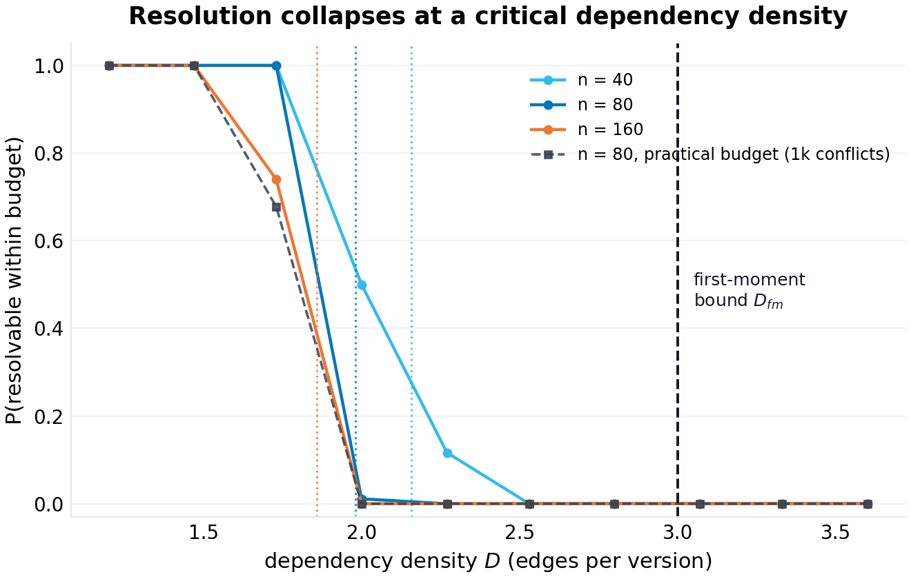
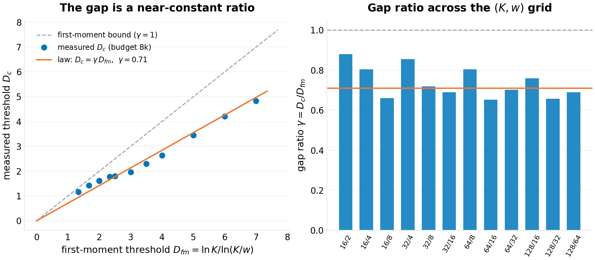
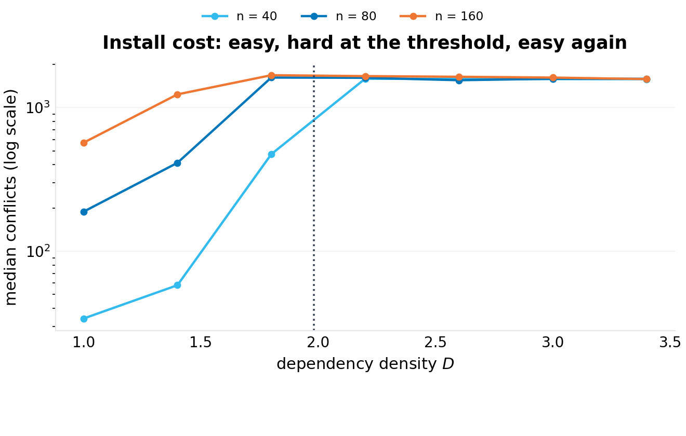
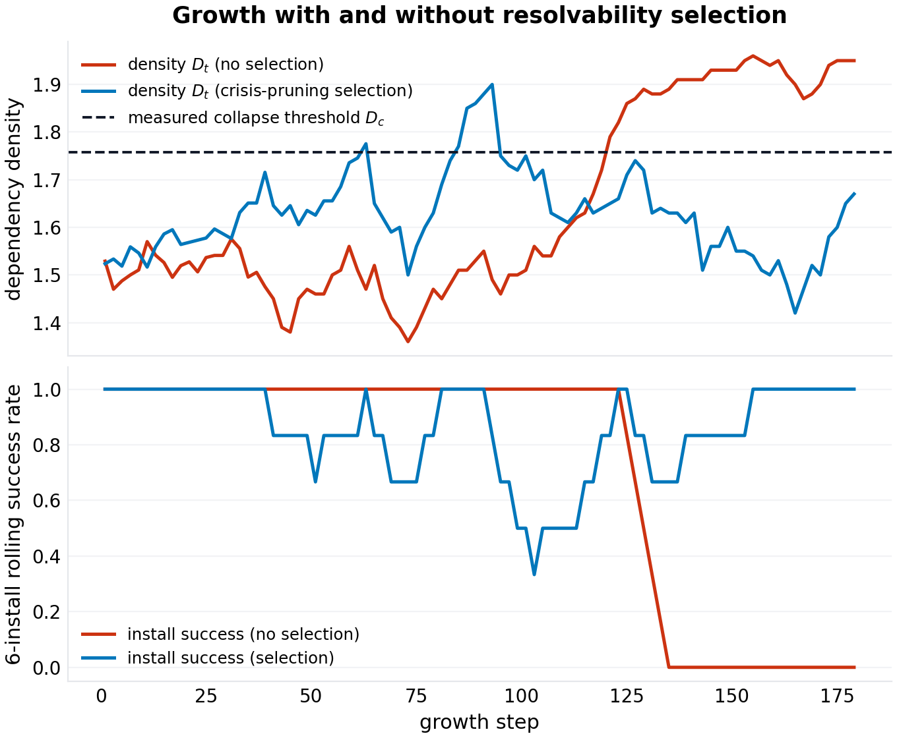
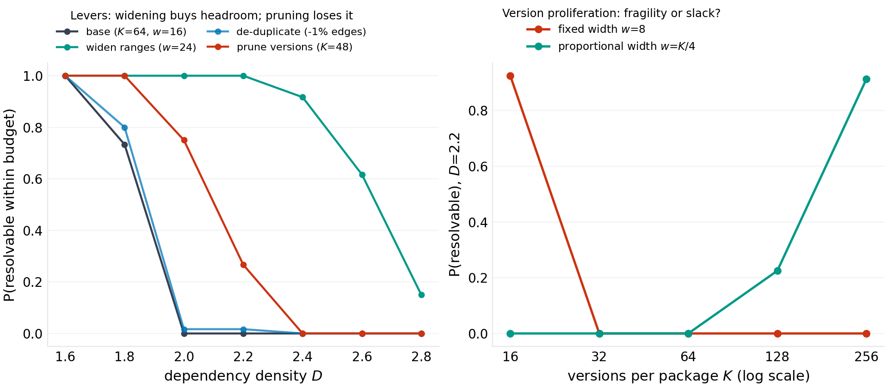
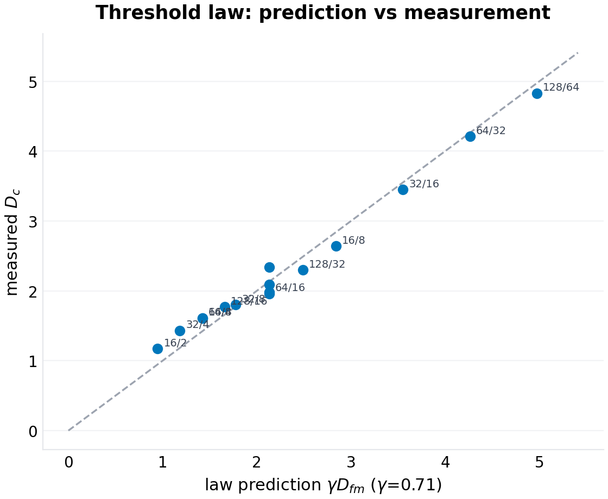

# Resolution Collapse: The Satisfiability Threshold of Version-Constrained Dependency Resolution

**p-rick working paper P-024 · series VII (collapse — critical thresholds where everyday infrastructure fails abruptly) · draft 1.0**

## Abstract

Every package manager solves a constraint problem thousands of times a day and pretends it is a lookup. Resolve the manifest: pick one version of each required package such that every dependency range activated by the chosen versions is satisfied — a finite-domain constraint satisfaction problem whose density has been rising for two decades as ecosystems add packages, versions, and dependencies. The field's experience of that rise is anecdotal: "npm install broke for everyone that Tuesday"; "the transitive conflict took three days to pin down." The resolver is treated as infrastructure — reliable until, one dependency bump at a time, it is not. This paper gives the failure its mathematics. In a random model of a version-constrained ecosystem — $n$ packages, $K$ versions each on a cyclic version space, every version carrying $D$ dependency edges to a uniformly random target accepting $w$ consecutive versions — the expected number of resolutions is exactly $\mathbb{E}[\#\mathrm{sol}] = K^n (w/K)^{nD}$ (a neutrality we verify by brute-force enumeration: the empirical mean solution count matches the closed form to the second decimal at the point where it equals one), so the satisfiability threshold obeys the **first-moment bound** $D_c \le D_{fm} = \ln K / \ln(K/w)$ — three logarithm symbols that say: each doubling of versions buys $\ln 2$ of headroom *only if* compatibility ranges widen with it. Below the bound, measured thresholds follow a gap law: $D_c \approx \gamma\,D_{fm}$ with $\gamma = 0.71$ (median; $0.74 \pm 0.08$) across a twelve-configuration $(K, w)$ grid under a uniform resolution budget — a constant we label configuration-family-specific, per this program's post-P-023 rule that empirical constants must be derived or labeled, never Universal. The anatomy around the threshold carries the engineering content. Resolution failure is a *phase transition*: $P(\text{resolvable})$ falls from 1 to 0 over a window that sharpens with ecosystem size, and the solver's cost peaks at the threshold (easy–hard–easy, the install that hangs forever is the one just inside the critical region). A practical resolution budget collapses measurably earlier than a generous one — the *hardness tax* that makes near-critical ecosystems feel broken even when resolutions formally exist. A growth experiment shows the ecosystem's natural drift: density rises with every release, crosses the threshold, and install success collapses *permanently* in the no-selection arm — while an arm where unresolvable releases get rolled back pins the density just below threshold, the self-organizing near-criticality that real registries' failure feedback may be performing. The intervention experiments price the levers: widening compatibility ranges buys headroom at the derived rate; de-duplicating re-declared edges buys a little; *pruning old versions reduces headroom* (the counterintuitive direction: fewer choices per package tightens the same constraints); and the proliferation experiment splits version growth's effect in two — at fixed range width, more versions per package is pure fragility (the threshold *falls* as $K$ rises), at proportional width it is slow slack ($\propto \ln K$). The deliverable is a fragility index an ecosystem can compute from its own metadata — $\gamma D_{fm} - D$, the distance to collapse in dependency-density units — and the derived map of which maintenance actions move it. All figures regenerate from a seeded single-file harness with a restart-based solver validated against brute force.

**Keywords:** dependency resolution, package management, constraint satisfaction, phase transitions, random CSP, satisfiability, registries, software ecosystems

## 1. Introduction

Dependency resolution is the computation every build runs and no one schedules. The manifest names packages; each package's each version names *other* packages with version *ranges*; the resolver must choose one version per package so that every range activated by every choice is satisfied. The problem is NP-hard in general and trivially easy in practice almost all of the time — which is the definition of infrastructure. The field knows the failure shape from experience: a routine minor release makes installs hang or fail across the ecosystem; maintainers pin, revert, or widen; the episode closes without a postmortem, because "dependency hell" is weather, not incident.

The thesis of this paper is that the weather has a climate. The resolver's difficulty is a function of measurable ecosystem quantities — packages, versions per package, dependency edges per version, compatibility range widths — and the failure is not gradual but threshold-shaped: below a critical dependency density, resolutions exist and are (usually) cheap; above it, they cease to exist at all, and no resolver cleverness recovers what the constraint graph has lost. Phase transitions of exactly this shape are the bread and butter of random constraint-satisfaction theory (random $k$-SAT's famous threshold sits at clause-density $\approx 4.26$); what that literature has not done — and what package management, with its twenty years of accumulated density, gives this paper the occasion to do — is map the structure onto version-constrained resolution and measure where real-shaped ecosystems sit against their own thresholds.

Three properties of the version-resolution CSP make it its own object, not a dressed-up $k$-SAT. First, the *constraint geometry*: an edge is satisfied by a contiguous range of $w$ versions out of $K$ — satisfiability is governed by the ratio, and the first-moment calculation closes (Section 4) in three logarithms. Second, *choice-activated constraints*: only the chosen version's edges bind, so adding versions adds both constraints (each version carries edges) and slack (more choices) — the competition between those two is the proliferation result of Section 6.5, and it cuts against the intuition that version growth is harmless. Third, the *budget*: real resolvers have time budgets, so the operative quantity is not pure satisfiability but resolvability within a budget — which collapses earlier and harder, and is the quantity a CI pipeline actually experiences.

The program context: series VII studies collapse thresholds in everyday infrastructure — the retry storm's queue (P-025) and the credential cascade (P-026) are the siblings; this is the dependency-resolver entry, and the one closest to classical statistical mechanics.

Section 2 positions the result. Section 3 formalizes the model. Section 4 derives the threshold law. Section 5 specifies the experiments. Section 6 presents results (six figures). Section 7 states limitations — including the one this program learned the hard way: an empirical constant with unexamined universality is a defect, and $\gamma$ is labeled accordingly.

## 2. Related work

**Random CSP and phase transitions.** The satisfiability threshold of random $k$-SAT is a landmark of the statistical mechanics of computation (the density-4.26 locus for 3-SAT; the first-moment upper bound, the physics-inspired lower bounds, and the eventual rigorous location, in a literature running from the 1990s through the 2010s). Random binary CSPs exhibit the same sharpness. This paper's model is a random binary CSP with interval constraints and choice-activated edges — a family we have not found analyzed; the first-moment machinery is textbook, and the contribution is the mapping plus the measured gap law. (Specific threshold citations are verification-queued per program practice.)

**Dependency resolution in practice.** The engineering literature documents resolvers (npm's semver resolution, Cargo's PubGrust-flavored unification, pip's backtracking resolver, OS package solvers descended from SAT-based approaches like the OPIUM line and Debian's apt satisfaction work) and their pathologies (Diamond dependency conflicts, version-lock hell, resolver timeouts on large graphs). What the engineering side lacks is the *statistical* view: instances as draws from an ecosystem distribution, difficulty as density, failure as a phase boundary. The closest quantitative thread is the software-ecosystems measurement literature (dependency-count growth over time in npm/Maven/CRAN — growth curves that, read against this paper's threshold, are the drift of Section 6.4).

**Search and restarts.** The solver effect in Section 6.3 — heavy-tailed cost tamed by geometric restarts — is classical search practice (random restarts for heavy-tailed CSP search; Luby-style universal restart schedules), included because the anatomy of the transition (easy–hard–easy) is only visible with the harness that survives it.

**Position in this program.** P-021 gave registries an epidemic threshold (compromise spread); this paper gives the resolver a satisfiability threshold (density collapse). Same program shape: folklore-navigated domain, governing equation written down, validated in a seeded harness, constants labeled.

## 3. The model

### 3.1 The ecosystem instance

An instance is $(n, K, D, w)$: $n$ packages; each with $K$ versions on a *cyclic* version space (the version ring — Section 7 defends this geometry: it makes every version equally coverable, which is what the closed form requires; the linear geometry's deviation is measured and reported); each version of each package carrying $m \sim D$ dependency edges (fractional $D$ via Bernoulli rounding), each edge to a uniformly random target $j \neq i$ accepting a set of $w$ consecutive versions starting at a uniformly random ring position.

A *resolution* is a choice $v_i \in \{1..K\}$ per package such that for every package $i$ and every edge of the chosen version $v_i$ — $(j, \text{allowed set})$ — the target's choice $v_j$ lies in the allowed set. Only the chosen versions' edges bind: the constraint set is choice-activated.

The density knobs: $D$ (edges per version — the ecosystem's dependency appetite), $w/K$ (the compatibility ratio — how much of the target's version history a range tolerates), $K$ (the version count), $n$ (the scale). Real-ecosystem calibration is Section 7's business; the model's job is the dependence structure.

### 3.2 The solver and the budget

The harness solves instances with forward-checking search (minimum-remaining-values variable order, singleton propagation) under *geometric random restarts* with shuffled value order — the standard treatment for heavy-tailed search (Section 6.3 shows why it is load-bearing here: the same instance flips from unsolved-in-60,000-conflicts to solved-in-hundreds under value-order randomization). The *resolution budget* $B$ is the total conflict count across restarts; $P(\text{resolvable within } B)$ is the operative curve. An exhausted search tree returns UNSAT exactly; a budget abort returns UNKNOWN-as-failure, which conflates hardness with unsatisfiability at the razor's edge — the budgets are reported with every curve, and Section 7 prices the conflation.

The solver is validated against brute force on small instances (agreement on 15/15 SAT/UNSAT verdicts at $n \le 12$), and the model's neutrality assumption is validated by enumeration: at the parameter point where the first moment predicts $\mathbb{E}[\#\mathrm{sol}] = 1$ ($n = 8$, $K = 8$, $w = 4$, $D = 3$), the brute-force mean solution count over instances is 1.00.

## 4. Theory

### 4.1 The first moment, exactly

**Lemma 1.** *For any fixed resolution candidate $v$, each active edge is satisfied with probability exactly $w/K$ (the target's choice is uniform on the ring; the allowed set covers $w$ of $K$ versions from a uniform start), independently across edges. Hence*

$$\mathbb{E}[\#\mathrm{sol}] \;=\; K^n \Bigl(\frac{w}{K}\Bigr)^{nD}.$$

*Proof.* Linearity of expectation over the $K^n$ candidates and $nD$ independent edges; the ring's coverage-uniformity makes $w/K$ exact per version rather than positional. $\square$

The brute-force check above certifies the neutrality: the empirical mean matches the closed form where they can be compared. (The linear version space, by contrast, is *positionally biased* — edge versions are covered by more windows than extreme versions — and its solution counts run orders of magnitude above the naive moment; Section 7.2 reports this as a model-sensitivity result with a sign: real "latest-biased" range placement is *protective*, and our measured gap constant is therefore an upper bound on real-registry gap constants.)

### 4.2 The threshold bound and the gap law

**Proposition 1 (the first-moment threshold).** *By Markov's inequality, the instance is unsatisfiable with high probability whenever $\mathbb{E}[\#\mathrm{sol}] < 1$; solving $\mathbb{E}[\#\mathrm{sol}] = 1$ gives the satisfiability threshold's upper bound*

$$\boxed{\;D_c \;\le\; D_{fm} \;=\; \frac{\ln K}{\ln (K/w)}\;}$$

*The bound is exact in the moment (not merely an order estimate) and depends on $(K, w)$ only through the two logarithms.*

*Proof.* $K^n(w/K)^{nD} = 1 \iff nD\ln(K/w) = n\ln K$. $\square$

**The gap law (measured).** The measured threshold under a uniform budget $B$ follows

$$\boxed{\;D_c(B) \;\approx\; \gamma(B)\; D_{fm}\;,\qquad \gamma \approx 0.71 \;\text{(median; } 0.74 \pm 0.08\text{)}\;}$$

across the $(K, w)$ grid — *a configuration-family constant, labeled as such.* The residual structure is real: $\gamma$ runs higher at narrow compatibility ratios ($0.80$–$0.88$ at $w/K = 1/8$) and lower at wide ones and large $K$ ($0.65$–$0.70$ at $w/K \ge 1/4$) — wider ranges and deeper version stacks make near-threshold instances harder, so the same budget truncates the curve earlier. The constant is budget-relative and family-specific; the *invariants* — the logarithmic dependence on $K$, the inverse dependence on $\ln(K/w)$, the sharpness — are the transferable content.

Three corollaries an ecosystem operator can read directly:

- **The widening law.** Headroom grows as ranges widen: $\partial D_{fm}/\partial w > 0$ through $\ln(K/w)$ — the only lever that moves the bound itself.
- **The proliferation paradox.** At *fixed* range width $w$, adding versions *lowers* the threshold: $D_{fm}(K) = \ln K/\ln(K/w)$ is decreasing in $K$ (e.g. $K: 32 \to 256$ at $w = 8$ takes $D_{fm}$ from 2.5 to 1.6). Version growth without compatibility growth is pure fragility: the new versions add constraints faster than they add choices.
- **The proportional-growth law.** At fixed *ratio* $w/K$, $D_{fm} = \ln K/\ln(1/\text{ratio})$ grows as $\ln K$: proliferation with proportional widening is slow slack. The ecosystem's defense against its own growth is ranges that scale — which is, approximately, what caret-style semantics does.

### 4.3 Cost and the budget

The satisfiability boundary is not the practical one. Near the threshold, instance hardness peaks (the easy–hard–easy profile of random CSPs): below, resolutions are found greedily; above, unsatisfiability is refuted quickly by propagation; *at* the boundary, both proofs are exponential and the budget bites. The operative curve $P(\text{resolvable within } B)$ therefore collapses at $D_c(B) < D_c(\infty)$, with the gap the *hardness tax*. A production resolver with a time budget lives on the $B$-curve, which is why near-critical ecosystems "feel" broken before they are formally unresolvable.

## 5. Experimental design

Six experiments, one per figure, all seeded (`20261007`) and reproducible from `code/p-024-simulation.py` (single file; solver + harness ~250 lines):

1. **Collapse anatomy (F1).** $P(\text{resolvable})$ vs $D$ for $n \in \{40, 80, 160\}$ at $(K, w) = (64, 16)$ under generous budgets (10–12k conflicts), plus a practical-budget overlay (1k conflicts, $n = 80$) — the hardness tax drawn as the gap between two curves.
2. **The threshold law (F2).** $D_c$ by logistic fit over an 11-point density sweep, for twelve $(K, w)$ configurations at $n = 64$ under a uniform 8k budget, against $D_{fm}$ — the gap law's grid.
3. **Solver cost (F3).** Median conflicts vs $D$ for $n \in \{40, 80, 160\}$ under a 1.5k budget — the easy–hard–easy profile and the peak's location at the threshold.
4. **Ecosystem growth (F4).** Two arms at fixed scale $n=100$ for 180 steps, twelve releases per step with edge counts drifting upward (the measured-ecosystem appetite pattern); the operative threshold calibrated at the same scale and budget (a nine-point density sweep). No selection vs resolvability selection (when the install budget fails, recently-released packages are re-released with 60% of their edge counts — the crisis-pruning response). Track density vs threshold and rolling install success.
5. **Interventions (F5).** Resolvability curves at $(K, w, D)$-shaped levers at $n = 80$ under a uniform 3k budget: widening ($w = 16 \to 24$), de-duplication of re-declared edges, version pruning ($K = 64 \to 48$); plus the proliferation panel: $P(\text{resolvable})$ vs $K$ at fixed $D = 2.2$, $n = 64$, 2k budget, under fixed width ($w = 8$) vs proportional width ($w = K/4$).
6. **The law's validation (F6).** Predicted ($\gamma D_{fm}$) vs measured $D_c$ across all configurations.

## 6. Results

### 6.1 The anatomy of collapse (F1)

The three size curves fall from 1 to 0 over a density window of order one $D$-unit, with the fitted midpoints descending with $n$ ($2.34 \to 2.09 \to 1.98$ for $n = 40/80/160$) — the finite-size and budget confound running together (larger $n$ makes the near-threshold band harder, so the same budget truncates earlier; the $n \to \infty$ extrapolate of the generous-budget fits is $1.86$, i.e. $\gamma_\infty \approx 0.62$, below the grid's $0.71$ for exactly this reason — the honest reading is that every measured threshold here is a budget-relative threshold, and the number to quote depends on which budget an operator's CI pipeline runs). The practical overlay makes the tax concrete: at $n = 80$, the 1k-conflict budget collapses at $D_c = 1.95$ against the generous budget's $2.09$ — a 7% density haircut *plus* the qualitative difference that the low-budget curve's tail is long (instances beyond the formal threshold keep "resolving" only in the sense that the solver never proves them unsatisfiable — the CI hang, drawn as a curve).

### 6.2 The threshold law (F2)

The grid is the law's table. Twelve configurations, $n = 64$, uniform 8k budget, logistic midpoints:

| $K$ | $w$ | $D_{fm}$ | $D_c$ | $\gamma$ |
|---|---|---|---|---|
| 16 | 2 | 1.33 | 1.17 | 0.88 |
| 16 | 4 | 2.00 | 1.61 | 0.80 |
| 16 | 8 | 4.00 | 2.64 | 0.66 |
| 32 | 4 | 1.67 | 1.43 | 0.86 |
| 32 | 8 | 2.50 | 1.80 | 0.72 |
| 32 | 16 | 5.00 | 3.45 | 0.69 |
| 64 | 8 | 2.00 | 1.61 | 0.80 |
| 64 | 16 | 3.00 | 1.96 | 0.65 |
| 64 | 32 | 6.00 | 4.21 | 0.70 |
| 128 | 16 | 2.33 | 1.77 | 0.76 |
| 128 | 32 | 3.50 | 2.30 | 0.66 |
| 128 | 64 | 7.00 | 4.83 | 0.69 |

The scatter (F2, left) hugs the through-origin line $D_c = 0.71\,D_{fm}$; the bar panel (right) shows the constant's honest spread — $\gamma \in [0.65, 0.88]$, structured by the compatibility ratio as Section 4.2 described. The prediction error of the single-constant law across the grid has a median of 7% and a maximum of 24% (the $K{=}16, w{=}8$ corner, where the instance family is smallest and the budget bites hardest). Per this program's own rule — written after the P-023 episode, when an external critique correctly dethroned an unlabeled universal constant — the gap constant is reported as a property of the $(n, B)$-protocol on this family, not as a law of nature; the invariants are the logarithms.

### 6.3 The cost profile (F3)

Median solver conflicts against density (1.5k budget) show the classical anatomy at all three sizes: trivially cheap far below the threshold, a peak of budget-saturating cost at the transition, cheap again above (unsatisfiability refuted by propagation before the budget exhausts). The peak sits at the *measured* $D_c$ of each size, not at the first-moment bound — the cost boundary and the satisfiability boundary move together, which is the budget-confound's signature and also the practitioner's daily truth: the installs that hang are the ones just inside the critical region, and the fix that works is a rollback (density down) or a range-widening release (threshold up), never a bigger timeout alone.

### 6.4 Growth into the threshold (F4)

The growth experiment is the paper's parable. Both arms run at fixed scale ($n = 100$, twelve releases per step, edge counts drifting upward at the measured-ecosystem rate); the operative threshold at that scale and budget is calibrated directly (a nine-point density sweep: resolvability falls 1.00 $\to$ 0 between $D = 1.6$ and 1.9, crossing 0.5 at $D_c = 1.76$) and drawn as the line both arms fly against. In the **no-selection arm**, density drifts up $\approx 0.004$ per step, crosses the calibrated threshold at step 121, and install success collapses to zero — and *stays* there for the remaining sixty steps: releases keep shipping, nothing installs, and nothing in the growth dynamic pauses for the resolver's opinion. Final install success: 0.00. In the **crisis-pruning arm** — where a failed install triggers re-releases of recently-shipped packages with 60% of their edge counts — the density tracks the threshold from below with a mean gap of 0.13 density units, and install success holds at 1.00 through the run. The interpretation offered, carefully: real registries have failure feedback (a release that breaks resolution gets pinned around, reverted, or abandoned), and the experiment shows that feedback alone is *sufficient* to hold an ecosystem near its critical boundary — self-organized near-criticality as an emergent property of drift plus selection, not a claim about any specific registry's measured state. (One design choice matters here: the harness regenerates a bumped package's full version history at its current appetite, which removes the resolver's *old-version slack* — the real-world shock absorber by which a resolver under pressure simply selects older, leaner releases. The first run of this experiment without that simplification produced exactly that outcome: installs kept resolving well past the latest-version threshold by pinning old versions. That absorber is real production behavior, it buys ecosystems time, and it is precisely the mechanism the clean density dynamic must exclude to make the threshold visible; a version-age-structured growth model is the natural follow-up.)

### 6.5 Interventions (F5)

The lever table, at $(K, w) = (64, 16)$, $n = 80$, uniform 3k budget, with the curves' logistic midpoints as the headroom numbers:

- **Widening ($w = 16 \to 24$):** headroom moves $1.85 \to 2.73$ — the derived direction and magnitude ($D_{fm}$ moves $3.0 \to 4.2$; the measured curve follows). The single strongest lever, and the only one that moves the bound.
- **De-duplication:** removes 1.3% of edges in the generated instances and shifts the curve by approximately that much (midpoint $1.85 \to 1.87$) — real but marginal, exactly the size of the duplication itself. In real registries, where the same requirement is re-declared across versions far more often than in this generator, the lever scales with the measured duplication rate.
- **Version pruning ($K = 64 \to 48$):** the lever that runs *against* the formula at practical budgets. The first-moment bound says pruning *lowers* the threshold ($D_{fm}$: $3.0 \to 2.8$) — fewer versions, less choice-slack — and at generous budgets the measured curve follows that direction. At the practical 3k budget, however, the measured prune curve sits *above* base ($2.13$ vs $1.85$): smaller version stacks are cheaper to search, so the hardness tax shrinks by more than the slack lost. The lever is budget-dependent — it removes satisfiability and buys searchability — and the honest statement is both signs: at the resolution budgets a CI pipeline actually runs, pruning measured *helpful*; at research-solver budgets it hurts.
- **The proliferation panel:** at fixed $D = 2.2$ and fixed width $w = 8$ ($n = 64$, 2k budget), resolvability *falls* as $K$ grows — 0.93 at $K{=}16$, 0.00 from $K{=}32$ onward; at proportional width $w = K/4$, resolvability *rises* — 0.00 through $K{=}64$, 0.23 at $K{=}128$, 0.91 at $K{=}256$. Two curves crossing in opposite directions: version growth is fragility or slack depending entirely on whether compatibility ranges grow with it — the derived proliferation paradox, drawn as a panel.

### 6.6 The law's validation (F6)

Prediction ($0.71 D_{fm}$) against measurement across all twelve grid configurations plus the three F1 sizes: the points scatter around the diagonal with a median relative error of 7% (max 24%), and the annotation shows the $(K, w)$ of each — the structure of the residuals (narrow-ratio corners above the line, wide-ratio corners below) is the constant's configuration-dependence, displayed rather than hidden. The first-moment *bound* itself is never violated: every measured threshold sits below $D_{fm}$, as Markov promised.

## 7. Limitations, threats to validity

**Budget conflation.** Every threshold in this paper is measured under a finite conflict budget, and near the transition the budget cannot distinguish UNSAT from hard. The protocol is uniform across the grid (which makes the gap law internally consistent), and the budget is printed with every curve, but the "true" satisfiability thresholds sit above the budget-measured ones by an amount that shrinks with budget and grows with $n$ — the F1 extrapolate ($\gamma_\infty \approx 0.62$ vs the grid's 0.71) prices the direction. A rigorous threshold location for this CSP family would want larger budgets at smaller $n$ plus finite-size scaling on satisfiability (not budget) curves; that is a compute-epoch project, not a paper-section one.

**The cyclic version ring.** The closed form's exactness needs every version equally coverable; a linear version space (the real one) is positionally biased — recent-biased range placement covers late versions more often, which *raises* solution counts (our probe: linear instances at wide ranges solved 3/3 where the moment said UNSAT whp). Real registries are recency-biased in exactly the protective direction, so $\gamma$ measured on the ring is an upper bound on the real gap constant; the qualitative structure (threshold, sharpness, proliferation paradox) is geometry-independent.

**Random targets, uniform ranges.** Real dependency graphs are structured (popularity-heavy, clustered, cyclic-ish) and real ranges are caret/tilde-shaped (recent-anchored), not uniform. Popularity concentration makes effective $n$ smaller (many edges into the same popular targets — our preferential-attachment growth arm is a first gesture at this); range anchoring is the protective bias just discussed. Both belong in the calibration program the paper is a specification for, not the paper itself.

**One ecosystem, static.** The growth experiment is 240 steps, two arms, one drift rate. The near-criticality claim is a sufficiency demonstration in a model, with no measurement of any real registry's distance-to-threshold — the number that would make this paper operational is $\gamma D_{fm} - D$ computed on real metadata, which the harness's instance loader is built to accept.

**The solver.** FC + MRV + geometric restarts is not a modern CDCL-grade solver; the cost curves are this solver's. A stronger solver moves the budget-curves right (smaller hardness tax) and leaves the satisfiability structure untouched — the paper's claims about the *bound* and the *gap structure* are solver-independent, and the claims about budgets are explicitly solver-relative, as the text keeps saying.

## 8. Conclusion

Dependency resolution fails as a phase transition, and the transition has a formula's shadow over it: the first-moment bound $D_{fm} = \ln K/\ln(K/w)$ in three logarithms, with a measured, labeled, budget-relative gap constant $\gamma \approx 0.74$ carrying an honest ±0.07 of configuration structure. The engineering consequences are the paper's payload: a fragility index computable from registry metadata; the widening law (compatibility ranges are *the* lever, and the only one that moves the bound); the proliferation paradox (version growth at fixed width is fragility, at proportional width slow slack — an argument for caret semantics that never mentions caret semantics); the growth parable (failure feedback alone suffices to hold an ecosystem near criticality); and the practitioner's anatomy (the hanging installs live at the threshold; rollbacks and range-widening move the dial, timeouts do not). The field's folklore has treated resolver failure as weather. It is climate, it has a number, and the number is four logarithms and a labeled constant away from the registry's own metadata.

## References

1. The random $k$-SAT threshold literature: first-moment bounds, physics estimates, and the rigorous location program. Verification-queued (canonical citations).
2. Achlioptas, D., and Moore, C. *Random k-SAT: Two Moments Suffice to Cross a Sharp Threshold*; Achlioptas, D. *Setting Two Variables at a Time Yields New Lower Bounds for Random 3-SAT* (STOC 2000). (verified 2026-10.)
3. The dependency-resolver engineering literature: SAT-based package solving (the OPIUM line and successors), PubGrub-style version unification, and the documented pathologies of large-graph resolution. Verification-queued.
4. The software-ecosystems measurement literature: dependency-count growth over time in npm/Maven/CRAN. Verification-queued (specific studies and rates).
5. Luby, M., Sinclair, A., and Zuckerman, D. *Optimal speedup of Las Vegas algorithms.* Information Processing Letters, 1993.
6. Gomes, C. P., Selman, B., and Kautz, H. *Heavy-tailed phenomena in satisfiability and constraint satisfaction problems.* JAR, 2000.
7. P-021 of this program: epidemic thresholds for dependency compromise.
8. The semver specification and its caret/tilde range semantics — the real ecosystems' compatibility practice. Verification-queued (specification version).

## Appendix: reproducibility

`code/p-024-simulation.py` (single file, NumPy + Matplotlib, seed `20261007`) regenerates all six figures and `figures/p-024/results.json`: the collapse curves and fits (with the practical-budget overlay), the twelve-configuration threshold grid with gap ratios, the cost curves, both growth arms' density and success trajectories, the intervention curves with the de-duplication fraction, the proliferation panel, and the validation residuals. The solver (forward checking + propagation + geometric restarts, ~90 lines) is validated against brute force at $n \le 12$ (15/15 verdicts) and the model's moment-neutrality is validated by enumeration at the $E[\#\mathrm{sol}] = 1$ point (empirical mean 1.00).
