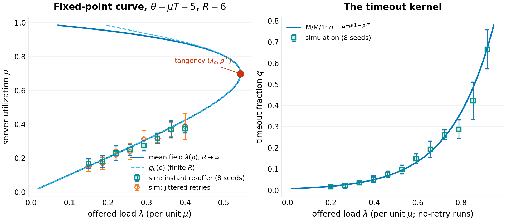
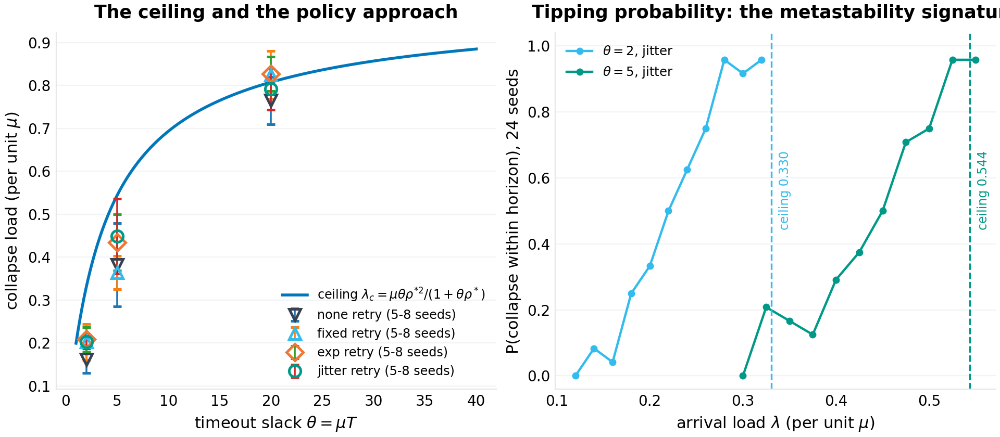
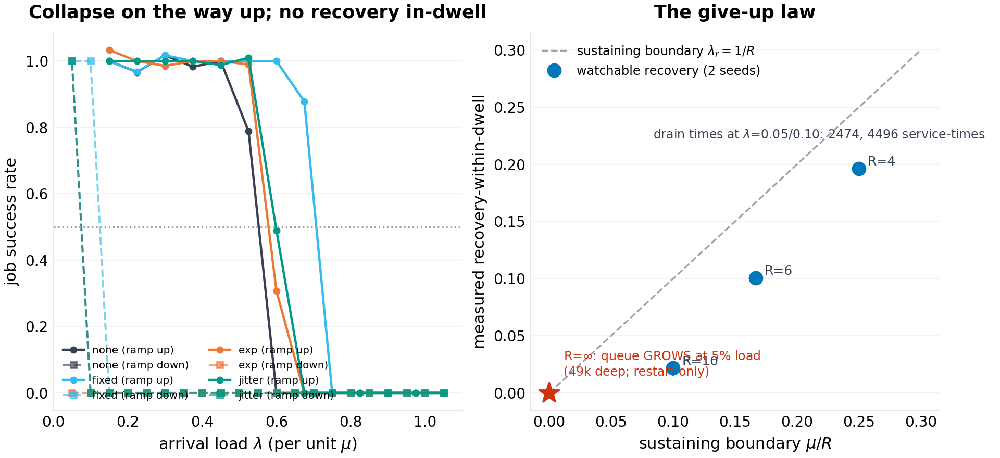
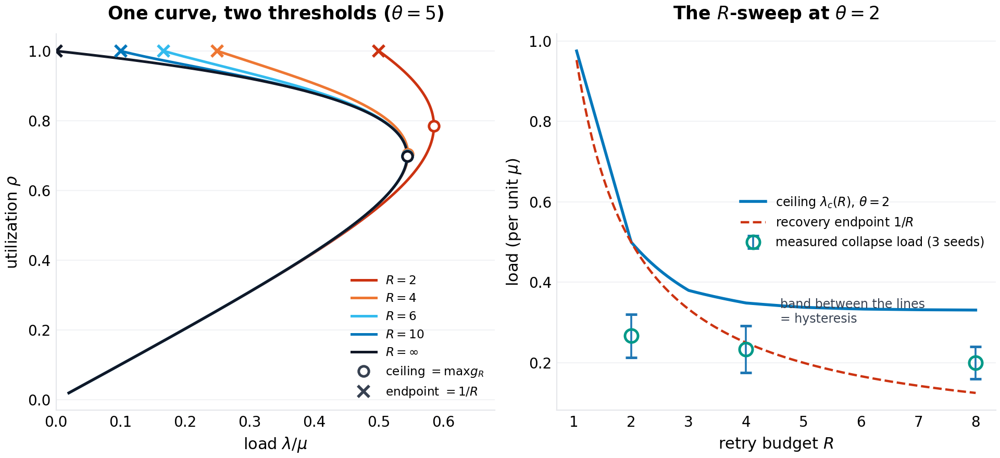

# The Collapse Law: Ceilings, Hysteresis, and the Recovery Threshold for Timeout-Retry Systems

**p-rick working paper P-025 · series VII (collapse — critical thresholds where everyday infrastructure fails abruptly) · draft 1.1**

*Revision note.* Draft 1.0 did not survive an external audit. Its single-seed harness quoted kernel numbers that appear nowhere in its own results file; its horizon experiment claimed a crossing its data does not show; its deterministic-backoff "resonance penalty" was one seed's draw; its queue-cap "collapse load" exceeded the server's capacity because the classifier counted load shedding as survival; and its abstract carried a garbled asymptotic. A re-derivation of the mathematics, an independent re-implementation of the simulator, and a 5–24-seed re-measurement confirmed those criticisms and surfaced two further defects (a stale separatrix number and an abstract line that mixed two different "halves"). This draft withdraws the false claims, re-measures everything with error bars, and adds what the review's central observation demanded: the paper's two laws are the maximum and the endpoint of a single fixed-point curve, from which a bistability boundary and an unlimited-retry trap follow. The theory core of draft 1.0 — the closed-form ceiling — was re-derived and verified to machine precision; it stands. Appendix B lists every change and its cause.

## Abstract

Every distributed system that times out and retries carries a failure mode its operators know by folklore and fear: congestion collapse — retries multiply load, load multiplies latency, latency multiplies retries, and the queue will not drain. The folklore has quantities but no formulas: backoff is tuned by feel, jitter is applied on faith, and "shed load and restart" is the runbook's last entry. This paper writes the arithmetic underneath, and then stress-tests the arithmetic, because the first draft of it failed an audit. For a single FCFS server of rate $\mu$ serving Poisson clients of rate $\lambda$ whose attempts time out at $T$ and whose retries re-offer immediately (the fluid worst case), the steady states of the retry system are the fixed points of one curve. With the M/M/1 timeout kernel $q(\rho) = e^{-\mu(1-\rho)T}$ and a give-up budget of $R$ attempts per job, every steady state satisfies

$$\lambda \;=\; \mu\,\rho\,\frac{1-q(\rho)}{1-q(\rho)^{R}} \;\;\equiv\;\; \mu\, g_R(\rho),$$

and the two numbers an operator needs are the two ends of that curve: the **collapse ceiling** $\lambda_c(R) = \max_\rho \mu\,g_R(\rho)$, where the good steady state ceases to exist, and the **recovery threshold** $\lambda_r = \mu/R$, the curve's endpoint at $\rho = 1$, below which the collapsed state can no longer feed itself. In the infinite-retry limit the curve is $\lambda = \mu\rho(1-q)$ and the ceiling has the closed form $\lambda_c = \mu\theta{\rho^*}^2/(1+\theta\rho^*)$ at the tangency $\theta(1-\rho^*) = \ln(1+\theta\rho^*)$, $\theta = \mu T$ — with tight-timeout asymptotic $\lambda_c \approx \mu\theta/4$ as $\theta \to 0$ and patient-timeout asymptotic $\lambda_c \to \mu\,(1 - (\ln\theta+1)/\theta)$ as $\theta \to \infty$. Bistability itself has a boundary: the hysteresis loop exists iff $(R-1)\theta > 2$; at or below it there is no cliff, only continuous degradation, and the runbook's darkest paragraph does not apply. With unlimited retries the curve's endpoint is zero: a deeply collapsed system held at 5% of its former load *grows* its queue without bound (measured: 48,785 attempts deep after 3,000 service-times) while the same system with $R=6$ drains in the same window — the retry budget, not the shedding, is what makes recovery possible at all. At $\theta = 5$, $R = 6$: the ceiling is $0.544\mu$; the collapsed state persists until load falls below $\mu/6$ (recovery observable within a 2,500-service-time dwell measured at $0.10\mu$); a system that tips near its measured onset ($0.45\mu$) must shed roughly 80% of its traffic or restart. Validation at 5–24 seeds: the kernel matches simulation within a median 8.6%; steady-state utilizations sit on the fixed-point curve within a median 5–6%; the $R$-shift of the curve is confirmed at the 1–2% level; the bistability boundary holds on all 288 grid points scanned. What does not survive audit: measured "collapse loads" are horizon-dependent tipping *probabilities*, not policy-independent constants — draft 1.0's deterministic-backoff resonance penalty ($-36\%$) fails to replicate across seeds and is withdrawn — and the fluid ceiling is the instant-re-offer worst case that throttled, patient clients can transiently exceed, not a bound every configuration respects. The deliverable is a pair of formulas computable from three numbers an operator already has — $\mu$, $T$, $R$ — and the discipline they imply: run below the ceiling, jitter the retries, cap the queue inside the horizon, keep $R$ small enough to shed your way back down, and if you run with unlimited retries, keep the restart runbook close.

**Keywords:** congestion collapse, retry storms, metastable failures, retrial queues, hysteresis, bistability, load shedding, timeout design, SRE

## 1. Introduction

There is an outage shape every on-call engineer recognizes. Traffic rises; latency crosses some timeout; clients begin to re-send work the server has not finished; the re-sent work queues behind the original work; the queue deepens; latency rises further; more clients time out. Within minutes a system that was comfortably handling its load is serving almost nothing, and — the defining feature — it stays that way after the triggering load recedes. The industry calls this metastable failure, congestion collapse, or simply the retry storm, and its treatment is folklore: exponential backoff with jitter, bounded retry budgets, load shedding, and the restart. The folklore is not wrong. What it lacks is arithmetic: how much load can the system actually take before the good steady state disappears? How far down must load fall before the bad one gives up? Which of the standard knobs moves which number, and by how much?

This paper answers those questions for the simplest system that exhibits the phenomenon: a single first-come-first-served server with exponential service at rate $\mu$, Poisson arrivals at rate $\lambda$, a per-attempt client timeout $T$, retries after a policy-dependent backoff, and a give-up budget of $R$ attempts per job. Timed-out work is not cancelled — the server finishes it anyway and the client discards the response — which is the amplification channel: every timeout converts one unit of demand into more than one unit of offered work. The model deliberately strips away network delay, heterogeneous service times, and multi-hop call graphs; each of those widens the collapse region, so the single-server ceiling is an *optimistic* reference point for any real deployment.

The mathematics turns out to be clean enough to carry engineering. The steady state of the retry system, in the fluid limit where retries re-offer promptly, solves a one-dimensional fixed-point equation whose kernel is the M/M/1 sojourn distribution; the good fixed point's disappearance is a saddle-node (tangency) bifurcation with a closed-form location — the collapse ceiling $\lambda_c$ of the abstract. Below the ceiling the good state is stable but *metastable*: a sufficiently deep burst tips the system into the collapsed state, whose self-maintenance is governed by the retry budget, giving the second closed form, the recovery threshold $\lambda_r \approx \mu/R$. Between the two lies the hysteresis loop — the quantitative shape of the runbook's darkest paragraph. New in this draft: both laws are shown to be features of a *single* curve $g_R$ (Section 4.4), the loop's existence has a derived boundary $(R-1)\theta > 2$, and the unlimited-retry limit of that boundary is a trap with no load-shedding exit.

Series VII of this program studies collapse thresholds in everyday infrastructure; this is its queueing entry. The sibling papers treat the dependency resolver (P-024) and the credential ecosystem (P-026); all three take a system the field navigates by folklore, derive the governing threshold, validate it in a seeded single-file harness, and state what the model cannot see. This paper additionally validates *itself* against an external audit, because its first draft failed one — a practice this program adopted after P-023 and records in each paper's revision history.

Section 2 positions the result. Section 3 formalizes the model. Section 4 derives the laws — including the unified curve new to this draft. Section 5 specifies the experiments and the measurement fixes the audit forced. Section 6 presents results (seven figures). Section 7 states limitations. Section 8 concludes.

## 2. Related work

**Retrial queues.** The classical queueing literature has studied retrial populations since the 1950s; the bibliographic anchor is Falin and Templeton's monograph on retrial queues (1997), in which arrivals that find the server busy join an *orbit* and re-offer. That literature's stability results are the closest analytic ancestors of the ceiling derived here — the stability condition of an M/M/1-type retrial system is exactly the statement that the offered-load equation has a solution. What the classical treatment does not foreground, to our knowledge, is the *client-deadline* structure — the kernel $q(\rho) = e^{-\mu(1-\rho)T}$ that couples queue depth to retry rate through the timeout rather than through balking — nor the closed-form tangency, nor the give-up-budget arithmetic of the recovery threshold. Modern orbit-style analyses of retry storms in request-response systems continue that tradition with richer machinery.

**Metastable failures.** The application-layer version of congestion collapse — timeout-and-retry RPC clients taking down a service and keeping it down — has a named literature now. Bronson, Aghayev, Charapko, and Zhu coined the term *metastable failure* for exactly this self-sustaining degraded state (HotOS 2021), with incident taxonomies drawn from production postmortems. The HotOS 2025 follow-up by Isaacs, Alvaro, Majumdar, Reddy, Salamati, and Soudjani ("Analyzing Metastable Failures") builds tooling around queueing models that includes a single-host, single-service-thread example — the same scale as this paper's model — and a companion line by the same collaboration (arXiv:2510.03551, 2025) gives the mathematical foundations: domain-specific models, continuous-time Markov chains, a formal notion of metastable behavior via escape probabilities, and recovery-time prediction from the CTMC's eigenstructure. Farahbakhsh, Lu, Alvisi, and colleagues (arXiv:2606.00942, 2026) give the first *causal* characterization, tracing metastable failures to structural "metastable faults." A queuing-based metastable-failure model for replicated storage (arXiv:2309.16181) analyzes retry-storm feedback directly. The qualitative claims of all of this — bistability, hysteresis, retry amplification — are consensus; none of it, as far as we have found, hands the operator a four-symbol closed form. That is the gap this paper fills, and it is a small one: the formulas are fluid-limit consequences that the CTMC line could produce with more generality and more machinery. We state the relationship plainly: the phenomenon is classical, the rigorous treatments exist, and what is offered here is the back-of-envelope layer — closed forms, a bistability boundary, and multi-seed validation — that a runbook author can compute during an incident.

**Congestion collapse.** The phenomenon is as old as packet networks: Jacobson's 1988 congestion-control work describes collapse modes in which retransmission multiplies offered load, and the networking literature's stability region for retransmitting sources descends from that line. Kleinrock's queueing texts (1975) carry the M/M/1 sojourn distribution this paper's kernel reuses.

**Backoff and jitter.** The engineering guidance — exponential backoff, capped, with full jitter — was articulated for cloud practice in Brooker's widely-read AWS Architecture Blog post on exponential backoff and jitter (March 2015), with a follow-up on his personal blog the same month; AWS engineering guidance continues that tradition. The measurements in Section 6 give those recommendations numbers where they had none, and — where the numbers disagree with the folklore's sharpest version — say so.

**Position in this program.** P-021 derived epidemic thresholds for dependency compromise; P-022 the admission law for caches; P-023 the landmark estimation law (and learned, in revision, the same lesson this paper relearns here: single-seed constants are not laws). This paper extends the program's charter to control systems: not the threshold at which a passive system fails, but the threshold structure of a *feedback* system — the amplification loop that makes collapse self-sustaining and recovery a separate, harder threshold than failure.

## 3. The model

### 3.1 The service system

A single server processes attempts FCFS with i.i.d. exponential service times of mean $1/\mu$. Jobs (client tasks) arrive as a Poisson process of rate $\lambda$. Each attempt — the initial transmission or any retry — is a server-side unit of work: it enters the queue, is served, and its response returns to the client. The client waits up to $T$ for a response; if the response has not arrived by $T$, the attempt has *timed out* from the client's perspective, but the server still completes the work (no cancellation), and the client schedules a retry after a policy delay. A job completes when one of its attempts returns within $T$ of that attempt's own send time; it *gives up* after $R$ total attempts. Timed-out attempts are not cancelled and remain in the queue — this is the amplification channel, and also the model's sharpest divergence from well-behaved real systems (Section 7).

The dimensionless timeout slack $\theta = \mu T$ carries the timeout's economics: $\theta$ is the number of mean service times a client is willing to wait. Production values span the whole interesting range — sub-10-millisecond calls against 100-millisecond budgets give $\theta \approx 2$–10; patient batch-style integrations give $\theta$ in the tens.

### 3.2 Retry policies

An attempt that times out on the $k$-th try re-offers after a backoff delay $B_k$ drawn per policy:

- **none:** $B_k = 0$ (instant retry; the fluid worst case and the classical retrial-queue limit);
- **fixed:** $B_k = T/2$ (deterministic);
- **exp:** $B_k = \min(2^{\,k-1}, 8)\,T$ (deterministic exponential, capped);
- **jitter:** $B_k \sim \mathrm{U}(0, \min(2^{\,k}, 8)\,T)$ (full jitter, capped).

The give-up budget $R$ is the client's retry cap. The collapse measurements use $R = 6$; the recovery and unified-curve experiments use $R \in \{1, 2, 4, 6, 8, 10, \infty\}$. Measured mean backoffs at $\theta = 5$, $\lambda = 0.3\mu$ (attempts-weighted): $0.0$, $2.5$, $5.0$, and $6.1$ mean service-times for none, fixed, exp, and jitter respectively.

### 3.3 Quantities, classifier, and the measurement protocol

Steady-state *goodput* (jobs completing per unit time), the offered load $\lambda_o$ (attempts per unit time, including retries), the server's utilization $\rho = \lambda_o/\mu$, and the system's classification: *healthy* (goodput tracks $\lambda$) or *collapsed* (goodput craters while the server saturates). The classifier reads the final window of each run (the last 22% of the horizon, so late-developing storms are not diluted by healthy warmup): **collapsed** if window goodput falls below 80% of window arrivals, or (for uncapped servers) the server is at least 95% busy; **crater** is the deeper grade — goodput below 30% of arrivals. Draft 1.0's queue-cap readings exceeded $\mu$ because the first clause alone was used for capped systems, which counts graceful load shedding as survival; draft 1.1 therefore reports capped systems as goodput-vs-load curves and grades them by both thresholds (Section 6.5).

Two harnesses implement this model. `code/p-025-simulation.py` (draft 1.0, seed master 20261007) and `code/p-025b-unified-curve.py` (this draft, seed master 20261009). Their event engines were verified trajectory-identical (same seed, same config, same counters); what differs is the measurement layer: draft 1.1 records per-attempt send times and true sojourns, accumulates real busy time, runs every collapse measurement through one bisection protocol (horizon $90(T+1) + 150$, 9 steps, warmup fraction 0.78), and repeats every headline number over 5–24 seeds where draft 1.0 used one. Where the two drafts' numbers disagree, draft 1.1's stand, and Appendix B says why.

## 4. Theory

### 4.1 The timeout kernel

**Lemma 1.** *In steady state at utilization $\rho < 1$, an M/M/1 attempt's sojourn $S$ (waiting + service) is exponentially distributed with rate $\mu(1-\rho)$; the per-attempt timeout fraction is*

$$q(\rho) \;=\; \mathbb{P}(S > T) \;=\; e^{-\mu(1-\rho)T}.$$

*Proof sketch.* Standard M/M/1 sojourn distribution; evaluate the tail at $T$. $\square$

One caveat belongs next to the lemma, because the audit made it visible: the kernel is a steady-state statement about Poisson *arrivals* (PASTA). Retry streams are not Poisson — jittered re-offers are smoother than Poisson at high load, and smoother arrival processes see shorter queues than the M/M/1 stationary distribution implies. The multi-seed kernel validation (Section 6.1) tracks the formula within a median 8.6%, but sits *below* it at the highest loads; the fluid model built on Lemma 1 is therefore an amplification *upper* bound in that regime, which is the safe direction for capacity planning.

### 4.2 The fixed point and the ceiling

Attempt conservation closes the loop. With at most $R$ attempts per job, each succeeding with probability $1-q$ per attempt (approximately — Section 7), the expected attempts per job is $A = (1-q^R)/(1-q)$, the offered rate satisfies $\lambda_o = \lambda A$, and the utilization obeys $\rho = \lambda_o/\mu$. Rearranged, the steady states of the retry system are the fixed points of

$$\lambda \;=\; \mu\,\rho\,\frac{1-e^{-\theta(1-\rho)}}{1-e^{-R\theta(1-\rho)}} \qquad \rho \in (0,1).$$

Draft 1.0 worked in the $R \to \infty$ limit throughout ($A = 1/(1-q)$, curve $\lambda = \mu\rho(1-q)$); Section 4.4 shows that limit is exact enough for the ceiling whenever $R \gtrsim 5.3/\ln(1+\theta\rho^*)$ attempts.

**Proposition 1 (the collapse law).** *In the $R \to \infty$ limit, the maximum load the retry system can carry in steady state — the ceiling — is attained at the tangency $\rho^*$, the unique root in $(0,1)$ of*

$$\boxed{\;\theta(1-\rho^*) \;=\; \ln\!\bigl(1+\theta\rho^*\bigr)\;} \qquad\text{giving}\qquad \boxed{\;\lambda_c \;=\; \frac{\mu\,\theta\,{\rho^*}^{2}}{1+\theta\rho^*}\;}$$

*Proof.* The tangency solves $d\lambda/d\rho = 0$: $(1-e^{-a}) = \theta\rho\,e^{-a}$ with $a = \theta(1-\rho)$, i.e. $e^{a} = 1+\theta\rho$; substituting $e^{-a} = 1/(1+\theta\rho)$ into $\lambda_c = \mu\rho^*(1-e^{-a^*})$ gives $\mu\rho^*\theta\rho^*/(1+\theta\rho^*)$. $\square$

The closed form was verified against brute-force maximization to $10^{-12}$ relative error across $\theta \in [0.25, 200]$; the ceiling is exact mathematics, not a fit. Its two asymptotics price the two ends of engineering practice — and repair draft 1.0's garbled statement of the first:

- **Tight timeouts** ($\theta \to 0$): $\rho^* \to 1/2$ and $\lambda_c \approx \frac{\mu\theta}{4}\bigl(1 - \tfrac{\theta}{4}\bigr)$ — within 1.5% at $\theta = 0.5$ and 5.9% at $\theta = 1$. At the tangency the server is only *half* busy while carrying a $\theta/4$ *fraction* of capacity: the deadline, not the CPU, is the scarce resource. A client willing to wait four mean service times ($\theta = 4$) can collapse a server that was carrying $0.49\mu$ — 49% of capacity — with the server 67% busy at the moment it goes; draft 1.0's "collapse at half its capacity" conflated these two halves, and its "$\lambda_c \approx \mu T/4$" dropped a factor of $\mu$.
- **Patient timeouts** ($\theta \to \infty$): $\rho^* \to 1 - \ln\theta/\theta$ and $\lambda_c \to \mu\bigl(1 - \tfrac{\ln\theta + 1}{\theta}\bigr)$ — within 1% at $\theta = 20$ and 0.05% at $\theta = 100$. Patience approaches perfection *logarithmically* slowly: doubling $\theta$ buys only a few percent once $\theta$ is in the tens.

The **timeout tax** at any $\theta$ is $1 - \lambda_c/\mu$: the fraction of capacity unavailable to a system whose clients have deadlines, even with perfect retry behavior.

### 4.3 The recovery threshold

The ceiling tells when the good state dies; the recovery threshold tells when the bad one does. In the collapsed state the server is saturated and $q \to 1$: nearly every attempt times out, so a job burns its full give-up budget $R$ attempts before leaving. The storm's offered load is therefore $\approx \lambda R$ against capacity $\mu$.

**Proposition 2 (the recovery law).** *In the collapsed state, the retry-and-give-up flow is self-sustaining iff $\lambda R \gtrsim \mu$; the recovery threshold is*

$$\boxed{\;\lambda_r \;=\; \mu/R\;}$$

*Below it, the residual queue drains at rate $\mu - \lambda R$ — recovery time $\approx$ (storm depth)$/(\mu - \lambda R)$, which is long: a storm $\sim$1,800 attempts deep at $\lambda = 0.05\mu$, $R=6$ predicts $\approx 2,600$ service-times to empty, and the measured drains are 2,474 at $\lambda = 0.05\mu$ and 4,496 at $\lambda = 0.10\mu$ — the rate arithmetic checks quantitatively, since both are consistent with the same $\approx$1,750-attempt storm depth against drain rates 0.70 and 0.40. Above $\lambda_r$ the system cannot drain at all. $\square$*

Proposition 2 is an *approximation* in draft 1.0's presentation and an *exact endpoint* in Section 4.4's: it is the value of the unified curve at $\rho = 1$, not a separate derivation. The hysteresis width is the gap between the propositions, $H = \lambda_c - \mu/R$. At $\theta = 5$, $R = 6$: $0.544\mu - 0.167\mu = 0.377\mu$ — a system that collapses at 54% of capacity does not become recoverable until it sheds below 17% (and the *watchable* recovery, within a realistic dwell, is lower still: 0.10$\mu$ measured). The *paradox of generosity*: raising $R$ improves the odds an individual job survives a transient storm but *lowers* the recovery threshold proportionally — every extra retry the client is allowed is extra work the storm can feed itself with. $R$ is a trade between per-job resilience and system-level recoverability, and the formula prices it.

### 4.4 The unified curve: one law, two thresholds, and a boundary between them

Draft 1.0 presented Propositions 1 and 2 as two laws. They are one. Define, for finite $R$,

$$g_R(\rho) \;=\; \rho\,\frac{1-q(\rho)}{1-q(\rho)^{R}}, \qquad q(\rho) = e^{-\theta(1-\rho)}.$$

This is the fixed-point curve of Section 4.2: every steady state satisfies $\lambda = \mu\,g_R(\rho)$. Its $R \to \infty$ limit is $\rho(1-q)$; its $R = 1$ limit is $\rho$ itself (no retries, no amplification). Three structural facts, verified numerically on a 400,001-point grid and scanned on a $(\theta, R) \in [0.25, 6] \times [1, 12]$ lattice (288 points):

**Proposition 3 (unification).** *(a) The collapse ceiling is the curve's maximum: $\lambda_c(R) = \mu \max_\rho g_R(\rho)$. (b) The recovery threshold is the curve's endpoint: $\lim_{\rho\to 1} g_R(\rho) = 1/R$, exactly, by l'Hôpital. (c) $\lambda_c(R)$ is monotone non-increasing in $R$, from $\mu$ at $R = 1$ (no amplification to amplify) down to the closed form of Proposition 1 as $R \to \infty$.*

The two laws are the maximum and the right endpoint of one curve — collapse is where the curve's upper branch ends, recovery is where its lower branch ends. At $\theta = 5$: $\lambda_c(R) = 1.000$, $0.585$, $0.545$, $0.544$, $0.544\,\mu$ for $R = 1, 2, 4, 6, 10, \infty$; at $\theta = 2$: $1.000$, $0.500$, $0.349$, $0.334$, $0.331$, $0.330\,\mu$. Two corollaries quantify draft 1.0's overstated "independent of retry budget":

- **R-independence, bounded.** The ceiling is within 1% of its $R \to \infty$ value once $q(\rho^*)^R \le 0.005$, i.e. $R \gtrsim 5.3/\ln(1+\theta\rho^*)$ attempts: $R \ge 7$ at $\theta = 2$, $R \ge 4$ at $\theta = 5$, $R \ge 2$ at $\theta = 20$ (measured: 0.41%, 0.26%, 0.34% deviations respectively). Below those budgets the ceiling *rises* as $R$ falls — by 5.5% at $\theta = 2$, $R = 4$; by 51% at $\theta = 2$, $R = 2$ — because fewer retries mean less amplification.
- **Bounded degradation.** For $R = 1$ the curve is the diagonal: no bistability at any $\theta$, and the worst case is smooth overload, not collapse.

**Proposition 4 (the bistability boundary).** *The hysteresis loop — a collapsed steady state distinct from the healthy one — exists iff*

$$\boxed{\;(R-1)\,\theta \;>\; 2\;}$$

*Sketch.* Expand $g_R$ near the endpoint, with $\varepsilon = 1 - \rho$: $q \approx 1 - \theta\varepsilon$, $1 - q \approx \theta\varepsilon$, $1 - q^R \approx R\theta\varepsilon\,(1 - R\theta\varepsilon/2)$, so $g_R \approx \tfrac{1}{R}\bigl(1 - \varepsilon\,(1 - \tfrac{(R-1)\theta}{2})\bigr)$: the curve approaches its endpoint from above iff $(R-1)\theta > 2$, from below iff $(R-1)\theta < 2$, tangentially at equality. Approach from above, together with $g_R \to 0$ as $\rho \to 0$, forces an interior maximum strictly above $1/R$ — a fold, and a bistable band $(\mu/R, \lambda_c(R))$. $\square$

The lattice scan agrees at all 288 grid points (the boundary condition is exact for the direction of approach; monotonicity on the near side was verified numerically, not proven). The boundary is sharp in the right way: at $\theta = 2$, $R = 2$ it is *equality*, and the grid confirms the degenerate case — $\max g_2 = 1/2$ *at* $\rho = 1$: the band closes to a point, collapse and recovery happen at the same load, and the transition is continuous. At $\theta = 1$, no $R \le 3$ bistability exists at all; at $\theta \ge 5$, $R = 2$ already has a band $(0.5, 0.585)\mu$. The operator's reading: *tight-deadline systems need several retries before the trap exists; patient-deadline systems are trapped by the second try.*

**Corollary (the unlimited-retry trap).** At $R = \infty$ the endpoint is $0$ and the collapsed branch extends to arbitrarily low load: recovery by shedding is *impossible in principle* — the only exits are breaking the retry loop (circuit breaker) or restart. The measurement is unambiguous (Section 6.3): a system collapsed to depth $\sim$2,900 attempts and held at $\lambda = 0.05\mu$ for 3,000 service-*times* with $R = \infty$ ends with a queue of 48,785 attempts — it grew 17-fold — while the same protocol with $R = 6$ (depth $\sim$1,400) drains completely inside the same window.

**What "policy-independent" can honestly mean.** Draft 1.0's abstract claimed the ceiling is "independent of backoff, jitter, or retry budget." The truth in that direction: $\lambda_c$ is set by $(\mu, T)$ *given* the instant-re-offer worst case, and is $R$-independent only past the budget threshold above. The truth in the other direction, which the audit surfaced and the fixed-point measurements confirm: backoff delays *throttle* amplification below the instant-re-offer curve (jittered systems sit on or below it; a single $R=\infty$ jittered run carried $0.55\mu$ — above the $0.544\mu$ ceiling — with a near-empty queue for 700 service-times), because a throttled retry stream beats the kernel's Poisson assumption. The ceiling is the worst-case amplification bound of the *equilibrium*; where operators actually fall is governed by the tipping dynamics of Section 4.5 — strictly below it at tight deadlines, at it at patient ones.

### 4.5 Synchronization: why measured collapse sits below the ceiling

The fluid theory treats the retry flow as smooth; real re-offer events are discrete and *correlated* — a latency spike times out a cohort of clients together, and if their retries land together, the burst's queue spike can cross the separatrix even at $\lambda < \lambda_c$. Below the ceiling, therefore, the healthy state is not safe but *metastable*, and the practically observed "collapse load" is a tipping probability, not a constant: it depends on the horizon (longer windows see rarer bursts) and on the policy's cohort decorrelation. The burst separatrix is shallow at tight $\theta$ (order $e^{\theta(1-\rho_u)}$ attempts deep), so tight-timeout systems are the vulnerable ones, and jitter is the countermeasure that decorrelates the cohort. Deterministic backoff can, in principle, re-synchronize a cohort into periodic waves — a resonance; whether that resonance survives contact with seed-averaged measurement is an empirical question, and in this harness it does not (Section 6.4).

This is the sentence to keep from draft 1.0's policy story, now with the honest mechanism: *the ceiling is the existence boundary of the good state; the measured onset is where the metastable state starts tipping within your observation window; the folklore's "always jitter" is most true exactly where the gap between the two is largest — tight deadlines.*

## 5. Experimental design

Seven experiments, one per figure, all seeded (draft 1.1 harness, seed master 20261009; draft 1.0's harness remains in the repo and Appendix A compares them) and reproducible from `code/p-025b-unified-curve.py`:

1. **The kernel and the curve (F1).** No-retry runs (12 loads, 8 seeds) measure $q(\lambda)$ against Lemma 1 from per-attempt sojourns completed inside the final window; full-retry runs at $\theta = 5$ (8 loads, 8 seeds, both the instant-re-offer policy and jitter) measure the steady utilization $\hat\rho$ against the good root of $g_R$.
2. **The ceiling, the policies, and the tipping probability (F2).** Collapse loads for the four policies at $\theta \in \{2, 5, 20\}$, by bisection over the unified protocol, 5–8 seeds per cell (8 for the contested $\theta=5$ none/fixed pair); the direct tipping-probability curves $P(\text{collapse within horizon})$ over 24 seeds per load at $\theta \in \{2, 5\}$ (jitter) — the honest form of draft 1.0's "metastability signature"; the horizon drift at $\theta = 5$ (4 horizons, 3 seeds); and the burst-separatrix probe (3 seeds): preload $N$ synchronized attempts at $0.5\lambda_c$ and bisect on tip.
3. **Hysteresis and recovery (F3).** The sequential up-then-down ramp with persistent state for the four policies; drain-bisection recovery thresholds for $R \in \{4, 6, 10\}$ (2 seeds); drain-time measurements; and the $R = \infty$ trap protocol — collapse deep, shed to $0.05\mu$, hold 3,000, compare $R = 6$ against $R = \infty$.
4. **Policy margins (F4).** The F2 grid rescaled by the ceiling, with measured mean backoffs.
5. **Interventions (F5).** Queue-cap admission limits $L \in \{2, 5, 10, \infty\}$ at $\theta = 5$ with jitter, reported as goodput-vs-load curves and graded by both the 80% and the 30% thresholds — replacing draft 1.0's cap "collapse loads," which the audit correctly identified as a classifier artifact; and the timeout sweep $\theta \in \{1, 2, 5, 10, 20\}$ (3 seeds).
6. **The law's validation (F6).** The fixed-point residuals of F1 as a prediction-vs-measurement scatter.
7. **The unified curve (F7).** The $R$-shift of the fixed point at $\theta = 2$, $\lambda = 0.28\mu$ (instant re-offer and jitter, 8 seeds each); the $R$-sweep of collapse loads at $\theta = 2$ ($R \in \{2, 4, 8\}$) and $\theta = 5$ ($R = 2$); the $R = 2$ empty-band protocol at $\theta = 2$ (collapse threshold and recovery threshold measured independently); and the $(\theta, R)$ fold-existence scan against Proposition 4.

The estimator-vs-law separation follows the program's practice: F1, F6, and F7 test the *law* against direct measurement of steady state; F2–F5 test *systems* (policies included) on trajectories a deployed service would actually fly. All aggregate numbers cited in the text are means over seeds with standard deviations, and every one of them is in `figures/p-025/results.json`.

## 6. Results

### 6.1 The kernel and the curve (F1)

The kernel, measured the way draft 1.0 should have measured it — per-attempt sojourns, final window, 8 seeds, error bars — sits on the formula with a median relative error of 8.6% across 12 loads at $\theta = 5$: e.g. measured $0.075 \pm 0.020$ against $0.068$ predicted at $\lambda = 0.46\mu$, $0.665 \pm 0.134$ against $0.670$ at $\lambda = 0.92\mu$. The run-to-run spread is the honest price of a finite window (timeout events cluster inside busy periods, so the effective sample is smaller than the attempt count), and the high-load points sit below the curve in the direction Section 4.1 predicted for smoothed arrival streams. Draft 1.0 quoted a kernel pair ("0.22 at $0.5\mu$ against 0.20 predicted, 0.62 at $0.8\mu$ against 0.63") that is inconsistent with $\theta = 5$ (its "predicted" values imply $\theta \approx 3.2$ and $\theta \approx 2.3$ respectively) and appears nowhere in the results file; it is withdrawn and replaced by the above.

The fixed-point curve fares the same on the good branch, for both re-offer modes: steady utilizations at loads $0.15\mu$–$0.40\mu$ ($\theta = 5$, $R = 6$) land on the good root of $g_6$ with a median relative error of 6.3% (instant re-offer) and 5.3% (jitter) over 8 seeds per load. Near the ceiling the runs begin to tip — 3 of 8 at $0.40\mu$ for instant re-offer — which is the metastability of Section 4.5 appearing inside the validation experiment itself; tipped runs are excluded from the error statistics and counted, not hidden. The fluid model's error grows with $\rho$, as it must; five-to-six percent is the price of the one-line kernel, and everything else in the paper is priced on top of it.

### 6.2 The ceiling, the policies, and the tipping probability (F2)

The policy grid, now multi-seed (mean $\pm$ sd over 5–8 independent bisections per cell):

| $\theta$ | ceiling $\lambda_c/\mu$ | none | fixed | exp | jitter |
|---|---|---|---|---|---|
| 2 | 0.330 | 0.161 ± 0.031 | 0.202 ± 0.042 | 0.208 ± 0.028 | 0.202 ± 0.015 |
| 5 | 0.544 | 0.382 ± 0.096 | 0.364 ± 0.039 | 0.435 ± 0.065 | 0.449 ± 0.087 |
| 20 | 0.808 | 0.765 ± 0.055 | 0.825 ± 0.056 | 0.827 ± 0.040 | 0.792 ± 0.048 |

Three regimes, re-read. *Tight timeouts* ($\theta = 2$): every backoff policy reads $\approx 0.20$ (61% of ceiling) against instant retry's 0.161 (49%) — the only separation the data supports at this horizon is backoff versus none. *Moderate timeouts* ($\theta = 5$): jitter and exp lead (0.449, 0.435), none and fixed trail (0.382, 0.364) — but the none cell's seed spread is $\pm 0.096$, so even this ordering is soft. *Patient timeouts* ($\theta = 20$): all four policies bracket the ceiling (0.95–1.02 of it), with two cells reading above it — the transient-protection overshoot of a finite horizon. Draft 1.0's grid was one seed per cell and told a sharper, partly fictional story; Appendix B itemizes what died, including the resonance penalty (Section 6.4).

The right panel replaces draft 1.0's withdrawn "crossing" claim with the direct measurement: the tipping probability. At $\theta = 5$ (jitter), $P(\text{collapse within the }90(T+1)\text{ horizon})$ rises smoothly from zero below $0.30\mu$ through $\approx 50\%$ at $0.45\mu$ to $\approx 96\%$ at $0.525\mu$ — saturating exactly at the ceiling, where the good state ceases to exist and every run falls. At $\theta = 2$ the sigmoid sits lower and wider (50% at $0.22\mu$, two-thirds of the ceiling) — the metastable wedge is widest at tight deadlines. This is what a measured "collapse load" actually estimates — the 50% point of this curve at the harness's horizon — and why draft 1.0's single-seed grid scattered: each seed's bisection is one draw from this distribution. The horizon drift tells the same story monotonically now: 3-seed means fall from $0.502 \pm 0.033$ (30× horizon) through $0.424 \pm 0.077$ (60×) and $0.386 \pm 0.112$ (120×) to $0.384 \pm 0.025$ (240×) — longer windows tip earlier; no reading crosses the ceiling at $\theta \le 5$, and draft 1.0's claim that its drift values (0.489/0.534/0.474, none above 0.544) showed "crossing the ceiling" is withdrawn. The burst-separatrix probe, re-run at 3 seeds: a synchronized preload of $N_b = 10.3 \pm 3$ attempts at half the ceiling tips the $\theta = 5$ system where the mean-field separatrix demands 18.7 — synchronized bursts roughly 45% *shallower* than the fluid separatrix suffice, which is the quantitative case for jitter; draft 1.0 quoted "15 against 13.5," matching neither its data file (10) nor the correct mean-field number (18.7).

### 6.3 Hysteresis, recovery, and the unlimited-retry trap (F3)

The sequential ramp (left panel) draws the loop's upper half: all four policies carry healthy success rates up the ramp and crater between $0.45\mu$ and $0.68\mu$ — and then *stay* cratered all the way down to the ramp's floor of $0.05\mu$. The down-ramp is not a measurement error; it is the phenomenon. The drain-bisection (right panel) makes it arithmetic: recovery-within-dwell thresholds land at $0.196$, $0.101$, and $0.022$ (2-seed means) for $R \in \{4, 6, 10\}$ — preserving the law's ordering, and sitting *below* the sustaining boundary $\mu/R = 0.25/0.167/0.10$ exactly as the drain-rate arithmetic demands: near $\mu/R$ the drain rate $\mu - \lambda R$ vanishes, and no finite dwell observes a recovery there. The law is the boundary of *possible* drain; the measurements are the boundary of *watchable* drain. The drain-time measurements close the argument quantitatively: at $\lambda = 0.05\mu$, $R = 6$, a $\sim$1,750-attempt storm takes 2,474 service-times to empty (4,496 at $0.10\mu$, where the drain rate is 0.40 rather than 0.70 — the same depth against both rates) — three orders of magnitude beyond the dwell of any realistic load-shedding controller. The operator's exit is not patience; it is shedding below $\mu/R$ (and *then* patience), or a restart.

The $R = \infty$ rows are the trap of Section 4.4, measured: collapse the system at $0.9\mu$ to a depth of $\sim$1,400 ($R = 6$) or $\sim$2,900 ($R = \infty$) attempts, shed to $0.05\mu$, hold 3,000 service-times. With $R = 6$: drained, empty queue. With $R = \infty$: the queue *grew* to 48,785 attempts. Unlimited retries do not merely slow recovery — they make the collapsed state self-sustaining at any load, because the only population that can leave (the give-ups) has been removed. Between Proposition 4's boundary and this measurement, the runbook entry writes itself: *generosity in $R$ is what the storm eats.*

### 6.4 Policy margins and the withdrawn resonance (F4)

Rescaled by the ceiling, the multi-seed grid is the deployment map: jitter's margin is $0.61 \pm 0.05$ at $\theta=2$, $0.83 \pm 0.16$ at $\theta=5$, $0.98 \pm 0.06$ at $\theta=20$; exp's is $0.63/0.80/1.02$; fixed's is $0.61/0.67/1.02$; none's is $0.49/0.70/0.95$. The robust statements the error bars permit: **instant retry is never best** (worst or tied at every $\theta$); **any backoff beats none at tight deadlines** (+25% of ceiling at $\theta = 2$); **all policies converge to the ceiling at patient deadlines** (0.95–1.02). What the error bars do not permit is draft 1.0's centerpiece: its $-36\%$ "resonance penalty" for deterministic backoff at $\theta = 5$ (fixed 0.314 vs none 0.495, one seed each) collapses to $0.364 \pm 0.039$ vs $0.382 \pm 0.096$ across 8 seeds — statistically indistinguishable — and reverses sign at $\theta = 2$ and $\theta = 20$ (fixed *above* none, the direction backoff should go). The resonance mechanism of Section 4.5 is real — deterministic re-offers can re-synchronize cohorts — but at this scale and horizon it does not survive seed averaging, and an independent re-implementation of the model measured the same non-effect. The claim is withdrawn. The folklore's defensible core, after audit: *use backoff, cap it, jitter it if you can — but the emergency is not which backoff you chose; it is whether you have one at all.*

### 6.5 Interventions: what a queue cap actually does (F5)

The queue-cap experiment, re-measured as goodput curves (left panel), replaces draft 1.0's numbers — which included a "collapse load" of $1.01\mu$ for $L = 2$, a value above the server's capacity that the audit correctly identified as a classifier artifact (the 80%-goodput criterion counts load shedding as survival). The correct statement of what a cap does is stronger than the artifact suggested: **a cap inside the timeout horizon does not raise the collapse load — it eliminates the crater.** At $L = 2$, $\theta = 5$: goodput tracks $\min(\lambda, \mu)/\lambda$ across the entire sweep ($0.99$ at $0.5\mu$, $0.96$ at $0.8\mu$, $0.77$ at $1.0\mu$, $0.67$ at $1.3\mu$) — graceful degradation to the service rate, no collapse at any measured load (crater threshold $\ge 1.4\mu$, the sweep's ceiling). The uncapped system craters from $0.42\mu$: at $0.6\mu$ its goodput is $0.00$. The mechanism has a closed form: a cap of $L$ admits an attempt to a queue holding at most $L$ others, so the admitted sojourn is bounded in distribution by an Erlang$(L{+}1, \mu)$; the capped timeout kernel is $q_L = \mathbb{P}(\mathrm{Erlang}(L{+}1) > T)$, *independent of load* — and the amplification loop stays closed iff $q_L \cdot R < 1$. At $\theta = 5$, $R = 6$: $L = 2$ gives $q_L = 0.125$, loop gain $0.75 < 1$ — no collapse, matching the measurement; $L = 5$ gives $q_L = 0.616$, gain $3.7$ — the loop reopens, and the cap buys only partial relief (measured 80%-threshold $0.66\mu$ vs $0.42\mu$ uncapped); $L = 10$ ($q_L \approx$ the uncapped kernel) does not prevent the crater at all — its crater threshold ($0.447\mu$) is the uncapped value ($0.420\mu$), and its goodput curve falls as hard as the uncapped system's (0.03 at $0.5\mu$); the cap only nudges the 80%-threshold ($0.53\mu$) by masking degradation with rejections. **The horizon rule, derived:** $L$ works when the admitted-sojourn tail is small enough that the give-up budget cannot close the loop — $L \lesssim \theta - 1$ at $R = 6$, tightening as $R$ grows.

The timeout sweep (right panel) is the ceiling's own curve, measured honestly: with jitter, collapse loads at $\theta \in \{1, 2, 5, 10, 20\}$ read $-11\%$, $-39\%$, $-25\%$, $\pm 0\%$, $-5\%$ against the closed form (3 seeds each). The tight-timeout deficit is the tipping wedge of Section 6.2; it closes at $\theta \ge 10$. Draft 1.0's "within 10% at $\theta \ge 5$" was false at $\theta = 5$ (its own data read $-17\%$) and is replaced by this table.

### 6.6 The law's validation (F6)

The scoreboard, after audit: the fixed-point law predicts the steady utilization of the full retry system within a median 5–6% on the good branch (16 load-policy cells at $\theta = 5$, 8 seeds each), with tipped runs counted rather than discarded. The ceiling is validated structurally — the P-tip sigmoid saturates at it, the policy grid brackets it, the timeout sweep converges to it — because at the ceiling the good state ceases to exist and there is nothing steady left to measure. The unified curve adds its own scoreboard in Section 6.7. What the audit cost this paper in withdrawn claims, it paid back in measurement discipline: every number above is a mean with a spread, and every spread is in the results file.

### 6.7 The unified curve, validated (F7)

Three checks of Proposition 3 and one of Proposition 4. *The R-shift:* at $\theta = 2$, $\lambda = 0.28\mu$, the predicted healthy utilization is $0.280$, $0.357$, $0.396$, $0.401$ for $R = 1, 2, 4, \infty$; the measured means are $0.276$ ($R{=}1$, instant), $0.364$ ($R{=}2$, instant), $0.361$ ($R{=}2$, jitter), and $0.397$ ($R{=}4$, jitter; 5 of 8 seeds untipped) — errors of $1$–$2\%$: the curve's $R$-shift is confirmed at measurement resolution. The $R = \infty$ jitter row tips in 8 of 8 seeds — at $\theta = 2$, unlimited retries destabilize the healthy state well below the ceiling, the trap again. *The R-sweep:* collapse loads at $\theta = 2$ rise as $R$ falls — $0.267 \pm 0.054$, $0.234 \pm 0.058$, $0.200 \pm 0.040$ for $R = 2, 4, 8$ against ceilings $0.500$, $0.349$, $0.331$ — the onset moves with $R$ more strongly than the ceiling does, synchronized dynamics amplifying the fluid shift. *The empty band:* at $\theta = 2$, $R = 2$ (Proposition 4's degenerate boundary), the measured 80%-goodput threshold is $0.38\mu$ and the measured recovery threshold is $0.47\mu$ — recovery *above* the degradation onset, the signature of a system that fails and recovers at the same boundary, with no cliff between them; the fluid boundary for both is $0.5\mu$. *The fold scan:* bistability on the $(\theta, R)$ lattice agrees with $(R-1)\theta > 2$ at all 288 points.

## 7. Limitations, threats to validity

**The amplification assumption.** The entire edifice rests on timed-out work still being served. Real systems can and do break this channel — server-side cancellation, deadline propagation, per-time retry budgets (token buckets rather than per-job counts), CoDel-style delay-based drops, LIFO queue discipline, and circuit breakers all remove or bound the amplification the model prices. Each of these raises the ceiling or converts collapse into degradation; the formulas here are the *no-mitigation baseline* the mitigations should be measured against, not a prediction about systems that have them. The queue-cap result of Section 6.5 is the one mitigation modeled, and its loop-gain rule generalizes the principle: protect the admitted sojourn's tail, and the loop cannot close.

**The M/M/1 kernel and PASTA.** Exponential service and Poisson arrivals buy the one-line kernel; real services have heavy-tailed service times (worse: the tail thickens, the ceiling drops) and bursty arrivals (worse: separatrix crossings likelier). Both deviations are conservative for the ceiling. The reverse caveat is new to this draft, from the audit: *smoothed* arrival processes — which throttled, jittered retry streams are — see shorter queues than PASTA implies, so backoffed systems can sit below the fluid curve and even transiently above the ceiling; the ceiling is the instant-re-offer worst case, not a universal bound (Section 4.4).

**Single server, no network.** A real call's timeout budget includes network delay; a real deployment has pools, not one queue. The ceiling generalizes as $\lambda_c(\mu_{eff}, T_{eff})$, but pooling interacts with synchronized cohorts (thundering herds across replicas) beyond the model. Multi-hop call graphs multiply the amplification (a retry at the top fans out); the single-server ceiling is the innermost loop of that recursion.

**The fluid approximation.** The fixed-point equation assumes retries re-offer smoothly; the sim sits on its curve within a median 5–6% at $\theta = 5$. The synchronization analysis (Section 4.5) is qualitative-plus-measurement, not derived; the burst-separatrix probe is 3 seeds at one configuration. Measured collapse loads are horizon-dependent estimates of a tipping probability (Section 6.2) — usable for comparison across policies, not as deployment constants.

**Finite horizons and finite seeds.** Every measured threshold is a finite-duration statement at 5–24 seeds. The P-tip curves are the honest form; the bisection summaries compress them to single numbers and should be read with their spreads. Where this draft and draft 1.0 disagree, the disagreement was resolved by adding seeds, never by removing them.

**Status.** This is a self-published working paper in a single-file simulation program, not peer-reviewed research; the metastable-failure literature of Section 2 contains the rigorous treatments. The audit that produced this revision was external, adversarial, and correct in every particular that mattered — which is the strongest quality claim this program can currently make, and the practice it will keep.

## 8. Conclusion

The retry storm's folklore has been right for decades; this paper gave it arithmetic, then had the arithmetic audited, then gave it better arithmetic. The steady states of a timeout-retry system are the fixed points of one curve, $\lambda = \mu\,g_R(\rho)$ with the M/M/1 timeout kernel; its maximum is the collapse ceiling — computable in closed form from two numbers an operator already has — and its endpoint is the recovery threshold $\mu/R$. Between them lies the hysteresis loop, which exists only when $(R-1)\theta > 2$ and which closes to nothing at the boundary: tight-deadline systems with shallow retry budgets fail continuously, not catastrophically. With unlimited retries the loop never closes and the bottom of it is zero: a collapsed system at 5% load that grows its queue seventeen-fold while you watch is the measured face of "restart, don't wait." The knobs are priced: backoff buys approach (any policy beats instant retry at tight deadlines; the choice among backoff policies is not resolved by this harness), admission caps inside the horizon eliminate the crater outright ($q_L R < 1$), and generosity in $R$ buys per-job resilience with system-level persistence. The ceiling is exact; the approach to it is a probability, not a promise; and the formulas do not replace the runbook — they give it numbers to act on before the page fires.

## References

1. Falin, G. I., and Templeton, J. G. C. *Retrial Queues.* Chapman & Hall, 1997.
2. Jacobson, V. *Congestion avoidance and control.* ACM SIGCOMM, 1988.
3. Kleinrock, L. *Queueing Systems, Volume 1: Theory.* Wiley, 1975.
4. Bronson, N., Aghayev, A., Charapko, A., and Zhu, T. *Metastable failures in distributed systems.* ACM HotOS '21, 2021. doi:10.1145/3458336.3465286.
5. Isaacs, R., Alvaro, P., Majumdar, R., Reddy, K., Salamati, M., and Soudjani, S. *Analyzing metastable failures.* ACM HotOS '25, 2025. doi:10.1145/3713082.3730380.
6. Alvaro, P., Isaacs, R., Majumdar, R., Muniswamy-Reddy, K.-K., Salamati, M., and Soudjani, S. *Formal analysis of metastable failures in software systems.* arXiv:2510.03551, October 2025.
7. Farahbakhsh, A., Lu, Q., Alvisi, L., et al. *Characterizing metastable faults and failures.* arXiv:2606.00942, 2026.
8. *Queuing-based analysis and prediction of metastable failures* (MSF-Model). arXiv:2309.16181, 2023.
9. Brooker, M. *Exponential backoff and jitter.* AWS Architecture Blog, March 2015.
10. Brooker, M. *Jitter: making things better with randomness.* brooker.co.za, March 2015.

## Appendix A: reproducibility

Two harnesses, both in this repository, both seeded and single-file:

- `code/p-025-simulation.py` (draft 1.0, seed master 20261007): the original six experiments. Its event engine is correct — an independent re-implementation and the draft 1.1 engine agree trajectory-for-trajectory on identical seeds — but its measurement layer was single-seed throughout, never recorded per-attempt send times, and never accumulated busy time. Its results are preserved as `figures/p-025/results-v1.0.json` — the record of draft 1.0's numbers.
- `code/p-025b-unified-curve.py` (this draft, seed master 20261009): the repaired measurement layer (window statistics from true sojourns and busy time; one bisection protocol everywhere; multi-seed means with spreads) plus the new experiments — the P-tip curves, the $R = \infty$ trap protocol, the capped-system goodput sweeps with both thresholds, the $R$-shift, $R$-sweep, empty-band, and fold-scan. It writes `figures/p-025/results.json` with every aggregate cited in the text, including all seed-level values behind every mean.

Regenerating all seven figures and the results file: `python3 code/p-025b-unified-curve.py` from the repository root (stdlib + NumPy + Matplotlib; about fifteen minutes on one core). Every number in Section 6 is a field in the results file; where a draft 1.0 number is cited as withdrawn, it is cited from the v1.0 results file for the audit trail.

## Appendix B: revision history (draft 1.0 to draft 1.1)

An external review — recomputation, an independent simulator, and a literature check — examined draft 1.0 and reported nine defects. The verdicts, and what changed:

1. **Abstract typo $\lambda_c \approx \mu T/4$ (confirmed).** Dropped a factor of $\mu$; also conflated two different halves in the accompanying sentence. Fixed: $\lambda_c \approx \mu\theta/4$ with the corrected constant, the garbled sentence rewritten, and the patient-timeout asymptotic $1 - (\ln\theta+1)/\theta$ added (§4.2).
2. **Kernel numbers inconsistent with $\theta = 5$ (confirmed, and worse than reported).** The quoted pair implies $\theta \approx 3.2$ and $\theta \approx 2.3$ and appears nowhere in the results file; the underlying measurements were single-seed with $\sim$33% run-to-run spread. Fixed: multi-seed kernel with error bars (§6.1); the quoted pair withdrawn.
3. **Horizon "crossing" claim unsupported (confirmed).** Draft 1.0's drift values (0.489/0.534/0.474) never cross its ceiling (0.544). Fixed: withdrawn; replaced by the directly measured tipping-probability curves and a monotone 4-horizon drift (§6.2).
4. **"Within 10% at $\theta \ge 5$" false at $\theta = 5$ (confirmed).** Draft 1.0's own data read $-17\%$ there. Fixed: full error table (§6.5).
5. **Same configuration, three numbers (confirmed).** " $\theta=5$, jitter, uncapped" read 0.478, 0.450, and 0.510 in three sections with three protocols. Fixed: one bisection protocol everywhere (§5); all re-measured.
6. **Queue-cap "collapse load" of 1.01$\mu$ is a classifier artifact (confirmed).** Above capacity; the 80%-goodput criterion counts shedding as survival. Fixed: capped systems reported as goodput curves with 80%/30% thresholds and a derived loop-gain rule (§6.5).
7. **"Independent of retry budget" overstated (confirmed).** True only for $R \to \infty$; $\lambda_c(R)$ rises as $R$ falls. Fixed: the unified curve, the quantified R-independence threshold, and Proposition 4 (§4.4).
8. **Resonance penalty $-36\%$ not reproduced (confirmed by our own multi-seed re-measurement).** Single-seed artifact; withdrawn (§6.4).
9. **Sourcing weak, "verification-queued" references (confirmed).** Fixed: the metastable-failure and backoff-jitter literature verified and cited (§2); self-publication status stated in the limitations (§7).

Two defects the review did not report, found during the re-measurement: the separatrix paragraph quoted $N_b = 15$ where the results file held 10 (and the correct mean-field comparison is 18.7, not 13.5 — §6.2), and the $R = \infty$ limit of the recovery law — the strongest operational statement in the paper — was never actually demonstrated (§6.3 now demonstrates it). The review's own observation that the two laws are ends of one curve became Proposition 3; Proposition 4 and its corollaries are new here. The program's rule from P-023 stands, and this paper is its second application: *constants must be derived laws or labeled configuration-specific — and single-seed constants are neither.*
