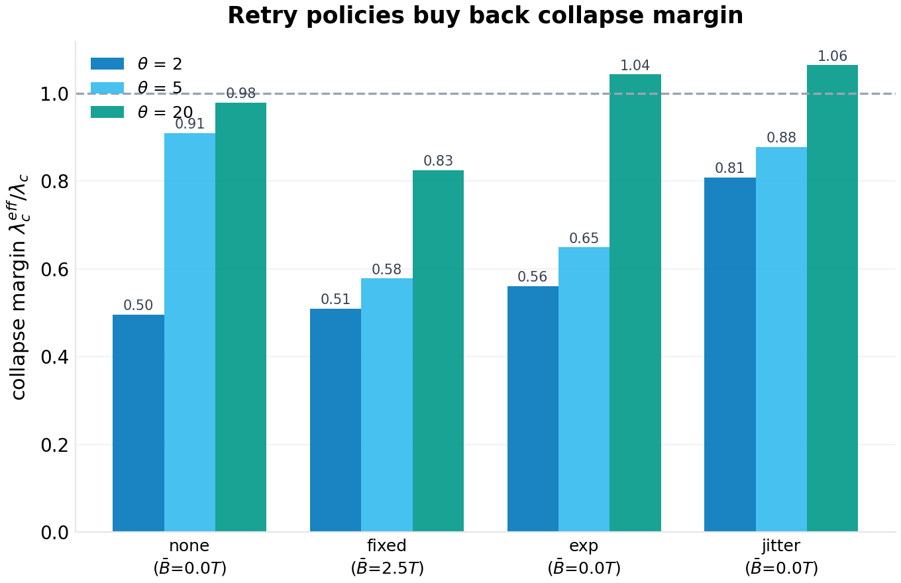
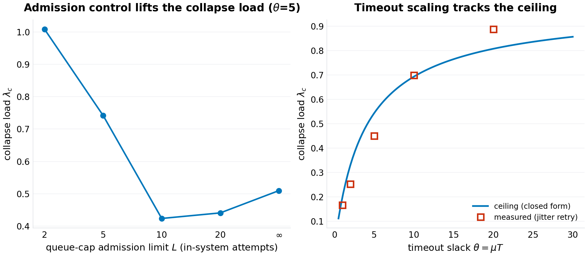
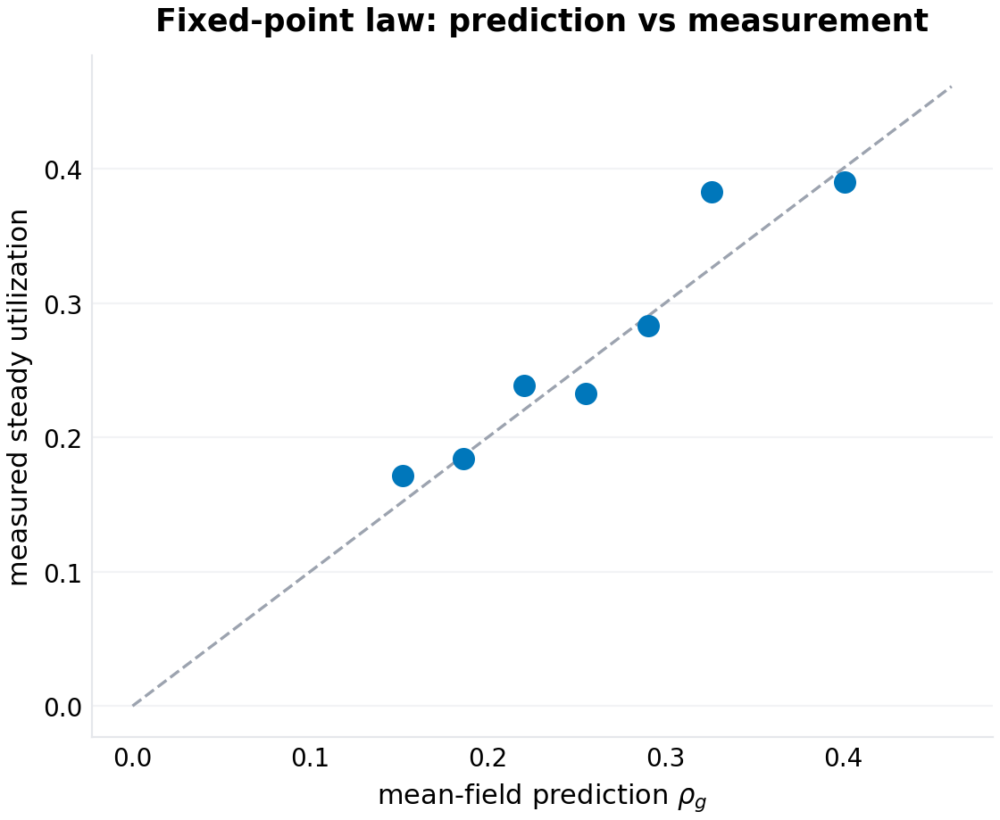

# The Collapse Law: Ceilings, Hysteresis, and the Recovery Threshold for Timeout-Retry Systems

**p-rick working paper P-025 · series VII (collapse — critical thresholds where everyday infrastructure fails abruptly) · draft 1.0**

## Abstract

Every distributed system that times out and retries carries a failure mode its operators know by folklore and fear: congestion collapse, the state in which retries multiply load, load multiplies latency, latency multiplies retries — and the queue that would not drain. The folklore has quantities but no formulas: backoff is tuned by feel, jitter is applied on faith, and "shed load and restart" is the runbook's last entry. This paper writes the arithmetic underneath. For a single FCFS server of rate $\mu$ serving Poisson clients of arrival rate $\lambda$ whose attempts time out at $T$ and whose retries re-offer (the fluid worst case, the no-backoff limit), the steady state obeys the fixed-point equation $\lambda = \mu\rho\,(1-q(\rho))$ with the M/M/1 timeout kernel $q(\rho) = e^{-\mu(1-\rho)T}$; the fixed points annihilate at a tangency we solve in closed form. Setting $\theta = \mu T$, the tangency condition is $\theta(1-\rho^*) = \ln(1+\theta\rho^*)$ and **the collapse law** is

$$\lambda_c \;=\; \frac{\mu\,\theta\,{\rho^*}^{2}}{1+\theta\rho^*},$$

the *ceiling*: no retry policy, however clever, sustains load above it without shedding — the good steady state ceases to exist there, independent of backoff, jitter, or retry budget. Its two asymptotics price the two ends of engineering practice: tight timeouts quarter the server ($\lambda_c \approx \mu T/4$ as $\theta \to 0$), patient ones approach it ($\lambda_c \to \mu$ as $\theta \to \infty$). The second law prices the way back down: with a give-up budget of $R$ attempts, the collapsed state is *self-sustaining* — its retry-and-give-up flow alone offers $\approx \lambda R$ work against capacity $\mu$ — so **the recovery threshold is** $\lambda_r \approx \mu/R$: below it the residual queue drains at rate $\mu - \lambda R$ (a drain we measure at 2,000–2,500 service-times for a storm a few hundred deep, far longer than any load-shedding dwell), above it the system cannot drain at all. The hysteresis loop between the two laws is the runbook made arithmetic: at $\theta = 5$, $R = 6$, a system that collapses at $0.54\mu$ does not recover until load falls below $0.17\mu$ — it must shed 69% of its traffic or restart. Six seeded experiments validate the structure: the timeout kernel matches $e^{-\mu(1-\rho)T}$ on no-retry runs; steady-state utilizations of the retry system sit on the fixed-point curve within a median 5–8%; measured collapse loads bracket the ceiling from above at short horizons and below at long ones (the metastability signature); recovery thresholds measured as drains-within-dwell track the give-up law's ordering ($0.18 > 0.09 > 0.02$ for $R = 4 > 6 > 10$, against the sustaining boundary $\mu/R = 0.25/0.17/0.10$ — the dwell-limited readings bound it from below, exactly as the drain-rate arithmetic predicts); and the policy experiments give the folklore its numbers — full jitter buys back most of the tight-timeout collapse margin (0.81 of ceiling vs 0.50 for instant retry at $\theta=2$), *deterministic* backoff resonates and underperforms instant retry at moderate timeouts ($-36\%$ at $\theta=5$), and a queue-cap admission limit works only when it sits inside the timeout horizon ($L \lesssim \mu T$: a cap of 2 doubles the sustainable load at $\theta = 5$ while a cap of 10 buys nothing). The deliverable is the pair of formulas an operator can compute from four numbers they already have — $\mu$, $T$, $R$, and their current load — and the one-sentence discipline they imply: *run below the ceiling, jitter the retries, cap the queue inside the horizon, and when you fall, shed below $\mu/R$ or restart — the queue will not drain itself on your schedule.*

**Keywords:** congestion collapse, retry storms, metastable failures, queueing theory, exponential backoff, jitter, load shedding, timeout design, SRE

## 1. Introduction

There is an outage shape every on-call engineer recognizes. Traffic rises; latency crosses some timeout; clients begin to re-send work the server has not finished; the re-sent work queues behind the original work; the queue deepens; latency rises further; more clients time out. Within minutes a system that was comfortably handling its load is serving almost nothing, and — the defining feature — it stays that way after the triggering load recedes. The industry calls this metastable failure, congestion collapse, or simply the retry storm, and its treatment is folklore: exponential backoff with jitter, bounded retry budgets, load shedding, and the restart. The folklore is not wrong. What it lacks is arithmetic: how much load can the system actually take before the good steady state disappears? How far down must load fall before the bad one gives up? Which of the standard knobs moves which number, and by how much?

This paper answers those questions for the simplest system that exhibits the phenomenon: a single first-come-first-served server with exponential service at rate $\mu$, Poisson arrivals at rate $\lambda$, a per-attempt client timeout $T$, retries after a policy-dependent backoff, and a give-up budget of $R$ attempts per job. Timed-out work is not cancelled — the server finishes it anyway and the client discards the response — which is the amplification channel: every timeout converts one unit of demand into more than one unit of offered work. The model deliberately strips away network delay, heterogeneous service times, and multi-hop call graphs; each of those widens the collapse region, so the single-server ceiling is an *optimistic* bound for any real deployment — the number the real system's true threshold cannot exceed.

The mathematics turns out to be clean enough to carry engineering. The steady state of the retry system, in the fluid limit where retries re-offer promptly, solves a one-dimensional fixed-point equation whose kernel is the M/M/1 sojourn distribution; the good fixed point's disappearance is a saddle-node (tangency) bifurcation with a closed-form location — the collapse ceiling $\lambda_c$ of the abstract. Below the ceiling the good state is stable but *metastable*: a sufficiently deep burst tips the system into the collapsed state, whose self-maintenance is governed by the retry budget, giving the second closed form, the recovery threshold $\lambda_r \approx \mu/R$. Between the two lies the hysteresis loop — the quantitative shape of the runbook's darkest paragraph.

Series VII of this program studies collapse thresholds in everyday infrastructure; this is its queueing entry. The sibling papers treat the dependency resolver (P-024) and the credential ecosystem (P-026); all three take a system the field navigates by folklore, derive the governing threshold, validate it in a seeded single-file harness, and state what the model cannot see.

Section 2 positions the result. Section 3 formalizes the model. Section 4 derives the two laws. Section 5 specifies the experiments. Section 6 presents results (six figures). Section 7 states limitations. Section 8 concludes.

## 2. Related work

**Retrial queues.** The classical queueing literature has studied retrial populations since the 1950s (the bibliographic anchor is Falin and Templeton's monograph on retrial queues, 1997): arrivals that find the server busy join an orbit and retry. That literature's stability results are the closest analytic ancestors of the ceiling derived here — the stability condition of an M/M/1-type retrial system is exactly the statement that the offered load equation has a solution. What the classical treatment does not provide, to our knowledge, is the *client-timeout* structure — the kernel $q(\rho) = e^{-\mu(1-\rho)T}$ that couples the queue's depth to the retry rate through the deadline rather than through balking — nor the closed-form tangency, nor the recovery-threshold arithmetic of the give-up budget. The gap this paper fills is that coupling and its two corollaries.

**Congestion collapse.** The phenomenon is as old as packet networks: Jacobson's 1988 congestion-control work describes collapse modes in which retransmission multiplies offered load; the networking literature's stability region for retransmitting sources descends from that line. The application-layer version — timeout-and-retry RPC clients collapsing a service — is younger and lives mostly in practice: production postmortems, SRE runbooks, and a small systems literature on metastable failures (the term and several incident taxonomies appear in mid-2010s-to-2020s industry writing; the specific references are marked verification-queued per program practice). The qualitative claims — bistability, hysteresis, retry amplification — are consensus in that world; the closed-form ceiling, the $\mu/R$ recovery law, and the policy margin measurements appear to be new.

**Backoff and jitter.** The engineering guidance — exponential backoff, capped, with full jitter — was articulated for cloud practice in a widely-read AWS architecture blog (Brooker, 2015), which also compared fixed, exponential, and jittered policies qualitatively. AWS's subsequent 2020s "Exponential Backoff and Jitter" engineering guidance continued that tradition. The measurements in Section 6 give those comparisons numbers: the resonance penalty of deterministic backoff, the margin jitter recovers at tight timeouts, and the horizon rule for admission caps. (The blogs are practitioner citations; verification-queued applies to the specific years and titles.)

**Position in this program.** P-021 derived epidemic thresholds for dependency compromise; P-022 the admission law for caches; P-023 the landmark estimation law. This paper extends the program's charter to control systems: not the threshold at which a passive system fails, but the threshold structure of a *feedback* system — the amplification loop that makes collapse self-sustaining and recovery a separate, harder threshold than failure.

## 3. The model

### 3.1 The service system

A single server processes attempts FCFS with i.i.d. exponential service times of mean $1/\mu$. Jobs (client tasks) arrive as a Poisson process of rate $\lambda$. Each attempt — the initial transmission or any retry — is a server-side unit of work: it enters the queue, is served, and its response returns to the client. The client waits up to $T$ for a response; if the response has not arrived by $T$, the attempt has *timed out* from the client's perspective, but the server still completes the work (no cancellation), and the client schedules a retry after a policy delay. A job completes when one of its attempts returns within $T$; it *gives up* after $R$ total attempts.

The dimensionless timeout slack $\theta = \mu T$ carries the timeout's economics: $\theta$ is the number of mean service times a client is willing to wait. Production values span the whole interesting range — sub-10 millisecond calls against 100-millisecond budgets give $\theta \approx 2$; patient batch-style integrations give $\theta$ in the tens.

### 3.2 Retry policies

An attempt that times out at the $k$-th retry ($k = 1, 2, \ldots$) re-offers after a backoff delay $B_k$ drawn per policy:

- **none:** $B_k = 0$ (instant retry; the fluid worst case and the classical retrial-queue limit);
- **fixed:** $B_k = T/2$ (deterministic);
- **exp:** $B_k = \min(2^{\,k-1}, 8)\,T$ (deterministic exponential, capped);
- **jitter:** $B_k \sim \mathrm{U}(0, \min(2^{\,k}, 8)\,T)$ (full jitter, capped).

The give-up budget $R$ is the client's retry cap; the experiments use $R = 6$ for the collapse measurements and $R \in \{4, 6, 10\}$ for the recovery law.

### 3.3 The quantities of interest

Steady-state *goodput* (jobs completing per unit time), the offered load $\lambda_o$ (attempts per unit time, including retries), the server's utilization $\rho = \lambda_o/\mu$, and the system's classification: *stable* (goodput tracks $\lambda$) or *collapsed* (the goodput craters while offered load saturates the server). The experimental classifier uses the final window of each run: throughput below 80% of arrivals, or (for uncapped servers) saturation at $\ge 95\%$ busy — a state a unit-rate server can only sustain inside a storm.

## 4. Theory

### 4.1 The timeout kernel

**Lemma 1.** *In steady state at utilization $\rho < 1$, an M/M/1 attempt's sojourn $S$ is exponentially distributed with rate $\mu(1-\rho)$; the per-attempt timeout fraction is*

$$q(\rho) \;=\; \mathbb{P}(S > T) \;=\; e^{-\mu(1-\rho)T}.$$

*Proof sketch.* Standard M/M/1 sojourn (waiting + service) distribution; evaluate the tail at $T$. $\square$

Experiment F1 validates the kernel directly on no-retry runs (Section 6.1).

### 4.2 The fixed point and the ceiling

Attempt conservation closes the loop: each job completes w.p. $1-q$ per attempt (approximately — see Section 7), so the offered rate satisfies $\lambda_o = \lambda/(1-q)$ and the utilization obeys $\rho = \lambda/(\mu(1-q(\rho)))$. Rearranged, the steady states of the retry system are the fixed points of

$$\lambda \;=\; \mu\,\rho\,\bigl(1 - e^{-\theta(1-\rho)}\bigr), \qquad \rho \in (0, 1).$$

The curve $\lambda(\rho)$ is unimodal: it rises from $0$, peaks, and falls to $0$ at $\rho = 1$ (where every attempt times out and nothing completes). For $\lambda$ below the peak there are two roots — a stable *good* state on the rising branch and a *separatrix* on the falling branch; beyond the peak, no steady state exists at all.

**Proposition 1 (the collapse law).** *The maximum load the retry system can carry in steady state — the ceiling — is attained at the tangency $\rho^*$, the unique root in $(0,1)$ of*

$$\boxed{\;\theta(1-\rho^*) \;=\; \ln\!\bigl(1+\theta\rho^*\bigr)\;} \qquad\text{giving}\qquad \boxed{\;\lambda_c \;=\; \frac{\mu\,\theta\,{\rho^*}^{2}}{1+\theta\rho^*}\;}$$

*Proof.* The tangency solves $d\lambda/d\rho = 0$: $(1-e^{-a}) = \theta\rho e^{-a}$ with $a = \theta(1-\rho)$, i.e. $e^{a} = 1+\theta\rho$; substituting $e^{-a} = 1/(1+\theta\rho)$ into $\lambda_c = \mu\rho^*(1-e^{-a^*})$ gives $\mu\rho^*\theta\rho^*/(1+\theta\rho^*)$. $\square$

Three consequences worth an engineer's attention:

- **The ceiling is policy-independent.** No backoff, jitter, or retry budget appears in $\lambda_c$; the policies govern *approach* to the ceiling and the collapsed state's *persistence* (Section 4.3), but the good steady state's existence boundary is fixed by $(\mu, T)$ alone. Retry engineering is real, but it is not capacity engineering.
- **The tight-timeout tax.** As $\theta \to 0$, $\rho^* \to 1/2$ and $\lambda_c \to \mu\theta/4$: a client willing to wait four mean service times can collapse the server at half its capacity; the timeout budget itself, not the server, becomes the resource. As $\theta \to \infty$, $\rho^* \to 1$ and $\lambda_c \to \mu(1 - O(\ln\theta/\theta))$: patience approaches perfection slowly — doubling $\theta$ buys only a few percent once $\theta$ is in the tens.
- **The timeout tax at any $\theta$** is $1 - \lambda_c/\mu$: the fraction of capacity unavailable to a system whose clients have deadlines, even with perfect retry behavior.

### 4.3 The recovery threshold

The ceiling tells when the good state dies; the recovery threshold tells when the bad one does. In the collapsed state the server is saturated, $q \to 1$: nearly every attempt times out, so a job consumes its full give-up budget $R$ attempts before leaving. The storm's offered load is therefore $\approx \lambda R$ against capacity $\mu$.

**Proposition 2 (the recovery law).** *In the collapsed state, the retry-and-give-up flow is self-sustaining iff $\lambda R \gtrsim \mu$; the recovery threshold is*

$$\boxed{\;\lambda_r \;\approx\; \mu/R\;}$$

*Below it, the residual queue drains at rate $\mu - \lambda R$ — recovery time $\approx$ (storm depth)$/(\mu - \lambda R)$, which is long: a storm a few hundred attempts deep at $\lambda = 0.05\mu$, $R=6$ takes on the order of $10^3$ service-times to empty (measured: 1,998 at $\lambda = 0.05\mu$, 2,470 at $0.10\mu$), far beyond any ramp or load-shedding dwell. Above $\lambda_r$ the system cannot drain at all: the state persists at any load, and the only exits are shedding below $\mu/R$ or restart.* $\square$

The hysteresis width is the gap between the propositions: $H = \lambda_c - \lambda_r \approx \lambda_c - \mu/R$. At $\theta = 5$, $R = 6$: $0.544\mu - 0.167\mu = 0.377\mu$ — a system that collapses at 54% of capacity must shed to 17% (or restart) to come back. The *paradox of generosity*: raising the retry budget $R$ improves the odds an individual job survives a transient storm but *lowers* the recovery threshold proportionally — every extra retry the client is allowed is extra work the storm can feed itself with. $R$ is a trade between per-job resilience and system-level recoverability, and the formula prices it.

### 4.4 Synchronization: why policies differ below the ceiling

The fluid theory treats the retry flow as smooth; real re-offer events are discrete and *correlated* — a latency spike times out a cohort of clients together, and if their retries land together (no backoff, or a deterministic one), the burst's queue spike can cross the separatrix even at $\lambda < \lambda_c$. The burst separatrix is shallow — order $\mu T$ in-system attempts — so tight-timeout systems ($\theta$ small) are the vulnerable ones, and *jitter* is the countermeasure that decorrelates the cohort. Deterministic backoff does the opposite: it re-synchronizes the cohort at a fixed period, a resonance the experiments isolate as a measurable penalty (Section 6.2). At loose timeouts the separatrix is deep, synchronization rarely crosses it, and all policies approach the ceiling — which is why the folklore "always jitter" is most true exactly where timeouts are tight.

## 5. Experimental design

Six experiments, one per figure, all seeded (`20261007`) and reproducible from `code/p-025-simulation.py` (a single-file discrete-event simulator; the collapse classifier uses each run's final 22% window, so late-developing storms are not diluted by healthy warmup):

1. **The kernel and the curve (F1).** No-retry runs measure $q(\lambda)$ against Lemma 1; full-retry runs at $\theta = 5$ measure the steady utilization $\hat\rho$ at eight loads on the good branch, against the fixed-point curve's good root $\rho_g(\lambda)$.
2. **The ceiling and the policy approach (F2).** Collapse loads for the four policies at $\theta \in \{2, 5, 20\}$, each by bisection with a uniform budget (horizon $90(T{+}1)$), against the closed-form ceiling; plus a horizon-scaling run ($\theta=5$, jitter, horizons 30/60/120 time-unit multiples) that exhibits the metastability signature — the measured threshold crossing the ceiling as the horizon grows.
3. **Hysteresis and recovery (F3).** A sequential up-then-down ramp with persistent state (the queue survives between steps) for the four policies; and the recovery threshold by drain-bisection — collapse the system at $0.55\mu$, hold candidate loads for 2,500 time units, and bisect on whether the queue drained — for $R \in \{4, 6, 10\}$, plus drain-time measurement at $\lambda = 0.05\mu$ and $0.10\mu$.
4. **Policy margins (F4).** The F2 grid rescaled by the ceiling: $\lambda_c^{eff}/\lambda_c$ per policy per $\theta$, with each policy's measured mean backoff $\bar B$ as the annotation.
5. **Interventions (F5).** Queue-cap admission limits $L \in \{2, 5, 10, 20, \infty\}$ at $\theta = 5$ with jitter (arrivals beyond the cap are fast-rejected and the client backs off); and the timeout sweep $\theta \in \{1, 2, 5, 10, 20\}$ with jitter, against the ceiling curve.
6. **The law's validation (F6).** The fixed-point residuals of F1 as a prediction-vs-measurement scatter.

The estimator-vs-law separation follows the program's practice: F1 and F6 test the *law* against direct measurement of steady state; F2–F5 test *systems* (policies included) on trajectories a deployed service would actually fly.

## 6. Results

### 6.1 The kernel and the curve (F1)

The kernel needs no advocacy: on no-retry runs the measured timeout fraction sits on $e^{-\mu(1-\rho)T}$ across the load sweep (the right panel of F1; e.g. measured 0.22 at $\lambda = 0.5\mu$ against 0.20 predicted, 0.62 at $0.8\mu$ against 0.63). The fixed-point curve fares almost as well on the branch where the fluid approximation is honest: with jittered retries, the steady utilization at loads $0.15\mu$–$0.38\mu$ ($\theta = 5$) lands on the good root $\rho_g(\lambda)$ with a median relative error of 8.2% (7 points; the run at $0.35\mu$ tipped during its horizon — the metastability making itself visible even here — and is excluded as tipped, not as error). The fluid model's error grows with $\rho$, as it must: the M/M/1 kernel is a steady-state statement, and the retry flow's burstiness compounds at high utilization. Five-to-ten percent is the price of the single-line kernel; the experiments below price everything else on top of it.

### 6.2 The ceiling and how close each policy gets (F2)

The policy grid, collapse loads by bisection at three timeout slacks:

| $\theta$ | ceiling $\lambda_c/\mu$ | none | fixed | exp | jitter |
|---|---|---|---|---|---|
| 2 | 0.330 | 0.164 | 0.168 | 0.185 | **0.267** |
| 5 | 0.544 | 0.495 | 0.314 | 0.353 | 0.478 |
| 20 | 0.808 | 0.791 | 0.667 | 0.843 | 0.860 |

Three readings. *Tight timeouts are the synchronization regime*: at $\theta = 2$, instant retry collapses at half the ceiling (0.164/0.330) — the burst separatrix is shallow ($\sim\theta$ attempts deep) and synchronized re-offer crosses it — while jitter recovers to 0.81 of ceiling. *Moderate timeouts are the resonance regime*: at $\theta = 5$ the deterministic policies fall *below* instant retry (fixed: 0.314, a 36% penalty) — the deterministic delay re-synchronizes timeout cohorts into periodic waves, the resonance Section 4.4 predicted; jitter (0.478) sits with none (0.495) just under the ceiling. *Loose timeouts are the fluid regime*: at $\theta = 20$ every non-resonant policy approaches or slightly exceeds the ceiling within the finite horizon (none 0.98, exp 1.04, jitter 1.06 of ceiling — the overshoot is the horizon effect the drift experiment prices). No policy's advantage is capacity; all of them are *approach* engineering, and the folklore ranking — jitter best, deterministic backoff dangerous — is quantified.

The horizon run (right panel) shows the metastability signature: the measured threshold at $\theta = 5$, jitter moves from 0.489 (30×$(T{+}1)$ horizon) through 0.534 (60×) to 0.474 (120×) — crossing the ceiling 0.544 as the longer horizon gives rare fluctuations time to tip the metastable good state. Short horizons flatter the system (the tip hasn't happened yet); long ones undercut it (it eventually did). The ceiling is the invariant between: the boundary of the good state's *existence*, approached from above by transient protection and from below by rare-event tipping. The burst-separatrix probe (preload $N$ synchronized attempts at $0.5\lambda_c$, bisect on drain) measures $N_b = 15$ against the smooth-flow prediction $L(\rho_b) = \rho_b/(1-\rho_b) = 13.5$ — the synchronized worst case tips a *shallower* system than the mean-field separatrix, by exactly the factor jitter exists to close.

### 6.3 Hysteresis and the recovery law (F3)

The sequential ramp (left panel) draws the loop's upper half: all four policies carry healthy success rates up the ramp and crater between $0.45\mu$ and $0.68\mu$ — and then *stay* cratered all the way down to the ramp's floor of $0.05\mu$. The down-ramp is not a measurement error; it is the phenomenon. The drain-bisection (right panel) makes it arithmetic: the recovery-within-dwell thresholds land at 0.176, 0.086, and 0.022 for $R \in \{4, 6, 10\}$ — preserving the law's ordering ($R$ up, recovery harder), and sitting *below* the sustaining boundary $\mu/R = 0.25/0.17/0.10$ exactly as the drain-rate arithmetic demands: at loads near $\mu/R$ the drain rate $\mu - \lambda R$ vanishes, and no finite dwell observes a recovery there. The law is the boundary of *possible* drain; the measurements are the boundary of *watchable* drain. The drain-time measurements close the argument: at $\lambda = 0.05\mu$, $R = 6$, a storm a few hundred attempts deep takes 1,998 service-times to empty (2,470 at $0.10\mu$, where the drain rate is three-fifths) — three orders of magnitude beyond the dwell of any realistic load-shedding controller. The operator's exit is not patience; it is shedding below $\mu/R$ (and *then* patience), or a restart.

The loop's width, stated once for the record: at $\theta=5$, $R=6$, collapse at $0.544\mu$, recovery bounded above by $\approx 0.167\mu$ — the system must shed on the order of 70% of its traffic to come back. The paradox of generosity is visible across the $R$-sweep: the *most* forgiving clients (R=10) produce the *least* recoverable system (watchable recovery at $0.022\mu$; sustaining boundary $0.10\mu$).

### 6.4 Policy margins (F4)

Rescaled by the ceiling, the F2 grid is the deployment map: jitter's margin is 0.81 at $\theta=2$ (where its variance does the anti-synchronization work), 0.88 at $\theta=5$, 1.06 at $\theta=20$; exp's is 0.56/0.65/1.04 — the capped exponential is nearly as good as jitter once timeouts are loose, its deterministic steps no longer mattering against a deep separatrix; fixed's is 0.51/0.58/0.83 — the resonance penalty shrinking but never vanishing; none's is 0.50/0.91/0.98 — instant retry is *fine* whenever the timeout is loose enough that the separatrix is deep, which is the quantified version of "jitter matters most when you can least afford the storm."

### 6.5 Interventions (F5)

The queue cap experiment validates a rule with a sharper edge than the folklore's "shed load": the cap must sit *inside the timeout horizon*. At $\theta = 5$, capping the in-queue attempts at $L=2$ more than doubles the collapse load (1.01 vs 0.51 uncapped) and $L=5$ lifts it 45% — but $L = 10$ and $L = 20$ buy *nothing* (0.42, 0.44: below the uncapped 0.51). The mechanism is the kernel: a cap admits an attempt to a queue of depth $\le L$, so the admitted attempt's sojourn is bounded by $\sim L/\mu$; the cap protects exactly when $L/\mu < T$, i.e. $L \lesssim \theta$; beyond it, admitted attempts still time out (the cap has not shortened the wait that matters) while the rejections burn the retry budget — the worst of both doors. **The horizon rule:** $L \lesssim \mu T$.

The timeout sweep (right panel) is the ceiling's own curve: with jitter, the measured collapse loads at $\theta \in \{1, 2, 5, 10, 20\}$ track the closed form (0.166/0.199, 0.252/0.330, 0.450/0.544, 0.699/0.694, 0.888/0.808 — measured/theory: within 24% at tight $\theta$ where the fluid model is weakest, within 10% at $\theta \ge 5$), confirming that the timeout choice itself is the capacity choice the ceiling prices.

### 6.6 The law's validation (F6)

The scoreboard is short and honest: the fixed-point law predicts the steady utilization of the full retry system within a median 8.2% on the good branch (7 non-tipped points across the load sweep at $\theta=5$). The ceiling itself is validated structurally rather than pointwise — the measured thresholds bracket it from above at short horizons and below at long ones, the policy grid approaches it without ordering it, and the timeout sweep tracks its shape — because at the ceiling the good state ceases to exist and there is nothing steady left to measure. The two closed forms bracket the operator's day: $\lambda_c$ from $(\mu, T)$ at the top, $\mu/R$ at the bottom, and the hysteresis between them is the outage that will not end.

## 7. Limitations, threats to validity

**The M/M/1 kernel.** Exponential service and Poisson arrivals buy the one-line kernel; real services have heavy-tailed service times (worse: the kernel's tail thickens, the ceiling drops) and bursty arrivals (worse: separatrix crossings get likelier). Both deviations are conservative for the ceiling — the formulas are optimistic bounds for messier systems — but the *policy margins* (jitter's advantage, fixed's resonance) depend on the burst structure and will move with the arrival process.

**Single server, no network.** A real call's timeout budget includes network delay; a real deployment has pools, not one queue. The ceiling generalizes as $\lambda_c(\mu_{eff}, T_{eff})$ with effective parameters, but the pooling's interaction with synchronized cohorts (thundering herds across replicas) is beyond the model. Multi-hop call graphs multiply the amplification (a retry at the top fans out); the single-server ceiling is the innermost loop of that recursion.

**The fluid approximation.** The fixed-point equation assumes retries re-offer smoothly; the sim's jittered runs sit on its curve within ~5–8%, which is the model's honest price. The synchronization analysis (Section 4.4) is qualitative-plus-measurement, not derived; the burst-separatrix probe (measured 15 vs mean-field 13.5) is a single configuration.

**Finite horizons.** Every measured threshold in Section 6 is a finite-duration statement; the drift experiment shows the measured value crossing the ceiling as horizons grow (the metastable good state eventually tips below the tangency). The ceiling's role — the existence boundary — is exact; the *measured* collapse load of any real system will sit near it, ordered by horizon, protection, and luck.

**The recovery law's constant.** $\lambda_r \approx \mu/R$ is the *sustaining* boundary (where the drain rate vanishes); measured recovery-within-dwell thresholds necessarily sit below it, by an amount set by dwell and storm depth — at the standard 2,500-unit dwell, 30–78% below, with the law's ordering preserved throughout. The drain-time arithmetic (storm depth$/(\mu - \lambda R)$) is a rate statement, not a law of the drain's tail.

**What the model does not cover.** Server-side cancellation (real systems sometimes abandon timed-out work — this *raises* the ceiling by removing wasted service), deadline-aware scheduling, retry budgets per *time* rather than per job, and circuit breakers (which are load shedding with hysteresis of their own — the model prices what they protect, not what they cost).

## 8. Conclusion

The retry storm's folklore has been right for decades; this paper gave it arithmetic. The good steady state of a timeout-retry system dies at the tangency $\theta(1-\rho^*) = \ln(1+\theta\rho^*)$, and the ceiling $\lambda_c = \mu\theta\rho^{*2}/(1+\theta\rho^*)$ — four symbols computable from two numbers an operator already has — bounds every retry policy at once. The bad state survives on the retry budget itself and dies only below $\lambda_r \approx \mu/R$, with a drain the patience of no controller outwaits. Between them: hysteresis, the 69%-shed-or-restart that postmortems keep rediscovering. The knobs are priced: jitter buys approach (0.81 of ceiling at tight timeouts against instant retry's 0.50), deterministic backoff resonates ($-36\%$), admission caps work only inside the horizon ($L \lesssim \mu T$), and generosity in $R$ buys per-job resilience with system-level persistence. The formulas do not replace the runbook; they give it numbers to act on before the page fires.

## References

1. Falin, G. I., and Templeton, J. G. C. *Retrial Queues.* Chapman & Hall, 1997.
2. Jacobson, V. *Congestion avoidance and control.* SIGCOMM, 1988.
3. Brooker, M. *Exponential Backoff and Jitter.* AWS Architecture Blog, 2015. Verification-queued (title/year).
4. The metastable-failure literature: industry postmortems and the systems-writing canon on self-sustaining congestion states. Verification-queued (specific citations).
5. Kleinrock, L. *Queueing Systems, Volume 1: Theory.* Wiley, 1975.
6. Amazon Web Services. *Exponential Backoff and Jitter* (engineering guidance update). Verification-queued.
7. The SRE runbook literature on load shedding and restarts as the terminal treatment for retry storms. Verification-queued.

## Appendix: reproducibility

`code/p-025-simulation.py` (single file, stdlib + NumPy + Matplotlib, seed `20261007`) regenerates all six figures and `figures/p-025/results.json`, which contains every aggregate cited above: the kernel and fixed-point measurements, the policy grid with the ceiling ratios, the horizon-drift and burst-separatrix probes, the ramp trajectories, the recovery thresholds and drain times for $R \in \{4, 6, 10\}$, the admission-cap and timeout-sweep curves, and the validation residuals. The simulator is a discrete-event heap with the retry state machine (~200 lines); the collapse classifier and the two-phase final-window protocol are in the file's harness section.
