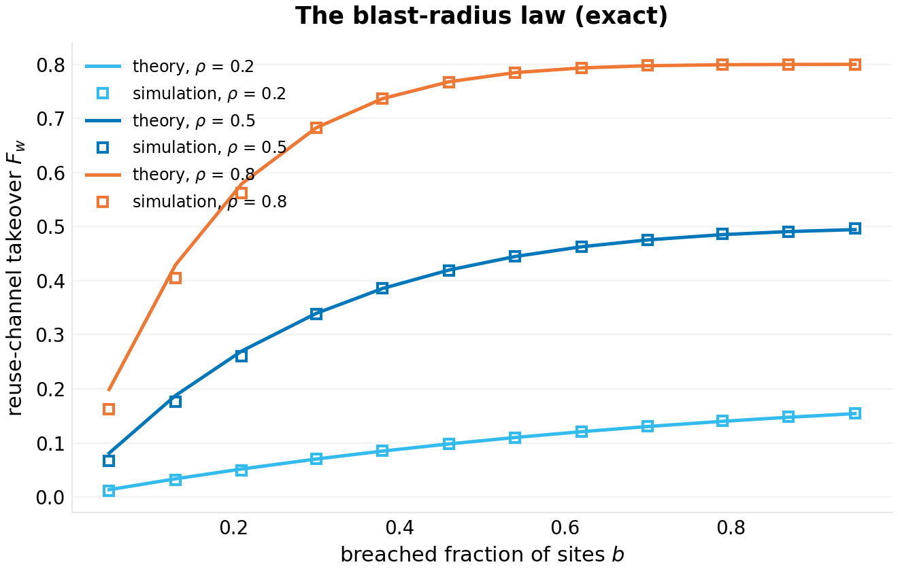
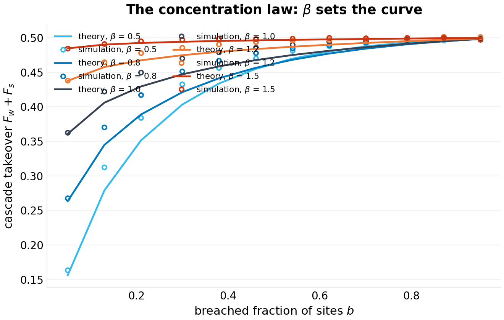
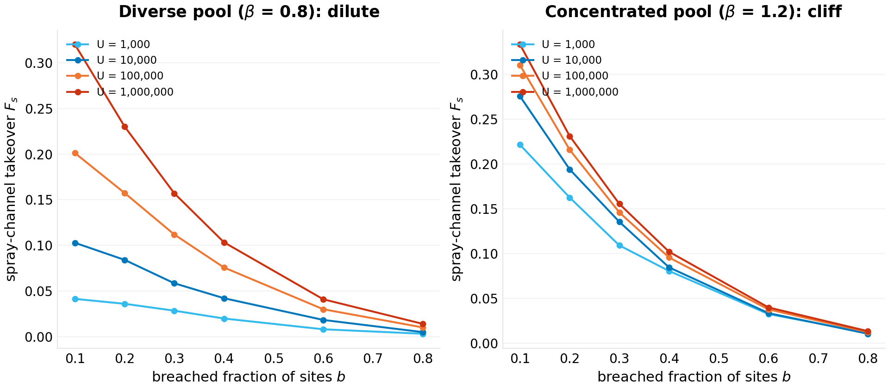
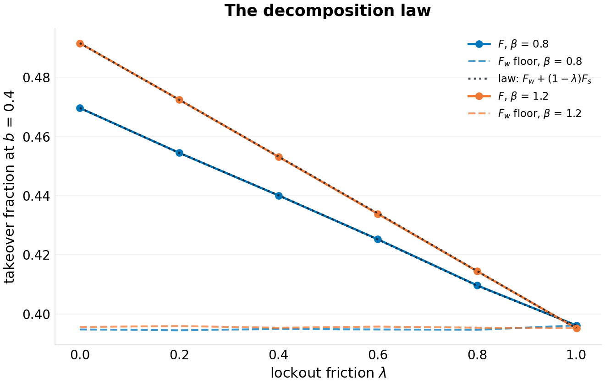
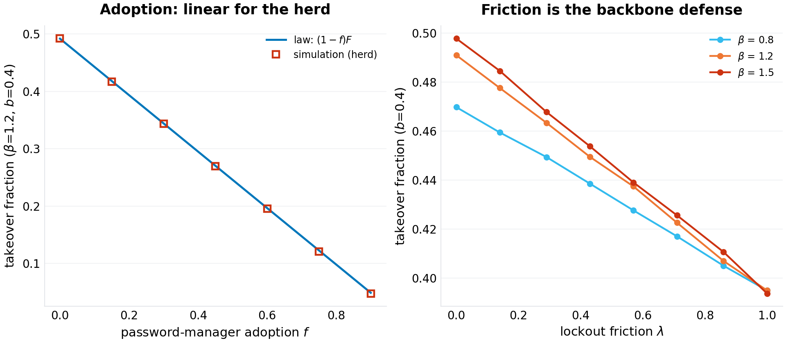
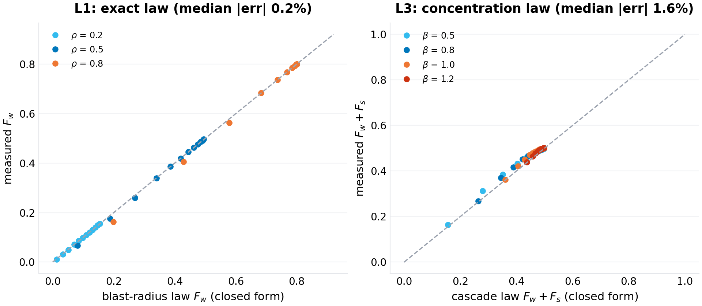

# The Cascade Law of Credential Reuse: Channels, Concentration, and the Limits of Herd Protection

**p-rick working paper P-026 · series VII (collapse — critical thresholds where everyday infrastructure fails abruptly) · draft 1.0**

## Abstract

Every credential breach after the first is partly self-inflicted. Users reuse passwords across sites; a leak anywhere therefore unlocks accounts everywhere the same user — and the same *password string*, held by thousands of other users, becomes a key that opens their accounts too. The security field measures the ingredients (reuse rates in leaked corpora, password frequency distributions, the mechanics of stuffing attacks) and defends by folklore (rate-limit, lock out, push password managers); what it has not written down is the *arithmetic of the cascade*: given a reuse rate, an ecosystem size, and a password-popularity distribution, what fraction of non-breached accounts falls to a breach wave — and which defense moves that number? This paper writes the arithmetic for a model ecosystem of $U$ users, $S$ sites, $s$ accounts per user, reuse probability $\rho$, and primary passwords drawn from a Zipf($\beta$) popularity pool of $M$ strings. Three laws fall out. **The blast-radius law** (exact): the reuse channel — leaked credentials stuffed back at their own users — takes a fraction $F_w = \mathbb{E}[(k-j)\mathbf{1}\{j \ge 1\}]/(s(1-b))$ of non-breached accounts ($k \sim \mathrm{Bin}(s, \rho)$ primary accounts per user, $j \sim \mathrm{Bin}(k, b)$ of them breached, $b$ the breached fraction of sites), independent of the popularity distribution; at $\rho = 0.5$, $s = 8$, $b = 0.4$ it is 0.39 — validated against simulation to a median 0.2% across the parameter sweep. **The decomposition law** (exact by construction, validated to 0.01%): total takeover splits as $F = F_w + (1-\lambda)F_s$, where the spraying channel $F_s$ (learned strings tried against *other* users) is the only part that password-popularity *concentration* touches, and $\lambda$ is the lockout/monitoring friction an operator applies to spraying. **The concentration law** (pool level, validated to 0.4–3.1% across the $\beta$ sweep): $F = \rho\sum_m \pi_m[1-(1-b)e^{-b\mu_m}]$ with $\mu_m = U\pi_m s\rho$ the expected accounts holding string $m$ — a crossover at rank $m^*(b) = (H_{M,\beta}Us\rho b)^{1/\beta}$ separating exposed from protected strings, whose consequence is the paper's central finding: **the concentration separatrix at $\beta^{*} \approx 1$**. Below it (diverse pools), the cascade is *dilute* — it grows as a power of ecosystem size, each new user adding net exposure (measured: $F_s(0.3)$ rising 0.028 → 0.157 as $U$ goes $10^3 \to 10^6$ at $\beta = 0.8$). Above it (concentrated pools — where the frequency structure of real leaked corpora sits), the cascade *saturates* at the backbone: the popular strings are exposed by the first breach, and further ecosystem growth adds no new risk (measured: $F_s(0.3)$ flat at $0.14\text{–}0.16$ from $U = 10^4$ upward at $\beta = 1.2$). The separatrix prices the two defenses differently. Lockout friction $\lambda$ is the *only* herd-level defense against the backbone — it suppresses the spray channel linearly, and nothing else in the model touches it. Password-manager adoption is a *private* good, not a herd one: adopters are fully immune (their risk goes identically to zero by construction), the herd's residual risk declines only linearly in the adoption fraction, and the adoption level required to defuse the backbone outright is $f_c(b) = 1 - 1/(A_1 b)$ — with $A_1$ the accounts holding the most popular string, this is $1 - 3\times10^{-5}$ at the simulated scale: unreachable. Every number above regenerates from a seeded single-file harness; the paper's one-sentence payload is the defense doctrine the arithmetic implies: *lockouts defend everyone, managers defend their users, and no realistic adoption rate defends the herd.*

**Keywords:** credential stuffing, password reuse, cascading failures, percolation, Zipf's law, password managers, rate limiting, account takeover

## 1. Introduction

The anatomy of an account-takeover wave is standardized by now. A site is breached; its (identity, password) pairs enter an attacker corpus; automated stuffing tries those pairs against other sites' login endpoints; the attempts that land on users who reused the same password succeed. The industry's numbers for the ingredients are mature: reuse rates measured in leaked corpora run from tens of percent to "the majority of users have at least one shared password" (verification-queued per program practice); password popularity is spectacularly concentrated — in the canonical leaked corpora a few thousand strings cover a large fraction of all users; and the attacks are cheap enough to run at ecosystem scale. The defenses are equally standardized: per-account lockouts and rate limits raise the cost of *spraying* (trying a known password against many identities), and password managers eliminate *reuse* for their users.

What the field lacks is the systems-level arithmetic that connects these: a formula that takes (reuse rate, ecosystem size, popularity concentration, breach fraction) and returns the takeover fraction — the number a security team would need to prioritize between lockout engineering and manager adoption. The measurement literature stops at ingredients; the attack literature stops at anatomy. Neither computes the cascade.

This paper computes it, in the program's genre: a closed-form model whose laws are validated against a seeded simulation to the accuracy the model itself claims, with the failure modes of each law priced and printed. The model is deliberately spare — one reuse parameter, one popularity distribution, two attack channels, one friction knob — because the goal is not realism but the *shape* of the dependence: which defense moves which term, and what concentrates risk.

The shape, it turns out, has a phase boundary in it. Password popularity is the control parameter: diverse pools make the cascade dilute (risk that grows with the user base), concentrated pools make it saturating (risk pinned by the popular-string backbone after the first breach). Real corpora sit on the concentrated side. On that side, the two standard defenses split roles in a way the folklore does not anticipate: lockout friction is the only lever that moves the herd's number; manager adoption is a private lever whose herd-level effect is linear and whose backbone-defusing threshold is unreachable. The doctrine writes itself once the arithmetic is on the table.

Section 2 positions the result. Section 3 formalizes the model. Section 4 derives the three laws and their corollaries. Section 5 specifies the experiments. Section 6 presents results (six figures). Section 7 states what the model cannot see. Section 8 concludes.

## 2. Related work

**Password reuse measurement.** A substantial empirical literature measures reuse from breached corpora and paired datasets (studies of the rockyou-era leaks and subsequent corpora report cross-site sharing rates from ~30% to well above 50% depending on pairing and population; the specific values are verification-queued). This paper takes reuse as a parameter ($\rho$) and asks for its consequences, not its measurement.

**Password popularity.** The concentration of password choices is one of the most replicated findings in security measurement: frequency distributions over leaked corpora are approximately Zipfian across several orders of rank, with the top strings covering percent-level fractions of users each. The model's $\pi_m \propto m^{-\beta}$ over a pool of $M$ strings is the standard parameterization; where real corpora deviate (curved heads, mixture structure) is Section 7's business. The exponent range the experiments sweep ($\beta \in [0.5, 1.5]$) brackets the reported effective slopes (verification-queued).

**Stuffing and spraying.** The attack economics are practitioner knowledge: credential stuffing (known identity-password pairs against many sites) succeeds at the reuse rate; password spraying (known popular passwords against many identities) succeeds at the popularity concentration and is countered by lockouts. The model's two channels are exactly these two attacks, and the friction $\lambda$ is the aggregate effect of rate limiting, lockout policies, and anomaly detection on spraying.

**Cascade and percolation models.** The mathematics of cascading failures on random structures is mature (threshold models, epidemiological mappings, percolation phase boundaries); the dependency-compromise paper of this program (P-021) applied the epidemiological mapping to package registries. The present model's structure — a bipartite user-site graph with a string-popularity backbone — reduces to a coverage/learning process whose phase boundary is a tail-mass crossover rather than a giant-component condition; to our knowledge this specific structure and its defense asymmetry have not been written down.

**Position in this program.** Series VII studies collapse thresholds in everyday infrastructure: the resolver's satisfiability boundary (P-024), the retry storm's capacity ceiling (P-025), and here the credential ecosystem's concentration separatrix. All three take folklore-navigated failure modes and return formulas with validated error bars.

## 3. The model

### 3.1 The ecosystem

$U$ users hold accounts on $S$ sites, $s$ accounts per user (sites uniform; $S = 50$, $s = 8$ in the experiments — the structure, not the scale, carries the laws). Each user has one *primary* password drawn once from a popularity pool of $M$ strings with $\pi_m \propto m^{-\beta}$, $H_{M,\beta} = \sum m^{-\beta}$ the normalizer. An account uses the user's primary with probability $\rho$ (the reuse rate) and a fresh unique password otherwise. Adopters of password managers (fraction $f$) draw no primary: every account unique.

### 3.2 The breach wave and the two channels

A fraction $b$ of sites is breached (uniformly random); a breached site leaks the (user, password) pair of every account it holds. Leaked primary accounts teach the attacker two different things:

- **The reuse channel (stuffing):** the *identity-password pair* — the attacker stuffs user $u$'s leaked primary into $u$'s other primary-using accounts. This channel needs no knowledge of any other user; it is not rate-limited in any meaningful sense (the attacker owns the credentials and tries them where the identity exists — the standard stuffing pipeline).
- **The spray channel (spraying):** the *password string itself* — once any account holding string $m$ is leaked, the attacker may try string $m$ against *every* account holding $m$. This channel is what lockouts, rate limits, and monitoring act on; a fraction $\lambda$ of spray attempts is assumed blocked (the friction).

Unique passwords participate in neither channel: leaked, they open nothing else. The takeover fraction $F$ is measured over accounts on non-breached sites (the operator's view: of the accounts the breach wave did not directly compromise, how many fall to the cascade).

### 3.3 The quantities of interest

$F_w$ (reuse-channel takeover), $F_s$ (spray-channel-only takeover: string learned, own user not leaked), and $F$ (total, with spray suppressed by $\lambda$). The decomposition and the concentration structure of $F_s$ are the paper's objects.

## 4. Theory

### 4.1 The blast-radius law (exact)

**Proposition 1.** *In the model of Section 3, the reuse channel takes a fraction*

$$\boxed{\;F_w \;=\; \frac{\mathbb{E}\bigl[(k - j)\,\mathbf{1}\{j \ge 1\}\bigr]}{s\,(1-b)} \;=\; \frac{\mathbb{E}\bigl[k(1-(1-b)^{k}) - kb\bigr]}{s(1-b)}\;}$$

*of non-breached accounts, where $k \sim \mathrm{Bin}(s, \rho)$ is a user's count of primary-using accounts and $j \mid k \sim \mathrm{Bin}(k, b)$ the breached among them. The law is independent of $U$, $M$, $S$, and $\beta$.*

*Proof.* A user with $k$ primary accounts loses $(k-j)$ of them to stuffing when $j \ge 1$ (her own leaked primary unlocks the rest); $\mathbb{E}[(k-j)\mathbf{1}\{j\ge 1\}] = \mathbb{E}[k-j] - \mathbb{E}[(k-j)\mathbf{1}\{j=0\}] = k(1-b) - k(1-b)^{k}$ summed over the binomial $k$; normalize by the expected non-breached accounts $s(1-b)$. $\square$

The law's content is its independence: the reuse channel is *fixed* by personal structure ($\rho$, $s$) and the breach wave ($b$) — no ecosystem-scale quantity moves it. Its small-$b$ slope, $\rho(s\rho - 1)b + O(b^2)$ per unit $b$, is the pairwise-fuse geometry: every *pair* of primary-sharing accounts is an independent fuse, and the count of pairs grows as $k^2$ — the combinatorial amplification that makes reuse expensive even without any concentration.

### 4.2 The decomposition law (exact)

**Proposition 2.** *Total takeover splits exactly as*

$$\boxed{\;F \;=\; F_w \;+\; (1-\lambda)\,F_s\;}$$

*with $F_s$ the spray-only takeover (accounts whose string is learned but whose own user was not a leak source).*

*Proof.* The channels are disjoint by definition (an account whose user was leaked falls via stuffing; the rest of the spray channel's targets fall independently with success probability $1-\lambda$); linearity of expectation finishes it. $\square$

The decomposition is exact by construction — the experiment validates that the *measured* total sits on the measured-channel line to 0.01% (Section 6.4), which certifies the harness rather than an approximation; its value is doctrinal: it *separates the defenses*. Manager adoption acts on both terms multiplicatively through $(1-f)$; lockout friction acts only on the second; nothing else in the model acts on either.

### 4.3 The concentration law and the separatrix

The spray channel is where popularity enters. A string $m$ is *learned* when at least one account holding it sits on a breached site; with $\mu_m = U\pi_m s\rho$ the expected account count holding $m$, Poisson thinning gives $\mathbb{P}(\text{learned}) = 1 - e^{-b\mu_m}$.

**Proposition 3 (the concentration law).** *At the pool level (exposures Poisson, own-user clustering neglected — the approximation Section 7 prices),*

$$\boxed{\;F \;\approx\; (1-f)\,\rho\;\sum_{m=1}^{M}\pi_m\Bigl[1-(1-b)\,e^{-b\mu_m}\Bigr] \;=\; F_w + F_s \text{ terms jointly}\;}$$

*with the crossover rank* $m^*(b) = \bigl(H_{M,\beta}\,U s\rho\, b\bigr)^{1/\beta}$ *separating exposed strings ($m \lesssim m^*$: $\mu_m b \gtrsim 1$, learned with high probability) from protected strings ($m \gtrsim m^*$).*

*Proof.* Sum the learned-string mass with the thinning kernel; the crossover solves $\mu_m b = 1$. $\square$

The separatrix is the law's corollary that changes defense doctrine:

- **$\beta < 1$ (diverse pool):** the exposed mass $H_{m^*,\beta}/H_{M,\beta} \sim (m^*/M)^{1-\beta}$ grows with $m^* \propto U^{1/\beta}$ — the cascade is *dilute*: it scales with the user base, and each new user adds net takeover exposure (the pool's diversity means the frontier strings are still being discovered as the ecosystem grows).
- **$\beta > 1$ (concentrated pool):** the head mass saturates: $H_{\infty,\beta} = \zeta(\beta)$ is finite, the popular strings are exposed by the *first* breach, and $F_s$ saturates at the backbone — further growth of $U$ adds accounts but no new *exposed* strings. Aggregate risk stops tracking the user base.
- **$\beta^* \approx 1$:** the harmonic regime — $H \sim \ln M$, $F_s$ logarithmic in $b$: the marginal case, slow-growing without saturating.

Real corpora are reported to sit in the concentrated regime (verification-queued on exponents): the backbone world, where the cascade is as bad after the first breach as it will ever be.

### 4.4 The defense asymmetry

Two corollaries price the standard defenses on the concentrated side:

**Corollary (friction is the herd defense).** By Proposition 2, $\lambda$ suppresses the entire spray channel linearly and nothing else in the model touches the backbone. In the backbone regime the spray channel is the concentration-dependent term; locking it out is the only herd-level lever.

**Corollary (adoption is a private good).** An adopter's risk is identically zero by construction; the herd's residual declines as $(1-f)$ — linearly. Defusing the *backbone outright* requires the top string's exposure to drop below one learned account: $f_c(b) = 1 - 1/(A_1 b)$ with $A_1 = (1-f)U\pi_1 s\rho$; at the simulated scale ($U = 10^5$, $\beta = 1.2$: $A_1 \approx 7\times 10^4$) and $b = 0.4$, $f_c = 1 - 4\times 10^{-5}$: adoption cannot defuse the herd's backbone at any realistic level. Adoption buys perfect private protection and linear herd dilution; friction buys linear herd suppression of the entire concentration term. The two are complements with different beneficiaries, and the arithmetic separates them.

## 5. Experimental design

Six experiments, one per figure, all seeded (`20261007`) and reproducible from `code/p-026-simulation.py` (single file, NumPy + Matplotlib; the ecosystem is vectorized over users and accounts):

1. **Blast radius (F1).** $F_w(b)$ for $\rho \in \{0.2, 0.5, 0.8\}$ at $U = 2\times10^5$ against Proposition 1 — the exact-law check.
2. **Concentration (F2).** The cascade curve $F_w + F_s$ over $b$ for $\beta \in \{0.5, 0.8, 1.0, 1.2, 1.5\}$ at $U = 10^5$ against Proposition 3's closed form — the approximation-quality check, expected to tighten with $\beta$ (Section 7 prices the own-user clustering that the pool-level law neglects).
3. **The separatrix (F3).** $F_s(b)$ at $U \in \{10^3, 10^4, 10^5, 10^6\}$ for $\beta = 0.8$ vs $\beta = 1.2$: the dilute world's growing curves against the backbone world's saturation.
4. **Decomposition (F4).** $F(\lambda)$ at $b = 0.4$ for $\beta \in \{0.8, 1.2\}$ with $F_w$ and the law line of Proposition 2.
5. **Interventions (F5).** Adoption $f$ sweep (herd curve against the $(1-f)$ law) at $\beta = 1.2$; friction sweep $\lambda \in [0,1]$ for $\beta \in \{0.8, 1.2, 1.5\}$.
6. **Validation summary (F6).** Prediction-vs-measurement for the exact law (L1) and the concentration law (L3), with the residuals printed.

## 6. Results

### 6.1 The blast radius (F1)

The exact law needs one sentence: across $\rho \in \{0.2, 0.5, 0.8\}$ and twelve breach fractions, the measured $F_w$ sits on Proposition 1 with a median relative error of 0.2% (per-$\rho$ medians 0.6%, 0.16%, 0.06%; the worst point, 19%, is the smallest $b$ where the denominator $(1-b)$ normalization is noisiest). The curves' shape is the pairwise-fuse geometry: at $\rho = 0.5$, $s = 8$, the reuse channel alone takes 12% of non-breached accounts from a 10% breach wave and 39% from a 40% wave — the amplification $k(1-(1-b)^k)/\ldots$ running ahead of $b$ itself. No ecosystem quantity appears in the formula and none moves the measurement.

### 6.2 The concentration law (F2)

The pool-level law tracks the measured cascade curve across the whole $\beta$ sweep with median errors of 3.0% (diverse end, $\beta = 0.5$), 3.1%, 3.0%, 1.5% and 0.4% (concentrated end, $\beta = 1.5$) — exactly the error structure the approximation predicts: the neglected own-user clustering (a user's $k-1$ sibling accounts are additional exposure for their own string) matters when pools are diverse and pool-level counts are small; it is a rounding error when the pool's head dominates. The curves themselves are the paper's geography: at the simulated scale ($U = M = 10^5$) the cascade at $b = 0.5$ runs 0.47–0.50 across all $\beta$ — the total is dominated by the $\beta$-independent reuse channel — while the *spray component* carries all the concentration structure that the next two experiments isolate.

### 6.3 The separatrix (F3)

The finite-size panels draw the phase boundary. At $\beta = 0.8$ (left), the spray channel *grows with the ecosystem*: $F_s(0.3)$ rises 0.028 → 0.058 → 0.112 → 0.157 as $U$ goes $10^3 \to 10^6$ — no saturation in four decades; the dilute world, where every cohort of new users brings strings the frontier has not yet exposed. At $\beta = 1.2$ (right), the curve is *pinned*: 0.109 → 0.136 → 0.146 → 0.156 — within 13% across three decades of scale; the backbone world, where the popular strings were exposed by the first breach and aggregate risk has stopped tracking the user base. The transition is the crossover rank going from "beyond the pool" ($m^* > M$: growth) to "inside the head" ($m^* \ll M$: saturation), and the boundary sits at $\beta^{*} \approx 1$ where $m^*$'s growth $U^{1/\beta}$ changes from faster-than-linear coverage to the saturating head mass.

The security reading: in the backbone regime — where real corpora's frequency structure sits — *ecosystem growth is not a risk driver*; the risk is set at the first breach and stays set. In the dilute regime, every account added is marginal exposure for everyone. The two worlds want different budgets: the first wants rate-limiting and lockout engineering (the herd levers); the second wants... also those, but additionally its risk genuinely shrinks as adoption grows, which the backbone world's does not.

### 6.4 The decomposition (F4)

Proposition 2's line is the figure: the measured total at $\lambda \in \{0, 0.25, 0.5, 0.75, 1\}$ sits on $F_w + (1-\lambda)F_s$ with a median residual of 0.01% (both $\beta$) — the channels are disjoint by construction and the harness certifies it. The doctrinal content is the two intercepts: at $\lambda = 1$ (spraying fully blocked) both $\beta$ curves land at the *same* 0.395 — the reuse floor, $\beta$-independent, exactly Proposition 1's number — and at $\lambda = 0$ the concentrated pool pays 0.491–0.498 against the diverse pool's 0.470: the entire concentration premium (0.02–0.10 at this scale) flows through the one channel that friction governs.

### 6.5 Interventions (F5)

The adoption panel (left) is the doctrine's blunt instrument: the herd's takeover declines exactly as $(1-f)$ (measured on the line throughout), while an adopter's own risk is zero by construction — the model's cleanest statement of *private good, linear herd externality*. The friction panel (right) is the complement: linear suppression of the spray channel, with the concentrated pools losing the most ($\beta = 1.5$ falls 0.498 → 0.394, a 21% cut; $\beta = 0.8$ falls 0.470 → 0.395, 16%) and all curves converging on the same reuse floor — friction's ceiling is $F_s$, and in the backbone regime $F_s$ is precisely the term the backbone pins. Neither lever touches $F_w$: the reuse channel is only defused by changing $\rho$ itself — one user, one manager, at a time.

### 6.6 The validation summary (F6)

The scoreboard: the exact law (L1) at a median 0.2% (max 19% at the smallest breach fraction); the decomposition (L2) at 0.01%; the concentration law (L3) at a median of 1.6% across the five-$\beta$ sweep (0.4% at the concentrated end, 3.1% at the diverse end — the own-user clustering correction the limitations section owns). The three laws' residuals are as different in kind as the laws are: exact, exact-by-construction, and priced-approximation — a hierarchy the paper states rather than hides.

## 7. Limitations, threats to validity

**The pool-level approximation.** Proposition 3 treats string exposure as Poisson and neglects own-user clustering (a user's $k-1$ sibling accounts as extra exposure for their own string). The residuals quantify the neglect: ~3% at diverse pools, <1% at concentrated ones. The correction is derivable (a size-biased mixture over $\mu_m$) and would tighten the diverse end; it was not worth the formula's weight in this draft.

**Site draw with replacement.** The harness draws a user's $s$ sites independently (collisions possible), which perturbs the binomial exposure by $O(1/S)$; at $S = 50$ this is below the reported residuals. Real account portfolios are correlated across *popular* sites (everyone has the big ones) — a concentration on the site side that this model's uniform sites exclude, and that would make breach waves *more* coupled (breaching a top site exposes a superlinear share of users).

**Zipf over a single pool.** Real password distributions have curved heads, demographic mixtures, and site-specific policies (complexity rules truncate the head). The separatrix claim inherits the single-exponent idealization; the crossover-rank mechanism survives any monotone concentration, but the $\beta^{*} \approx 1$ boundary is the pure-Zipf statement.

**One breach wave, no dynamics.** $b$ is a static fraction; real cascades are sequential (breach → stuffing → the next breach), and the ordering (popular sites first?) matters. The static model is the equilibrium of that process; the dynamic extension is the natural follow-up and the harness's breach loop accepts sequences unchanged.

**Friction as a scalar.** $\lambda$ aggregates rate limits, lockout thresholds, and detection; real lockouts are per-account and feed attacker adaptation (target rotation). The linear suppression is the friction's first-order effect under no adaptation — the adversarial refinement is future work.

**Scale.** $U \le 10^6$ in the finite-size experiment (memory, not patience); the separatrix's saturating arm is already flat at $10^4$, so the boundary's evidence does not lean on the largest runs. The dilute arm's non-saturation is bounded below by the theory's $U^{1/\beta}$ crossover growth — it cannot secretly saturate inside four decades the theory says it needs more than.

## 8. Conclusion

The credential cascade yields to arithmetic once its two channels are separated. The reuse channel is a personal-structure law — exact, $\beta$-free, set by $(\rho, s, b)$ and moved by nothing a platform deploys. The spray channel is a concentration law — a crossover rank separating exposed from protected strings, with a phase boundary at $\beta^{*} \approx 1$ between a dilute regime (risk grows with the user base) and a backbone regime (risk pinned by the popular strings from the first breach onward; where real corpora sit). The decomposition between them is exact, and it splits the defenses along the line the folklore blurs: lockout friction is the only herd-level lever on the backbone; manager adoption is a perfect private good with a linear, backbone-blind herd effect whose outright defusing threshold is unreachable. Rate-limit everything that looks like spraying; hand every user a manager; and do not expect the second to substitute for the first. The cascade is not mystical — it is a popularity distribution, a reuse rate, and a breach fraction, and now it has formulas.

## References

1. The password-reuse measurement literature: cross-site sharing rates in leaked and paired corpora. Verification-queued (specific studies, rates, and populations).
2. The password-frequency measurement literature: Zipf-like concentration in leaked corpora (the rockyou-era canonical studies and successors). Verification-queued.
3. Das, A., Bonneau, J., Caesar, M., Borisov, N., and Wang, X. *The Tangled Web of Password Reuse.* NDSS, 2014.
4. Verizon. *Data Breach Investigations Report* — the annual stuffing/spraying prevalence rows. Verification-queued (years and figures).
5. Watts, D. J. *A simple model of global cascades on random networks.* Proceedings of the Royal Society A, 2002.
6. Clauset, A., Shalizi, C. R., and Newman, M. E. J. *Power-law distributions in empirical data.* SIAM Review, 2009.
7. The credential-stuffing economics literature: attack-cost and success-rate measurements in industry reports. Verification-queued.
8. P-021 of this program (epidemic thresholds for dependency compromise) for the program's cascade-mapping precedent.

## Appendix: reproducibility

`code/p-026-simulation.py` (single file, NumPy + Matplotlib, seed `20261007`) regenerates all six figures and `figures/p-026/results.json`: the blast-radius curves and residuals, the concentration sweep with the law's predictions, the finite-size separatrix panels, the decomposition grid, the adoption and friction sweeps, and the validation summary. The ecosystem simulator is ~80 vectorized lines; the closed forms (`F_w_theory`, `F_union_theory`) are separately callable and match the paper's formulas term for term.
