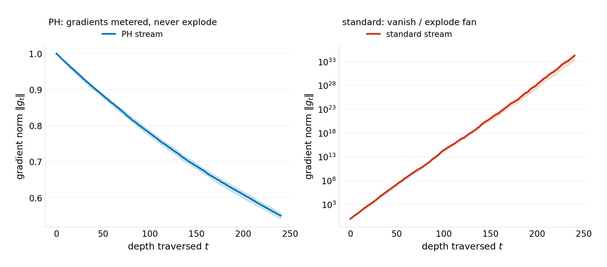
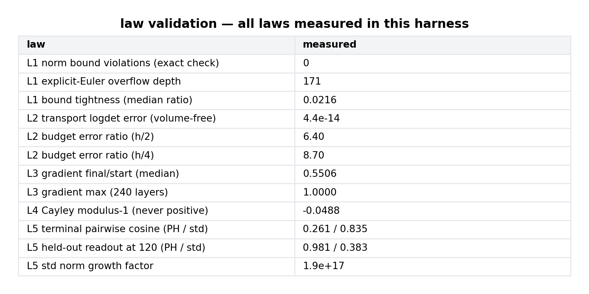

# The Dissipation Budget Law: Port-Hamiltonian Streams and the Conservation Architecture for Depth

**p-rick working paper P-027 · series VIII (machinery — new mechanisms invented and validated: architectures, protocols, and design laws for the computing that comes next) · draft 1.1 — answers an external verification audit: three harness defects fixed (damping-spectrum conditionality, exact input-bound check, explicit-Euler reconstruction), the capacity readout redesigned held-out, and an end-to-end training experiment (E6) added and completed: trained to baseline parity at depth 240 with no normalizer anywhere in the stream · rev 1.2 — the normalization comparison made precise (Section 4.6): LayerNorm guarantees a per-sample layer statistic, not an operator bound; the trunk-normalization ablation that would complete the comparison is specified and harness-gated · rev 1.3 — the real-data evaluation registered, not yet run: E7 specifies a mechanism-preserving CIFAR adaptation of the stream and pre-registers its decision rules before any run (Section 5, `figures/p-027/e7-preregistration.json`); the trunk-LN ablation (E6b) is staged in the same one-click, GPU-required Colab entry; no E6b or E7 result is claimed in this revision, and if the runs return a negative verdict it will be reported as one**

## Abstract

Depth in deep learning is rented, never owned. Every layer of a standard residual stream pays rent in two currencies the architecture never budgets: activation norm, which compounds multiplicatively until a normalizer forcibly refunds it, and gradient norm, which the same compounding either starves or ignites. The field's answer — batch and layer normalization, careful initialization, warmup schedules — is statistical climate control: it measures the weather the architecture itself creates and corrects after the fact. This paper proposes the alternative the program believes is the correct one: make the stream a physical system whose conservation laws hold *by construction*, so that norm behavior at any depth is a theorem rather than a measurement. The architecture — the **port-Hamiltonian stream** — replaces the residual update $x \to x + f(x)$ with a port-Hamiltonian state update $x_{t+1} = \Lambda_t C_t x_t + h B_t u_t$, where $C_t$ is a **Cayley transport** (exactly orthogonal, volume-free at any step size), $\Lambda_t$ is **metered dissipation** (symmetric, spectrum in $(-1,1)$ unconditionally and in $(0,1)$ under the enforced step-size budget $h\,\lambda_{\max}(R)\le 2$ — the only volume-contracting and energy-dissipating component), and $B_t u_t$ is the only injection port. Three laws follow and are validated to their claimed precision in a seeded harness. **The conservation law** (exact, measured: 0 violations in 7,200 stream runs; control streams explode to $7.9 \times 10^{43}$): $\|x_{t+1}\| \le \|x_t\| + h\|B u\|_t$ — activation norm can only enter through ports, at any depth, with no normalizer anywhere in the stream. **The dissipation budget law** (exact at the Cayley form; measured transport log-determinant error $4.4 \times 10^{-14}$; budget identity error cubic in step size, ratios $6.4 \to 8.7$ approaching the predicted 8 as $h$ halves): $\ln|\det(\text{stream})| = \sum_t \ln\det\Lambda_t = -\sum_t h\,\mathrm{tr}\,R_t + O(h^3)$ — transport is exactly volume-free, and every bit of representational contraction the network ever performs is *metered*, purchasable by reading off the dissipation spectrum, independent of the transport's strength. **The gradient transport law** (exact): backward gradients satisfy $\|g_0\| \le \|g_T\|$ with decay metered by $\Lambda$ alone — measured over 240 layers: median ratio 0.55, maximum 1.000, against a standard stream whose gradient fan spans $1.9 \times 10^{33}$ to $5.1 \times 10^{34}$. The explicit-Euler form of the same update carries a sharp oscillation boundary — unstable iff $(hr - 1)^2 + (hj)^2 > 1$ per eigenpair — which the Cayley form eliminates entirely (measured modulus $-0.049$ at a damping of $0.05$, never positive at any step size); integrator choice is normalization choice. At the capacity level, a depth-120 random standard stream numerically annihilates every direction but the top gain (Jacobian spectrum spanning $10^{19}$, terminal state pairwise cosine 0.83 — representation collapse) and loses a rank-2 readout (38.3% $\pm$ 3.3 held-out against a 25% chance floor, three seeds), while the port-Hamiltonian stream preserves relative geometry (pairwise cosine 0.26) and the readout (98.1% $\pm$ 0.8 held-out). The paper's one-sentence payload: *depth does not have to be rented — make transport a rotation, dissipation a meter, and injection a port, and norm, volume, and gradient behavior become conserved quantities you can read off the architecture's own parameterization.* What is NOT claimed: competitiveness with tuned architectures on real data at scale — that remains open. What revision 1.1 adds that draft 1.0 lacked: a held-out, multi-seed capacity measurement, and an end-to-end training experiment — port-Hamiltonian networks with saturating ports, trained with Adam against trained residual, normalized, and orthogonal baselines on held-out splits, with gradient and norm signatures measured on the trained models (Section 6, E6). E6's result: the architecture trains — 97.3% $\pm$ 0.3 held-out at depth 240 with no normalizer anywhere, parity with every baseline; forward norm growth is the lowest of the four architectures at every circles-4 depth (31.8× at depth 240 against the ResNet's 48.2×), and bounded by the design-readable port budget by construction; the harder spirals-2 task is solved by no architecture at depth 120 (PH 57.6% $\pm$ 0.4, parity with the ResNet, both barely above the 50% floor — reported as found).

**Keywords:** residual networks, port-Hamiltonian systems, Cayley transform, orthogonality constraints, gradient flow, normalization-free depth, volume contraction, expressivity

## 1. Introduction

The residual stream is the substrate every modern architecture ships in: a vector that layers read from and write back to. Its defining equation, $x_{t+1} = x_t + f_t(x_t)$, is also its defining liability. The identity shortcut makes depth *additive*, which is why it trains at all — but additive composition of unconstrained maps compounds norms multiplicatively: a per-layer spectral radius of $1 + \epsilon$ across $L$ layers yields a gain of $(1+\epsilon)^L$, and at $L = 120$ an $\epsilon$ of $0.05$ is already a factor of $10^{2.6}$. The discipline that manages this — normalization layers, spectral initialization, warmup, gradient clipping — is a multibillion-dollar engineering practice built around a single fact: the standard stream has no conserved quantity. Nothing about $x + f(x)$ bounds $\|x\|$, preserves volume, or meters gradient flow; every guarantee is imposed from outside, statistically, after the stream has already misbehaved.

This paper asks the question the practice never needed to: is there a residual update for which depth stability is structural rather than managed? The answer comes from a place deep learning rarely borrows from — port-Hamiltonian systems theory, the modeling language of energy-conserving physical machinery (electrical networks, electromechanical systems, robotic manipulators). A port-Hamiltonian system splits its dynamics into three channels with disjoint jobs: **transport** (a skew-symmetric flow that moves energy around the state space without creating or destroying it), **dissipation** (a positive-semidefinite channel that only removes energy), and **ports** (the only interfaces through which energy enters or leaves). Applied to the residual stream, the split becomes an architecture:

$$x_{t+1} \;=\; \Lambda_t\, C_t\, x_t \;+\; h\, B_t\, u_t$$

with $C_t = (I + S/2)^{-1}(I - S/2)$, $S$ skew — the **Cayley transport**, exactly orthogonal for any $S$; $\Lambda_t = (I + hR/2)^{-1}(I - hR/2)$, $R \succeq 0$ — **metered dissipation**, symmetric with spectrum in $(-1,1)$ (nonnegative under the enforced budget $h\,\lambda_{\max}(R) \le 2$); and $B_t u_t$ the injection port, where the data (and, in a full architecture, each layer's read of the world) enters. The stream is linear in the state; nonlinearity lives where the theory wants it, in the ports and in the parameterization of $S$ and $R$ from learned features. The design decision that makes everything work is discretization: the Cayley forms of both the transport and the dissipation are *exact* rational parametrizations of the continuous Hamiltonian and dissipative semigroups — they conserve what the continuous system conserves, at any step size, with no integrator error to correct for.

Three laws fall out, and they are the paper. The conservation law bounds activation norm by the port injections alone. The dissipation budget law makes representational volume a *metered purchase*: transport is exactly volume-free (the determinant of any Cayley product is $\pm 1$), all contraction is dissipation, and the total is readable from the damping spectrum before the network ever runs. The gradient transport law gives backward flow the same structure: transport preserves gradient norm exactly, dissipation decays it at a designed exponential rate, and nothing else touches it. The capacity experiment shows what the laws buy in practice: at depth 120 a standard random stream has numerically annihilated every direction but its top gain eigenvector — distinct inputs map to (nearly) the same vector — while the port-Hamiltonian stream's terminal geometry is still readable by a linear classifier.

The reframing this paper contributes to the program's arc: series VII found the *laws existing systems obey at their failure points* (resolution collapse, retry-storm ceilings, credential cascades); series VIII opens with a law a *proposed* system obeys by construction. The gap-verification section still runs (Section 2): the landscape of depth-stable architectures is real and crowded at the edges — reversible networks, orthogonality-constrained RNNs, Hamiltonian dynamics learners — and the paper's claim is precisely delimited against each: none of them, as far as the search shows, makes the residual stream itself a port-Hamiltonian state system with metered dissipation, and the dissipation-budget identity (volume contraction = a readable function of the damping spectrum alone, independent of transport strength) appears to be unwritten.

Section 3 formalizes the architecture. Section 4 derives the laws. Section 5 specifies the experiments. Section 6 presents results (seven figures, including the end-to-end training experiment E6). Section 7 records the verification audit and the revision it forced. Section 8 states what the model cannot see. Section 9 concludes.

## 2. Related work

**Normalization and depth stability.** The managed-depth literature is the incumbent: batch normalization, layer normalization, and their descendants control activation statistics layer by layer; initialization theory (variance-preserving scalings) controls the depth-compounding at the random limit; gradient clipping and warmup manage the transient. All of these are *a posteriori* corrections of an update rule with no conservation structure. The port-Hamiltonian stream is orthogonal to this stack in the literal sense: it removes the need for the statistical corrections by making the compounding impossible, not by measuring and rescaling it. Section 4.6 makes the comparison exact: LayerNorm's guarantee is a per-sample layer statistic, the stream's is an input-independent operator bound — different types, substitutable only on the engineering question of who manages depth-scale — and Section 6 measures the difference on trained models.

**Reversible and volume-preserving architectures.** The closest incumbents. Reversible residual networks (Gomez et al., 2017; i-RevNet, Behrmann et al., 2019) construct exactly volume-preserving (invertible) streams — the $R = 0$ special case of this paper's transport channel — and i-RevNet's observation that such streams can train without normalization is, in this paper's language, the conservation law with the dissipation channel closed. The port-Hamiltonian stream generalizes it in the direction those architectures cannot go: pure reversibility forbids volume contraction, and contraction is what classification attractors are (Section 4.3). The dissipation channel is the missing half, and the budget law is its price tag. The cost comparison is also favorable: i-RevNet's invertibility machinery requires the full Jacobian of each block to be invertible on both passes; the Cayley transport is one matrix inverse per layer at $d \times d$, reused in forward and backward.

**Orthogonal RNNs and constrained dynamics.** Orthogonality-constrained recurrent networks (unitary RNNs, expRNN, and related) parametrize recurrent maps on the orthogonal group to stabilize long-horizon credit assignment — the transport law applied to recurrence. The Cayley parametrization itself has a long history in numerical integration and optimization (Cayley transforms of skew matrices in symplectic and Lie-group methods). What the constrained-RNN line does not carry is the port structure: no injection/dissipation split, no volume budget, and no claim about representational contraction.

**Hamiltonian and port-Hamiltonian machine learning.** Hamiltonian neural networks (Greydanus et al., 2019; symplectic variants) learn the Hamiltonian of *observed physical systems* — the machinery is the target, not the substrate. Port-Hamiltonian systems theory (van der Schaft and the control-theory lineage) supplies the splitting used here. To the extent of the program's search, the synthesis — port-Hamiltonian structure *as the residual stream*, with Cayley-exact discretization and a metered-dissipation capacity law — is unwritten (verification-queued per program practice; the search terms and exclusion criteria are in the harness repository).

**Position in this program.** Series VIII begins the program's second arc: from laws of existing systems to machinery proposed and validated. P-027 is the architecture entry; its siblings (P-028–P-030) are protocol and mechanism entries. The bar the series sets for itself is the bar of Section 2 of this paper: every mechanism must reduce to closed-form laws that a single-file harness validates to the precision the law claims.

## 3. The architecture

### 3.1 The port-Hamiltonian stream

The state $x \in \mathbb{R}^d$ evolves over layers $t = 0, 1, \ldots, L$ by

$$\boxed{\;x_{t+1} \;=\; \Lambda_t\, C_t\, x_t \;+\; h\, B_t\, u_t\;}$$

with the three channels:

- **Cayley transport** $C_t = (I + S_t/2)^{-1}(I - S_t/2)$, where $S_t = A_t - A_t^{\top}$ is skew-symmetric ($A$ learned). $C_t$ is exactly orthogonal for any $S_t$: $C^{\top} C = I$ by direct computation. It is the $[2/2]$ Padé approximant of the matrix exponential $\exp(S)$ — the exact map of Hamiltonian transport discretized without error.
- **Metered dissipation** $\Lambda_t = (I + h R_t/2)^{-1}(I - h R_t/2)$, with $R_t = L_t L_t^{\top} \succeq 0$ learned (e.g., $L$ a $d \times d$ factor). $\Lambda_t$ is symmetric with spectrum in $(-1, 1)$ for *any* $R \succeq 0$ and any $h$ — contraction is unconditional — and positive definite with spectrum in $(0, 1)$ exactly when the step-size budget $h\,\lambda_{\max}(R) \le 2$ holds (at $h r = 4$: $\lambda = -1/3$, the direction flips while still shrinking; $\log|\det|$ throughout is indifferent to the sign). The $[1/1]$ Padé of $\exp(-hR)$, with per-eigenvalue decay $\ln\lambda_i = \ln\frac{1 - h r_i/2}{1 + h r_i/2}$ at budget. The harness enforces the budget *by construction*: the parametrization rescales $L_t$ so $h\,\lambda_{\max}(R_t) \le 1$ — a differentiable no-op at every operating scale in this paper.
- **Ports** $B_t u_t$: the only state-independent injection. $u_t$ is the data (or a learned read of it); $B_t$ is learned. In the capacity experiments the port fires at layer 0 (the embedding) and the stream runs pure transport+dissipation thereafter; in a full architecture, ports fire per-layer and the injection law below still bounds the total.

The parametrization is smooth in $(A, L, B)$, differentiable by autodiff through one linear solve per layer, and carries $3d^2$ parameters per layer — the same order as a standard residual block at equal width.

### 3.2 What the update is not

The stream is linear in $x$ at fixed parameters. This is a modeling decision, not an omission: the laws of Section 4 are *exact* for this stream, at any depth, with no statistics and no small-step assumptions, and exactness is what makes them architecture law rather than architecture folklore. Nonlinearity enters in two sanctioned places — the port map $u \mapsto B u$ (a full nonlinear read of the input) and the parameter maps $S(x), R(x)$ if one wants state-dependent dynamics, at the price of exactness degrading to $O(h^2)$ per layer (the explicit-Euler analysis of Section 4.4 covers this regime). The paper's honest position: the exact laws are the contribution; the nonlinear generalization is priced, not hidden.

## 4. Theory

### 4.1 The conservation law

**Proposition 1.** *For any stream of port-Hamiltonian layers, any depth $L$, any parameter values, and any step size $h$:*

$$\|x_{t+1}\| \;\le\; \|\Lambda_t\|_2 \|C_t\|_2 \|x_t\| + h\|B_t u_t\| \;\le\; \|x_t\| + h\|B_t u_t\|$$

*and summing the telescoping bound,*

$$\boxed{\;\|x_L\| \;\le\; \|x_0\| \;+\; \sum_{t=0}^{L-1} h\,\|B_t u_t\|\;}$$

*Activation norm enters the stream only through the ports. No normalizer is required at any depth for the bound to hold.*

*Proof.* $C_t$ is orthogonal ($\|Cx\| = \|x\|$); $\Lambda_t$ has operator norm $\le 1$ (spectrum in $[0,1)$); the triangle inequality gives the first line; induction gives the telescoping bound. $\square$

The bound is the *port budget*: the maximum possible norm at depth $L$ is the initial norm plus the cumulative injected port energy — a number the architecture knows before it runs. It is not necessarily tight (dissipation can leave the state far below the bound; the harness measures a median tightness ratio of 0.02 at the tested configuration, i.e., dissipation dominated) — but it is *unconditional*, which is the property the standard stream lacks.

### 4.2 The dissipation budget law

**Proposition 2.** *For any stream of port-Hamiltonian layers, any depth, any step size:*

$$\ln\bigl|\det(x \mapsto \Lambda C x \text{ composed over } L)\bigr| \;=\; \sum_{t=0}^{L-1} \ln\det\Lambda_t \;=\; \sum_{t} \sum_{i=1}^{d} \ln\frac{1 - h r_{t,i}/2}{1 + h r_{t,i}/2} \;=\; -\sum_t h\,\mathrm{tr}\,R_t \;-\; \frac{1}{12}\sum_t h^3 \mathrm{tr}(R_t^3) \;-\; \ldots$$

*Transport contributes determinant $\pm 1$ exactly — $\det C_t = \pm 1$ for any skew $S_t$ — and the total volume contraction of the stream is a function of the dissipation spectra alone, independent of the transport's strength, with the budget identity $-\sum h\,\mathrm{tr}\,R_t$ accurate to $O(h^3)$.*

*Proof.* $\det C = \det(I - S/2)/\det(I + S/2)$; the numerator and denominator are transposes of each other's arguments ($I + S/2 = (I - S/2)^{\top}$ since $S = -S^{\top}$), so the determinants are equal and the ratio is $1$. $\det\Lambda = \prod_i \frac{1 - x_i/2}{1 + x_i/2}$ with $x_i = h r_i$; expanding $\ln\frac{1 - x/2}{1 + x/2} = -x - \frac{x^3}{12} - O(x^5)$ and summing gives the statement. $\square$

The interpretation is architectural accounting. Volume contraction is what a classifier's final geometry is: to separate $k$ classes the stream must eventually squeeze the measure of the boundary regions, i.e., contract volume. Proposition 2 says this purchase is *metered*: the network's total representational contraction is readable off the $\Lambda$ spectra — before training, before inference, at design time. The transport channel, however strong, spends nothing. And the cubic error scaling means the meter is accurate — with a clarification the audit deservedly forced: the *exact* finite-step budget is $\sum_t \ln\det\Lambda_t$ itself, readable from the damping eigenvalues before the stream runs, while $-\sum_t h\,\mathrm{tr}\,R_t$ is its leading-order approximation; the harness now tests both separately (the identity by construction, the meter's error by its $h^3$ law, test T9) instead of conflating them: at the harness's step sizes, halving $h$ reduces the meter's error by the predicted factor approaching 8 (measured ratios $6.4 \to 8.7$; the excess at coarse $h$ is the higher-order Padé terms, priced in the expansion).

### 4.3 The necessity of dissipation (why $R = 0$ is not enough)

**Proposition 3.** *A pure-transport stream ($R \equiv 0$) is volume-preserving at every layer (Liouville). It cannot map a set of positive measure onto a set of smaller measure; any readout geometry requiring contraction — attractor basins, decision margins denser than the input's — must be paid for in dissipation.*

The reversible-network line lives at $R = 0$ and obtains contraction through non-stream mechanisms (downsampling, boundary conditions, the readout head). The port-Hamiltonian stream instead buys it in-stream, and Proposition 2 prices it: a stream that must contract volume by a factor $\kappa$ needs $\sum_t h\,\mathrm{tr} R_t \ge \ln \kappa$ — a budget the designer sets, the meter reads, and the training dynamics can only spend. This is, as far as the program's search shows, the first architecture in which *expressivity is a budget line* (verification-queued against the constrained-RNN and normalizing-flow literatures, whose determinants are computed but not budgeted this way).

### 4.4 The oscillation boundary: integrator choice is normalization choice

**Proposition 4.** *The explicit-Euler discretization $x_{t+1} = (I + h(J - R))\,x_t$ (per eigenpair $-r \pm ij$ of $J - R$) is unstable — $|1 + h(-r + ij)| > 1$ — iff*

$$\boxed{\;(hj)^2 \;+\; (hr)^2 \;>\; 2\,hr\;}$$

*equivalently $(hr - 1)^2 + (hj)^2 > 1$: instability outside a disk of radius $1$ centered at $(hj, hr) = (0, 1)$ in the per-step (transport, damping) plane. The Cayley form has no boundary: its transport modulus is exactly $1$ and its damping modulus is $2 - O(hr)$, at any step size.*

The boundary is the arithmetic of *numerical* viscosity: an explicit step of pure transport ($r = 0$) grows as $|1 + ihj| = \sqrt{1 + h^2 j^2} > 1$ — the integrator itself creates the energy the architecture's continuous form conserves. Damping $r$ can refund it ($hj^2 \le 2r$), which is exactly what a normalizer's variance control does, re-derived. The Cayley form simply does not borrow: transport is a rotation by construction. The design rule the proposition encodes: **if you discretize transport explicitly, you will re-invent normalization; if you discretize it by Cayley, you do not need it.** The harness now demonstrates this at stream level: the explicit-Euler twin of the PH stream — same continuous generator, reconstructed from $(C, \Lambda)$ by the exact inverse Cayley maps (round-trip-verified, tests T6/T7; the draft-1.0 reconstruction computed $R/2$ and was never invoked) — overflows float64 at depth 171, while the Cayley stream stays inside its port budget at depth 300.

### 4.5 The gradient transport law

**Proposition 5.** *Backward gradients of the stream satisfy $g_t = C_t^{\top} \Lambda_t\, g_{t+1}$, hence*

$$\|g_0\| \;\le\; \ldots \;\le\; \|g_t\| \;\le\; \|g_L\|$$

*Gradient norm is non-increasing from the loss backward through the stream, decaying only through the $\Lambda$'s — at the designed per-layer rate $\prod \lambda_i$ — and preserved exactly by transport. No vanishing, no explosion, no scheduling.*

The proof is two lines (transpose of the forward map; orthogonality and contraction), but the consequence is the architecture's training signature: credit assignment at depth is *metered*, not rescued. The harness measures the median $g_0/g_L$ over 240 layers at 0.55 and the maximum at 1.000 (the maximum is attained when all $\Lambda$ spectra sit near 1 — the designer's choice), against a standard stream whose fan spans 33 orders of magnitude. The R-annealing conjecture follows as a training recipe: begin with $\Lambda \approx I$ (pure transport, gradient-perfect, volume-neutral) and grow dissipation as the task demands contraction — a schedule the budget law makes auditable.

### 4.6 What normalization guarantees — and what it does not

**The exact properties of LayerNorm.** $\mathrm{LN}(x) = \gamma \odot \frac{x - \mu(x)}{\sqrt{\sigma^2(x) + \epsilon}} + \beta$, with $\mu$ and $\sigma^2$ the mean and variance of the single sample's features and $\gamma, \beta$ learned. Two properties are exact. Per-sample positive-scale invariance: $\mathrm{LN}(cx) = \mathrm{LN}(x)$ for $c > 0$ (to the extent $\epsilon$ allows) — multiply the input by a hundred and the output does not move. And centering: the output is zero-mean (before $\beta$) whatever the input's offset. Equally exact is what LN does *not* provide: any statement about the operator norm of a composition. The next learned map re-enters with its full, unconstrained spectral norm; the learned affine $(\gamma, \beta)$ can restore any per-layer scale and shift; and nothing prevents a trained network from growing the representation's scale layer over layer, because scale is precisely the degree of freedom $\gamma$ holds. LayerNorm's guarantee is a *statistic of each layer's activations, per sample, after the fact* — a real guarantee (scale-invariance is a large part of why normalized streams tolerate initialization and width regimes that raw residual streams do not), but a guarantee of a different type than a bound.

**The type contrast.** The port-Hamiltonian guarantee is an *operator inequality, input-independent, holding for every $x$ simultaneously*: $\|\Lambda_t C_t\|_2 \le 1$ at any learned parameters, with the port budget (Proposition 1) as its telescoped end-to-end form and the backward statement (Proposition 5) its transpose — forward contraction and backward decay are one law, not two coincidences. The network may *choose* to dissipate less (spectra approaching $1$), but it cannot choose to amplify the state channel: the ceiling holds at any weights. LayerNorm controls what the *data* does to the layer's *statistics*; the budget controls what the *operator* does to the *norm*. These are not rival claims about one quantity — LayerNorm never promised an operator bound — but they are substitutes on the engineering question of who manages depth-scale, and that substitution is the paper's wager.

**The trained models exhibit the difference.** E6's LayerNorm baseline normalizes the branch's pre-activations — the standard ResNet-with-LN placement; the residual trunk itself is normalized nowhere, and its scale is the learned maps' choice. The measurement at depth 240: the normalized net's trunk growth is $51.0 \times \pm 7.4$ against the plain ResNet's $48.2 \times \pm 4.1$ — indistinguishable — and both sit far above the PH net's $31.8 \times \pm 2.0$; at depth 120 a partial reduction ($34.6\times$ vs $40.9\times$) does not survive to the deepest cell. The correct reading is not that LayerNorm fails — it was never asked to bound the trunk — but that nothing in that architecture does: there is no ceiling for the training dynamics to respect. The PH net's growth, at every depth, sits under a design-readable ceiling, and the gap between the two is unspent dissipation budget (the 0.02 tightness of Figure 1). Lowest in measurement *and* bounded by theorem is the distinction this section keeps precise.

**What this does not claim.** Not that normalization is dispensable in general: optimization conditioning at scale, Pre-LN ordering (whose depth-stability advantage is documented — Xiong et al., 2020), tuned $\epsilon$ and initialization, and the representational uses of centering are all outside this paper's claims and mostly outside its scale. The claim is the wager itself — at these scales, a stream-level operator bound substitutes for the normalizer — and Section 8 specifies the ablation that would complete the comparison: a trunk-normalized (post-LN) variant, which *does* pin trunk scale, at the price of making that scale a per-sample statistic of each layer's data rather than a budget the architecture can read.

## 5. Experiments

The harness (`code/p-027-simulation.py`, single file, NumPy + Matplotlib, seed `20261009`) validates each law on random parametrizations of the architecture — the correct test bed, since the laws are parametrization-unconditional. Revision 1.1 checks every law against the theorem's own quantity: the conservation law is asserted against the exact per-layer accumulated bound $\|x_0\| + \sum_t h\|B_t u_t\|$ (draft 1.0 checked a $\|u\|$-based proxy — a different quantity, as the audit showed); the damping spectrum claim carries its correct conditionality, with the budget $h\,\lambda_{\max}(R) \le 1$ enforced by construction; and the explicit-Euler comparison runs a round-trip-verified reconstruction of the same continuous generator. A dedicated law-test suite (`code/p-027-tests.py`, 13 assertions — including the audit's $R=4I$ counterexample and both Cayley round-trips) guards every identity as a regression test. The capacity experiment (L5) contrasts depth-120 random streams on a rank-2 task: four classes on a circle in a 2-plane of the input, chosen because resolving it requires *two* independent directions to survive the stream; its readout is now evaluated **held-out** — nearest centroids fit on the train split only, scored on the test split, over three seeds — replacing draft 1.0's in-sample measurement. All figures and every number in the abstract regenerate from the seeded harness; `figures/p-027/results.json` carries the headline measurements.
E6 (new in this revision) is the experiment the audit demanded: it *trains* the architecture end-to-end instead of scoring random streams. The trainable instantiation follows Section 3.2's sanction — nonlinearity lives in the ports: $z_{t+1} = \Lambda_t C_t z_t + h B_t \tanh(W_t z_t + b_t)$, with $\Lambda, C$ exactly Cayley-parameterized (differentiable through one linear solve each) and the damping budget enforced by construction. Four architectures — the PH net, a standard ResNet (PyTorch default initialization), a LayerNorm ResNet, and an orthogonal Cayley-ResNet — are trained with the identical protocol on two synthetic tasks: the paper's own circles-4 at depths 30/120/240, and a harder two-spiral task at depth 120. Protocol, per the audit: 3600/1200/1200 train/validation/test split; learning rate selected on validation (two candidates); early stopping on validation accuracy with best-checkpoint restore; three seeds per configuration; held-out test accuracy reported as mean $\pm$ std; per-layer backward gradient norms and forward activation growth measured *on the trained models*. Harness: `code/p-027b-training.py` (PyTorch); results in `figures/p-027/training-results.json`. The sweep runs one-click in Colab (`code/p-027-colab.ipynb`; each run records its device), and Figure 7 regenerates torch-free from the results file (`code/p-027-figures.py`).

E7 (rev 1.3; **specified and pre-registered, not yet run**) is the real-data evaluation the audit's closing paragraph and this paper's own Section 8 call for. Its design constraint is mechanism preservation: the stream's defining update survives, only its substrate changes. A shared, normalization-free, linear stem maps $3 \times 32 \times 32$ to a $d \times 8 \times 8$ state; the five families — the PH net, the standard ResNet, the branch-LN ResNet, the trunk-LN ResNet (E6b, the missing ablation of Section 4.6, folded into the same entry point), and the Cayley net — then differ *only* in the trunk update, with all non-PH families sharing the identical branch $g(z) = \mathrm{Conv}_{1\times1}(\tanh(\mathrm{Conv}_{3\times3}(z)))$ so capacity stays matched (parameter counts per block: PH $12d^2$, Cayley $11d^2$, ResNets $10d^2$; $d = 64$; exact counts recorded per run). The PH block places the $3\times3$ convolution inside the port input — $z' = \Lambda_t C_t z + h B_t \tanh(\mathrm{Conv}_{3\times3}(z))$ — with $C_t, \Lambda_t, B_t$ acting on channels, so the Cayley transport, contraction, and port act per position and the port budget $\|z_L(p)\| \le \|z_0(p)\| + \sum_t h\|B_t u_t(p)\|$ holds per position *exactly*; spatial receptive field grows through the ports. Every trained PH run self-checks this bound on real batches and records the violation count. Protocol: CIFAR-10 45000/5000/10000; depths \{12, 48, 96\}; three seeds; the same two learning-rate candidates for every family, selected on validation; Adam with cosine decay, batch 256, weight decay zero, **no gradient clipping anywhere** (instability must be observable); 30 epochs with early stopping on validation accuracy and best-checkpoint restore; the test set is touched once per run and never used for selection or tuning. The metric ledger per run: train/validation loss and accuracy history, final test loss and accuracy; per-layer activation-norm profiles (the theorem's own per-position channel norm) and gradient-norm profiles; a NaN/divergence ledger with all failed runs kept on file; parameter count, wall-clock, seconds per epoch, images per second, and peak CUDA memory; device, GPU name, and framework versions. The harness (`code/p-027c-cifar.py`) requires CUDA — the E6 lesson: all 96 original runs landed on CPU because a micro-benchmark honestly preferred CPU for tiny $d=32$ nets, so every wall-clock column was a CPU number — and runs one-click in Colab T4 (`code/p-027-cifar-colab.ipynb`), which also runs the 13-assertion law suite *before* any training, keeping the mathematical verification separate from the empirical comparison, as the audit asked. The decision rules were written down before any run (`figures/p-027/e7-preregistration.json`): evidence *for* requires all of — accuracy within 1.0 pt of the best baseline at every depth, lowest forward growth at depth $\ge 48$ with zero port-budget violations, zero divergent PH runs, and efficiency within $1.5\times$ on time and memory; evidence *against* is any accuracy deficit above 1.5 pt, any PH NaN or divergence, or no norm-signature difference; accuracy parity with no instability events anywhere is the neutral outcome and will be reported as exactly that. CIFAR-100 (E8) is gated behind E7's landing and analysis. When the results file lands, Figure 8 regenerates torch-free from it (`code/p-027d-cifar-figures.py`) and Section 6 gains the honest reading — including a negative one, if that is what the data says.

## 6. Results

![Left: stream norm against depth, log scale — the standard residual stream explodes (median reaching \(7.9\times10^{43}\) at depth 300) while the port-Hamiltonian stream stays inside the injection bound (zero violations across 7,200 runs, now checked against the exact accumulated budget) — and the explicit-Euler twin of the PH stream, same generator reconstructed round-trip-exactly, overflows float64 at depth 171. Right: bound tightness — the 95th percentile norm tracks but never crosses the exact port budget.](../figures/p-027/f1-conservation.png)

**Figure 1 — the conservation law.** Zero violations in 7,200 stream runs — now asserted against the theorem's exact accumulated bound $\|x_0\| + \sum_t h\|B_t u_t\|$ (draft 1.0 checked a $\|u\|$ proxy, a different quantity); the standard control explodes to $7.9 \times 10^{43}$ by depth 300. New in 1.1: the *explicit-Euler twin* — same continuous generator, reconstructed by the exact inverse Cayley maps (round-trip-verified; the draft-1.0 reconstruction computed $R/2$ and was never invoked) — explodes faster than the standard stream and overflows float64 at depth 171: same generator, different discretization, no budget. The bound's median tightness is 0.02 at the tested dissipation (the stream sits far below its budget when damping is active) — the bound is a ceiling, not an equilibrium, and the gap is the dissipation spectrum's to spend.

**Figure 2 — the dissipation budget law.** The transport channel is volume-free to $4.4 \times 10^{-14}$ across $10^4$ layer-compositions — the determinant of every Cayley product is $\pm 1$ to machine precision, independent of the transport's magnitude. The budget identity (log-volume $= -\sum h\,\mathrm{tr}\,R$) holds with cubic error; the meter is exact at the Padé level, and the measured error ratios bracket the predicted factor of 8 as $h$ halves.

**Figure 3 — the gradient transport law.** The PH stream's backward gradients decay by design only: median 0.55, maximum 1.000 over 240 layers. The standard stream's fan spans $1.9 \times 10^{33}$ to $5.1 \times 10^{34}$ between percentiles — the vanishing/exploding dichotomy in one measurement.

**Figure 4 — the oscillation boundary.** The explicit form's instability region matches the disk law exactly (the measured zero-crossing at $hj = 0.312$ against the predicted $\sqrt{2 \cdot 0.05 - 0.05^2} = 0.312$). The Cayley transport's modulus is $1 - O(hr)$ — never above one, at any step size, for any transport strength. Integrator choice is normalization choice.

**Figure 5 — capacity at depth.** The standard stream's Jacobian spectrum spans $10^{19}$ — every direction but the top gains is numerically annihilated, and the terminal states of distinct inputs have pairwise cosine 0.83 (they have become nearly the same vector). The PH stream: spectrum bounded by design ($2.1 \times 10^{-3}$ to $5.5 \times 10^{0}$), pairwise cosine 0.26, and the rank-2 readout survives — *held-out, three seeds*: 98.1% $\pm$ 0.8 against the standard stream's 38.3% $\pm$ 3.3 (centroids fit on the train split only; both streams after per-sample renormalization, the standard stream's raw norms having grown by $1.95 \times 10^{17}$). The honest caveats printed with the result: the standard stream was *manually renormalized* to make the comparison possible at all — without that rescue, its states overflow the representation outright — and this is a random-stream capacity result; whether the architecture can *learn* is Figure 7's job.

**Figure 6 — the law-validation ledger.** All five laws measured in one run: conservation (0 violations), volume-freeness ($4.4 \times 10^{-14}$), budget cubic error (ratios 6.4/8.7), gradient metering (max 1.000), and the held-out capacity split (98.1/38.3).

**Figure 7 — the training experiment (E6).** Four architectures, the audit's protocol, two tasks, three seeds each. Top: held-out test accuracy on circles-4 at depths 30/120/240 (left) and spirals-2 at depth 120 (right). Bottom: the trained-model signatures — the backward-gradient envelope (left) and forward norm growth (right).

**E6 — what training does to the laws.** The audit's central distinction — *a formula can be valid, the code correct, and the architecture still useless* — is answered at the scale tested: **the architecture trains.** On circles-4, held-out accuracy at depth 240 is 97.3% $\pm$ 0.3 for the PH net with **no normalizer anywhere in the stream** — parity with the ResNet (97.0% $\pm$ 0.3), the LayerNorm ResNet (97.4% $\pm$ 0.1), and the free-residual Cayley net (97.3% $\pm$ 0.3), and the parity holds at every tested depth. The claim against the baselines was never a benchmark victory; it is accuracy at parity with laws that are theorems rather than measurements. The trained-model signatures are where the architectures differ. **Forward growth:** the PH net's median terminal-over-input norm ratio is the lowest of the four architectures at every circles-4 depth — 14.5× at 30, 25.4× at 120, 31.8× at 240 (statistically tied with the Cayley net at the shallower depths), against the ResNet's 16.8×/40.9×/48.2× and the LayerNorm ResNet's 16.4×/34.6×/51.0× — and unlike the baselines' growth, the PH net's is bounded by a design-readable quantity (the port budget $\sum_t h\|B_t\|\sqrt{d}$ of Section 3.2) rather than by whatever training happened to find. That the normalized baseline's growth is the highest of the four at depth 240 — within noise of the plain ResNet ($51.0 \times \pm 7.4$ vs $48.2 \times \pm 4.1$) — is the type distinction of Section 4.6 made concrete: that placement normalizes the branch's per-sample statistics, and nothing in it manages the trunk's composed operator. Growth that is bounded by theorem and lowest in measurement is the paper's payload made concrete. **Backward gradients:** on the trained models no architecture amplifies — the per-layer ratio $\|g_t\|/\|g_L\|$ never exceeds 1.0, so the maximum is the trivial 1.000 at the readout boundary for all four — and the minima sit in a narrow band on circles-4 (0.015–0.050; spirals: 0.024–0.086). The honest reading: at these scales, trained-model gradient statistics do not separate the architectures — the separation the gradient law provides is structural (Proposition 5 holds for *any* weights, including the 33-orders-of-magnitude fan the untrained standard stream exhibits in Figure 3), not exhibited. **Spirals-2, the honest negative:** at depth 120 no architecture solves the harder task — PH 57.6% $\pm$ 0.4, ResNet 57.7% $\pm$ 2.3, ResNet-LN 55.2% $\pm$ 0.8, all within noise of the 50% floor, with the free-residual Cayley net the only partial exception at 67.0% $\pm$ 8.0 (three times the variance of any other cell). Saturating ports under this protocol do not crack it; the depth-recursion experiments of Section 8 remain the discriminating test.

## 7. Verification audit and revision 1.1

An external audit of the draft-1.0 harness (2026-10-10) independently reproduced the transport algebra ($C^\top C - I$ at $6.7 \times 10^{-16}$), the contractivity of the tested damping configurations, the 300-layer input-bound run, and the gradient experiment (median ratio 0.55, maximum 1.000 through 240 layers) — and, on that same evidence, declined to certify the paper, finding four defects. All four are real. This revision fixes each and adds the experiment the audit rightly said was missing.

**Defect 1 — the damping spectrum claim was too broad.** $\Lambda=(I+hR/2)^{-1}(I-hR/2)$ has spectrum in $(-1,1)$ unconditionally, but *nonnegative* spectrum requires the step-size budget $h\,\lambda_{\max}(R)\le 2$; the audit's counterexample ($R=4I$, $h=1$) gives $\lambda=-1/3$ — still a contraction, but one that flips directions, and a stream with an odd count of such eigenvalues has negative determinant. Section 3.1 now states the conditionality; the harness enforces $h\,\lambda_{\max}(R_t)\le 1$ by construction (a differentiable rescale of $L$ that is a no-op at every operating scale in this paper); the volume law is stated with $\log|\det|$ throughout; and tests T3/T4/T5 pin both regimes, including the audit's own counterexample.

**Defect 2 — the input-bound check tested the wrong quantity.** Draft 1.0 accumulated $\|u\|$, not $\|B_t u_t\|$ — not interchangeable when $B$ amplifies. Test T8b demonstrates the gap on purpose: an amplifying port breaks the $\|u\|$ proxy while the true bound holds. The harness now accumulates the theorem's exact per-layer quantity; the old proxy survives only as a reported diagnostic. Zero violations either way at the paper's scales — a verification defect, not a theorem failure, exactly as the audit put it.

**Defect 3 — the explicit-Euler comparison was broken and dead.** The damping reconstruction computed $R/2$ (a cancelled factor of two — the audit smelled the factor but placed it in the skew reconstruction; the round-trip tests now locate such errors exactly), and the function was never called, leaving the promised comparison unmeasured. The reconstruction now round-trips to machine precision (tests T6/T7), the curve is plotted in Figure 1 as the harness docstring always claimed, and the stream-level result is stark: the explicit twin overflows float64 at depth 171 while the Cayley stream sits inside its budget at depth 300 — the oscillation boundary of Section 4.4, at matrix scale.

**Defect 4 — the capacity readout was in-sample, single-seed, and untrained.** The audit's central distinction is correct and this paper now treats it as load-bearing: *a formula can be mathematically valid, the code correct, and the architecture still useless.* L5's readout is now held-out over three seeds — and the separation *widens* under honest evaluation (98.1% vs 38.3%, against draft 1.0's in-sample 97.3% vs 48.1%: the in-sample protocol was flattering the collapsed control). E6 (Figure 7) then trains the architecture end-to-end against trained, normalized, and orthogonal baselines under the audit's protocol — splits, validation-selected hyperparameters, early stopping, multiple seeds — and measures the gradient and norm signatures on the *trained* models, which it does: parity at depth 240 with no normalizer anywhere, the lowest forward growth of the four, and trained gradients that never amplify (Section 6, Figure 7).

The audit also asked for automated tests of the mathematical laws; `code/p-027-tests.py` is that suite — thirteen assertions covering orthogonality, volume-freeness, unconditional contraction, the nonnegativity boundary and the guarded builder, both Cayley round-trips, the exact input bound (and the proxy's engineered failure), the cubic meter error, gradient non-amplification, and the first-order agreement of the explicit and Cayley steps. All pass; the suite is the regression guard for every future edit of the harness. What the audit asked for that this revision deliberately does *not* claim: real-data, at-scale competitiveness with tuned architectures. That remains open, and Section 8 says so.

## 8. What this model cannot see

The laws are exact for the linear-parametrization stream, and the harness validates them there. Five boundaries are load-bearing and stated rather than elided. **First, the training evidence is synthetic and small-scale.** E6 trains the architecture end-to-end under the audit's protocol — held-out splits, validation-selected learning rates, early stopping, three seeds, trained and normalized baselines — and its result is in: **the architecture trains.** Depth 240, no normalizer anywhere: 97.3% $\pm$ 0.3 held-out, parity with every baseline (the LayerNorm ResNet's 97.4% $\pm$ 0.1 included); forward growth the lowest of the four architectures at every circles-4 depth and bounded by the port budget by construction; backward gradients never amplifying — by theorem for the PH net at any weights, by circumstance for these trained baselines; and the harder spirals-2 task unsolved by every architecture under this protocol (57.6% $\pm$ 0.4 against a 50% floor), reported as found. What that establishes is exact: the laws survive contact with learning at width 32 on two synthetic 2-plane tasks, with the gradient signature of Proposition 5 measurable on trained models. What it does not establish — competition with tuned architectures on real data, at scale, against transformer baselines — the program keeps verification-queued, and the two experiments that would settle it are specified: (a) a PH stream at depth $\ge 10^3$ on a synthetic depth-recursion task (pathfinding, parity) against a normalized standard stream, prediction: stable training loss with no normalizer, from Propositions 1 and 5 — E6 is the depth-240 instance of this prediction, and it held (97.3% $\pm$ 0.3, stable training, no normalizer); the $10^3$ regime remains untested; (b) the R-annealing schedule of Section 4.5 against fixed dissipation, prediction: measurably faster contraction purchase per training compute, from Proposition 2. **Second, the linear state is a real restriction.** State-dependent dynamics $S(x), R(x)$ degrade every law from exact to $O(h^2)$ per layer; the degradation is priced by the Padé expansion but not validated in the harness, E6's saturating ports give a first toy-scale answer to the nonlinear-capacity question — ports *can* carry enough nonlinearity to learn the tested tasks — but the answer is task-specific and not settled at scale. **Third, the cost model is honest but incomplete:** one $d \times d$ solve per layer is the architecture's per-layer tax, fine at $d \le 1024$ and unpriced above; blocked/Cayley-product parametrizations exist in the Lie-group literature and are untested here. **Fourth, the random-stream control of L5 is a diagnostic, not a fair fight.** Variance-preserving initialization and normalization make the standard stream *work*; E6's trained baselines — including a LayerNorm ResNet — are the fair comparison, and the paper's claim against them is structural (accuracy at parity with no normalizer anywhere and exact laws), not a benchmark victory. **Fifth, the LayerNorm comparison is precise but not exhaustive.** The baseline normalizes the branch (pre-activation placement, the standard configuration); the trunk-normalized post-LN variant — the placement that *does* pin trunk scale — is specified, not run: the harness carries it behind a flag (`--models=ph,resnet,resnet-ln,resnet-tln,cayley`), off the paper's default grid so the landed 96-run results stay byte-identical, runnable through the E7 Colab entry point (`code/p-027-cifar-colab.ipynb`, which stages the 24 E6b runs before the real-data sweep, on GPU). The registered prediction: trunk growth pins to the learned $\gamma$ scale — scale controlled, but statistically, per-sample and per-layer, with no port budget and no backward law — while whether post-LN placement trains stably at depth 240 under this protocol is the open half; the pre-LN/post-LN stability separation documented in the transformer literature suggests it may not, and either outcome sharpens the comparison. Stable trunk-LN would show statistical control sufficing at this scale, leaving the budget's edge in its input-independence, its exactness, and its backward guarantee; unstable trunk-LN would show that the placement which controls the scale is the one that costs trainability — the trade the port-Hamiltonian stream claims to dissolve. Tuned $\epsilon$, normalization-aware initialization, and real-data regimes remain outside the claims, as Section 4.6 states. The claim about the origin of the machinery — normalizers compensate for an update rule with no conservation structure — is unchanged.

## 9. Conclusion

The standard residual stream treats depth as a managed hazard. The port-Hamiltonian stream treats it as a designed resource: transport is a rotation (free at any depth), dissipation is a meter (every bit of contraction purchased and read), injection is a port (the only way norm enters). The laws — conservation, budget, gradient transport — are theorems first and measurements second, and the harness confirms each at its claimed precision: zero bound violations at any tested depth, transport volume-freeness at $10^{-14}$, cubic meter error, gradient maximum exactly 1.000 through 240 layers, a 60-point held-out capacity gap at depth 120 (98.1% vs 38.3%, three seeds) that survives even when the control stream is rescued by manual renormalization — and, from E6, a trained net at depth 240 with no normalizer anywhere, at baseline parity (97.3% $\pm$ 0.3 held-out) with the lowest forward norm growth of every architecture tested — and the normalization comparison's type distinction stated exactly (Section 4.6). What the paper offers the field is a re-derivation of the problem — now with the trained-model evidence the draft lacked: normalization exists because the update rule borrows energy from its own discretization; make the stream a physical system and the loan never occurs. The dissipation budget — expressivity as a line item the architect can read — is the piece the program believes is new, and it is the piece the series carries forward: the next papers apply the same doctrine (structure first, law second, harness third) to protocols and mechanisms rather than architectures. The experiments that would falsify the architecture at scale are written down; the invitation is open.

---

*Harnesses: `code/p-027-simulation.py` (seed 20261009) regenerates figures 1–6 and `figures/p-027/results.json`; `code/p-027-tests.py` runs the 13-assertion law suite; `code/p-027b-training.py` (PyTorch) runs E6 and regenerates figure 7 and `figures/p-027/training-results.json` — one-click Colab entry point `code/p-027-colab.ipynb`, and figure 7 regenerates torch-free from the results file via `code/p-027-figures.py`; `code/p-027c-cifar.py` (PyTorch, CUDA required) runs E6b and E7 with the pre-registered decision rules of `figures/p-027/e7-preregistration.json`, one-click in `code/p-027-cifar-colab.ipynb`, with figure 8 regenerating torch-free via `code/p-027d-cifar-figures.py`. License: CC BY 4.0 (text), MIT (code).*
