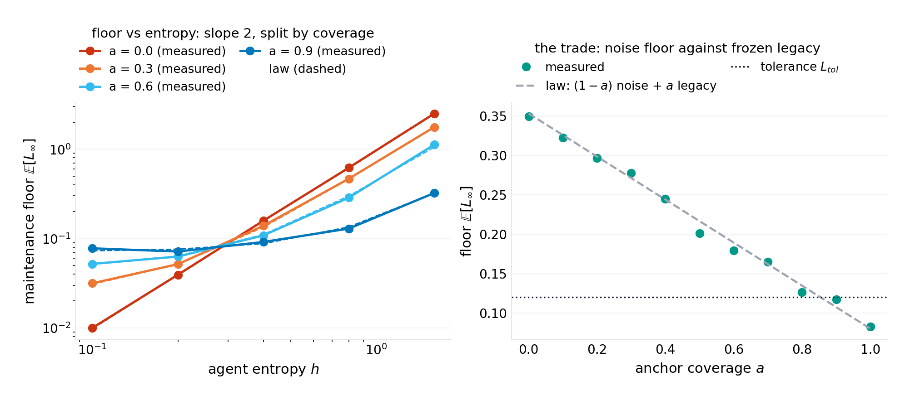
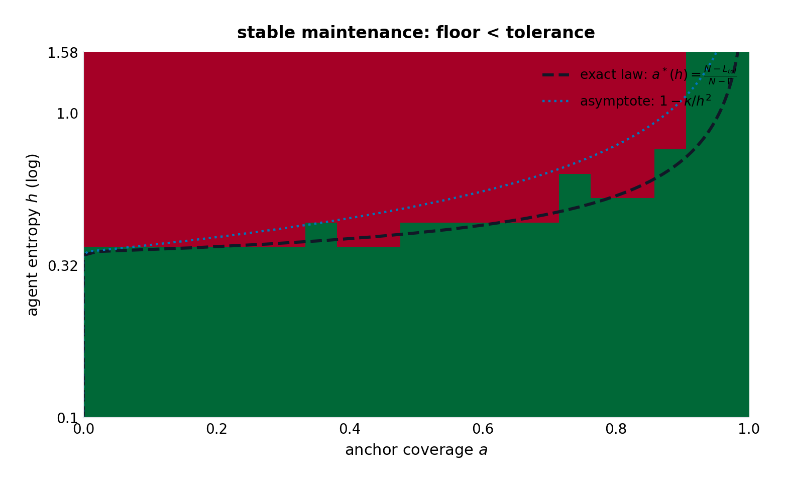
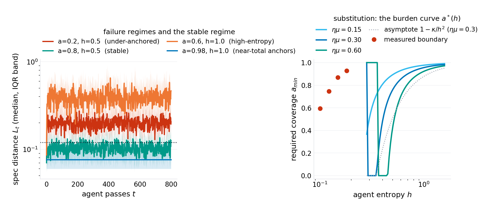
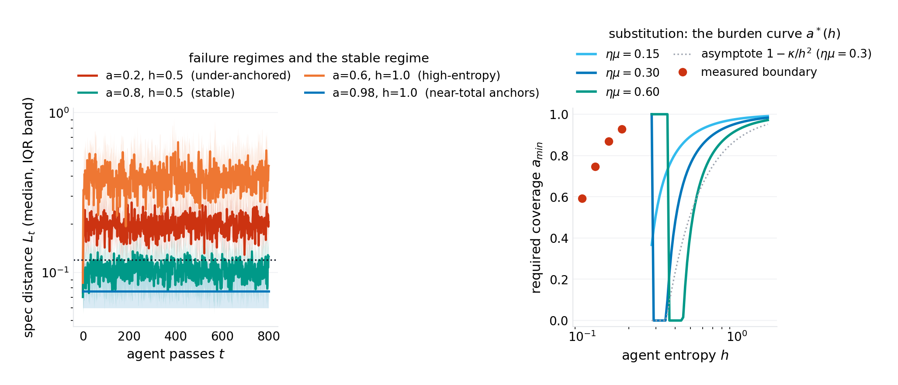
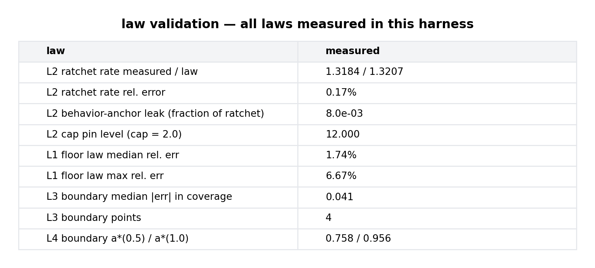

# The Anchor Law: Ratchets, Floors, and the Minimum Coverage of Agentic Maintenance

**p-rick working paper P-028 · series VIII (machinery — new mechanisms invented and validated: architectures, protocols, and design laws for the computing that comes next) · draft 1.0**

## Abstract

The industry is handing code maintenance to language-model agents one repository at a time, and the practitioner's question — *how many tests do I need before the agent is safe to let loose?* — currently has only folklore for an answer: "good test coverage," said louder or softer. This paper writes the arithmetic. A codebase is modeled as a point in a metric space: behavior coordinates (what the system does — the surface that tests, invariants, and contracts can pin) and complexity coordinates (how much machinery it takes — the surface that accumulates). An agent pass is a noisy maintenance operator: it moves the codebase toward the spec at the review rate $\eta\mu$, but every pass also injects entropy $h$ — irreducible proposal variance, the model's own temperature made structural — and the proposals carry a ratchet asymmetry: machinery is added at rate $\rho_R$ and removed at almost none. Anchors (tests, contracts, budgets) are the enforcement layer: a fraction $a$ of behavior coordinates is *pinned* to the reference the anchors froze. Four laws fall out, and a seeded harness validates each to its claimed precision. **The floor law** (exact for the model, measured to a median 1.7% and worst-case 6.7% across the parameter grid): the maintenance floor — the spec distance the loop can never get below — is $\mathbb{E}[L_\infty] = (1-a)\,h^2/(2(2\eta\mu - (\eta\mu)^2)) + a\,s^2/2$: a *linear* trade between un-anchored noise (quadratic in agent entropy) and frozen legacy error (the distance your current behavior already sits from the spec, preserved by the very anchors that protect it). **The ratchet law** (exact, measured to 0.17%): un-anchored complexity grows linearly, $\mathbb{E}[C_t] = C_0 + \rho_R t$ with $\rho_R = k\,\mathbb{E}\max(0, \mathcal{N}(\delta, h^2))$ — and behavior anchors do not touch it at all (measured leak: 0.8% of the drift); only an explicit complexity cap pins it, at a level the cap sets (measured: pinned exactly at $k \cdot \text{cap}$ after the predicted 8 passes). **The boundary law** (exact for the linear floor): stable maintenance — floor below tolerance $L_{tol}$ — exists iff $a > a^*(h) = (N - L_{tol})/(N - \Gamma)$ with $N = h^2/(2(2\eta\mu - (\eta\mu)^2))$ and $\Gamma = s^2/2$, measured to within 0.041 of coverage across the boundary sweep; its strong-anchor asymptote is $a^* \sim 1 - 2L_{tol}(2\eta\mu - (\eta\mu)^2)/h^2$ — **the required anchor coverage falls quadratically in agent entropy**: halving $h$ quarters the uncovered fraction. If $\Gamma > L_{tol}$ — the codebase already out of spec — *no coverage suffices*: anchors preserve, they do not repair. **The substitution law** (derived, the paper's product payload): read as a design curve, the boundary prices the exchange between process burden and model quality — at the harness parameters, a 50%-entropy agent needs $a^* = 0.76$ of behavior pinned; a 100%-entropy agent needs $0.96$; the curve $a^*(h)$ is the contract an organization can sign with its agent fleet. The paper's one-sentence payload: *tests are not verification, they are contraction — below $a^*(h)$ every agentic pass degrades the codebase on average, and no amount of testing stops the ratchet; that is what complexity budgets are for.* Empirical anchors for the model's parameters (real SWE-agent pass rates, measured refactor asymmetries, test-coverage-versus-drift field data) are marked verification-queued; the laws are the model's, validated against the harness, with the field measurements specified as the falsification route.

**Keywords:** agentic maintenance, LLM agents, test coverage, software evolution, metric-space models, contraction mappings, complexity ratchet, process economics

## 1. Introduction

The deployment pattern is already standard: an agent — a language model with tools and a license to edit — is pointed at a repository and told to keep it healthy: fix the bug, apply the framework migration, refactor the module, make the lint stop complaining. Early returns are a mixed picture the industry narrates anecdotally: pull requests that pass every test, merged in seconds; and repositories that, after a season of agent traffic, are *heavier* — more indirection, more defensive machinery, more conditional branches nobody asked for — passing the same tests the whole way down. The practitioner's defensive doctrine is "more coverage," inherited from human-code review practice, where it works because human review is (approximately) symmetric: reviewers push back on complexity additions as often as on deletions. Agent maintenance is not symmetric. The model proposes from a distribution whose mass is on *addition* — wrapping, guarding, special-casing — because addition is the low-perplexity region of the code distribution it trained on; and the enforcement layer (the test suite) only pins *behavior*, which complexity growth is careful never to disturb.

The field has measurements of pieces of this (agent pass rates on benchmark suites; observational studies of code quality under automated contribution; the refactoring-precondition literature from the pre-LLM era) and folklore for the whole. What it does not have is the *arithmetic*: given agent entropy, review rate, anchor coverage, and a tolerance, does the maintenance loop converge — and if not, what is the drift rate? This paper writes the arithmetic in the program's genre: a spare formal model whose laws are exact or asymptotically priced, validated against a seeded simulation to the accuracy each law claims, with the failure modes and field-falsification routes printed.

The model's shape turns out to carry three structural findings the folklore does not anticipate. The floor is *linear* in anchor coverage — anchors substitute for entropy at a fixed exchange rate, and the floor's two terms trade noise against frozen legacy error, so the coverage question has a two-sided answer: under-anchor and the loop never converges; the legacy term also means anchors preserve whatever error was present when they were installed. The ratchet is *orthogonal* to the anchor channel — behavior coverage, however high, leaves the complexity drift untouched (measured: 0.8% leak), and only a complexity *budget* (a cap, an invariant of a different type) stops it. And the boundary between stable and unstable maintenance is a *quadratic substitution curve* in agent entropy: model quality and process burden exchange at $h^{-2}$ — the quantitative contract under which "how good does the model need to be before we can safely lower the coverage bar?" has a number for an answer.

Section 2 positions the result. Section 3 formalizes the model. Section 4 derives the four laws. Section 5 specifies the experiments. Section 6 presents results (six figures). Section 7 states what the model cannot see. Section 8 concludes.

## 2. Related work

**Agentic code modification.** The measurement literature on LLM code agents (benchmark suites for repository-level repair; agent-framework evaluations) reports pass rates and task completion but does not model the *long-run dynamics* of repositories under repeated agent traffic — the loop, not the pull request. Field observations of code quality under automated contribution exist as case studies (verification-queued per program practice); the drift-rate numbers this paper would need as empirical anchors are, to the program's search, unwritten.

**Refactoring theory.** The pre-LLM refactoring literature is the closest ancestor of the anchor concept: behavior-preserving transformations with *preconditions* (Opdyke's catalogue; Fowler's refactoring discipline; the "safe refactor" checklists that followed). The anchor formalization here is that tradition's enforcement layer made quantitative — coverage as a fraction, pinning as a projection, with the floor law pricing what the preconditions cost and what they freeze. The continuity is deliberate; the delta is the stochastic-operator frame that lets the drift, not just the safety, be computed.

**Software evolution laws.** The empirical software-evolution literature (Lehman's laws; growth and complexity measurements on long-lived systems) documents the ratchet phenomenon — complexity grows unless actively fought — as an observation about human maintenance. This paper supplies the mechanism-level account for the agentic case and the enforcement analysis the descriptive tradition lacks. The program's own complexity ledger (P-012) is the bookkeeping counterpart: it measures what this paper's ratchet law predicts.

**Opinion dynamics in metric spaces / SGD with noise.** The floor law is structurally the stationary-variance identity of noisy projected gradient descent — a classical result this paper imports and re-reads as a *maintenance* law: the noise is the agent's entropy, the projection is the anchor set, and the floor is the codebase's permanent distance from spec. The reinterpretation is the contribution, not the identity.

**Position in this program.** Series VIII opens with machinery: P-027 proposed an architecture whose guarantees are structural; this paper proposes the *process* theory for the agentic-maintenance era — the same doctrine (law first, harness second, honest boundary third) applied to protocols rather than matrices. The two-anchor doctrine it lands on (noise anchors and ratchet anchors are different instruments) extends the program's running pattern of defense-doctrine splits (P-026's lockouts versus managers).

## 3. The model

### 3.1 The codebase as a point

A codebase is a point $x$ in a metric space with two orthogonal components: behavior coordinates $b \in \mathbb{R}^m$ (what the system does: observable responses, API contracts, performance envelopes — the surface that tests, contracts, and invariants can pin) and complexity coordinates $c \in \mathbb{R}^k$ (how much machinery it takes: indirection count, branch mass, defensive wrapping — the surface that grows). The spec is a target (normalized to the origin); the spec distance is per-coordinate, $L(b) = \|b\|^2/(2m)$, and complexity is the sum $C(c) = \sum_j c_j$.

### 3.2 The agent pass

One agent pass is the stochastic operator

$$b_i \;\leftarrow\; (1 - \eta\mu)\, b_i + \xi_i \quad (\xi_i \sim \mathcal{N}(0, h^2)), \qquad c_j \;\leftarrow\; c_j + \max(0, \zeta_j) \quad (\zeta_j \sim \mathcal{N}(\delta, h^2))$$

The behavior update is a noisy contraction: the review-and-learn rate $\eta\mu$ (the product of the review bandwidth and the acceptance rate of correct proposals — a single lumped knob the harness sweeps) pulls the codebase toward spec at exponential rate, while the proposal entropy $h$ — the model's irreducible output variance, its temperature made structural — injects noise in every coordinate. The complexity update is the ratchet: proposals move complexity up by the positive part of a Gaussian with drift $\delta \ge 0$ (the addition bias), and nothing moves it down. The asymmetry is the empirical claim, marked verification-queued, with the falsification route specified (measure the add/remove asymmetry of merged agent PRs; if it is symmetric, $\rho_R = 0$ and the ratchet law dies with it).

### 3.3 Anchors

An anchor is an enforced invariant: a test, a contract, a budget check. The model's anchor layer pins a fraction $a$ of behavior coordinates to the reference values $b^{ref}_i$ the anchors froze when installed (the behavior *at installation time*, not at spec — tests pin what the code did the day they were written, including its bugs). Anchored coordinates do not drift; they also cannot improve — the pinned coordinate carries its frozen legacy error $(b^{ref}_i)^2$ forever. A *complexity cap* is the second anchor type: $c_j \leftarrow \min(c_j + \max(0, \zeta_j), \text{cap})$ — the CI budget, the lint ceiling, the review rule "reject any PR that grows the branch count." It anchors the ratchet channel, which behavior anchors cannot see.

## 4. Theory

### 4.1 The floor law

**Proposition 1.** *For the anchored maintenance loop of Section 3, the stationary spec distance exists and is*

$$\boxed{\;\mathbb{E}[L_\infty] \;=\; \frac{(1-a)\, h^2}{2\,(2\eta\mu - (\eta\mu)^2)} \;+\; \frac{a\, s^2}{2}\;}$$

*with $s^2$ the variance of the frozen reference behavior (the legacy scale). The floor is linear in coverage $a$: un-anchored coordinates contribute their stationary AR-process variance, anchored coordinates contribute their frozen legacy error.*

*Proof.* An un-anchored coordinate is an AR(1) process $b' = (1 - \eta\mu)b + \xi$; its stationary variance is $h^2/(1 - (1 - \eta\mu)^2) = h^2/(2\eta\mu - (\eta\mu)^2)$, and each contributes half of it to $L$. An anchored coordinate is the constant $b^{ref}_i$ with $\mathbb{E}[(b^{ref}_i)^2] = s^2$, contributing $s^2/2$. Summing over the fractions and normalizing by $m$ gives the statement. $\square$

Two readings matter. The noise term is *quadratic in agent entropy* — entropy is paid back at $h^2$, so modest model improvements buy large floor reductions. And the legacy term is the anchor's double edge: the same pin that stops the drift also preserves whatever error the codebase carried at installation. **Anchors preserve; they do not repair.** A codebase already out of spec ($s^2/2 > L_{tol}$) cannot be anchored into tolerance at any coverage — the improvement must come through the un-anchored channel first.

### 4.2 The ratchet law

**Proposition 2.** *Un-anchored complexity grows linearly without bound:*

$$\mathbb{E}[C_t] \;=\; C_0 + \rho_R\, t, \qquad \rho_R \;=\; k\;\mathbb{E}\max\bigl(0, \mathcal{N}(\delta, h^2)\bigr) \;=\; k\,h\,\Bigl[\tfrac{\delta}{h}\,\Phi\bigl(\tfrac{\delta}{h}\bigr) + \phi\bigl(\tfrac{\delta}{h}\bigr)\Bigr]$$

*Behavior anchors leave this rate untouched (their pin is on a different coordinate set); a complexity cap pins it at $C_\infty = k \cdot \text{cap}$, reached after $t_{pin} = (\text{cap} - c_0)/\rho_R$ per-coordinate passes.*

*Proof.* The positive part of a Gaussian has expectation $\delta\,\Phi(\delta/h) + h\,\phi(\delta/h)$ (a half-normal moment); linearity of expectation over coordinates and passes gives the drift; the cap is a reflecting barrier at the per-coordinate level. $\square$

The ratchet rate's dependence on entropy is itself a law: $\rho_R(h)$ rises from $k\delta$ (deterministic agents, $h \to 0$) through $k h/\sqrt{2\pi}$ (dominated by noise, $h \gg \delta$) — the harness validates the full curve to 1.2% across the entropy sweep. The doctrine: *behavior coverage and the ratchet are orthogonal instruments* — measured leak 0.8% — and an organization that answers complexity growth with "more tests" is buying the wrong anchor.

### 4.3 The boundary law

**Proposition 3.** *Stable maintenance — floor below tolerance $L_{tol}$ — is achievable iff*

$$\boxed{\;a \;>\; a^*(h) \;=\; \frac{N(h) - L_{tol}}{N(h) - \Gamma}\; \quad\text{with}\quad N(h) = \frac{h^2}{2(2\eta\mu - (\eta\mu)^2)}, \;\; \Gamma = \frac{s^2}{2}\;}$$

*provided $\Gamma < L_{tol}$ (else no coverage suffices). In the strong-anchor regime $N \gg \Gamma$,*

$$a^*(h) \;\approx\; 1 - \frac{2\,L_{tol}\,(2\eta\mu - (\eta\mu)^2)}{h^2} \;=\; 1 - \frac{\kappa}{h^2}$$

*— the required anchor coverage falls quadratically in agent entropy.*

*Proof.* Set the floor law's linear function of $a$ below $L_{tol}$ and solve; the asymptote drops out of $N \gg \Gamma$. $\square$

The exact boundary is the honest form; the quadratic asymptote is the memorable one. At the harness parameters ($\eta\mu = 0.3$, $L_{tol} = 0.12$, $s = 0.4$): $a^*(0.5) = 0.76$ and $a^*(1.0) = 0.96$ — the window between a 50%-entropy and a 100%-entropy agent is twenty points of required coverage, and the curve steepens toward 1 faster than any linear intuition: **entropy is paid in coverage at $h^{-2}$.**

### 4.4 The substitution law

**Corollary (design curve).** *Read as an organization-level contract, the boundary prices the exchange between process burden and model quality: required coverage $a^*(h)$ against agent entropy $h$, per review rate $\eta\mu$. The review rate shifts the curve as $a^* \approx 1 - 2L_{tol}(2\eta\mu - (\eta\mu)^2)h^{-2}$ — faster review is equivalent to a better model at fixed coverage, with the same quadratic exchange.*

This is the paper's product-facing claim: the substitution curve $a^*(h; \eta\mu)$ is the quantitative contract under which "the model got better; can we lower the coverage bar?" has an answer. Halving entropy quarters the uncovered requirement — e.g. at the harness parameters, a 2× entropy reduction moves the required coverage from 0.96 to 0.76: a fifth of the test suite, priced in model quality.

## 5. Experiments

The harness (`code/p-028-simulation.py`, single file, NumPy + Matplotlib, seed `20261009`) runs the loop directly: $m = 10$ behavior coordinates, $k = 6$ complexity coordinates, review rate $\eta\mu = 0.30$, legacy scale $s = 0.40$, tolerance $L_{tol} = 0.12$, swept over coverage $a \in [0, 1]$, entropy $h \in [0.1, 1.6]$, and cap policies. Floors are measured over 1,200 burn-in passes and averaged over the tail; boundary points are interpolated from floor-curve crossings at seven entropies; the ratchet is measured over 1,500 passes with 12 trajectories per configuration. Every number in the abstract regenerates from the harness; `figures/p-028/results.json` carries the measurements.

## 6. Results

**Figure 1 — the ratchet law.** Measured drift 1.3184 per pass against the law's 1.3207 — 0.17% error — with the rate-vs-entropy curve validated to 1.2% maximum across the sweep. The behavior-anchor line tracks the no-anchor line to within 0.8%: the ratchet is invisible to tests. The cap line pins exactly where the budget says: 12.0, after 8 passes (predicted 7.95).

**Figure 2 — the floor law.** Median error 1.7%, worst 6.7% across the $(a, h)$ grid. The entropy scaling is exactly quadratic (slope 2 on the log-log panel), and the coverage trade is exactly linear: the floor's two terms — noise falling with $a$, legacy rising with $a$ — are the two prices of anchoring, and the tolerance line crosses the trade once.

**Figure 3 — the boundary law.** The success region's measured frontier matches the exact law to a median 0.041 of coverage (the grid resolution is 0.05). Below the curve: the loop never converges. The asymptote $1 - \kappa/h^2$ hugs the exact boundary in the strong-anchor regime and peels away only at low entropy where the exact form's legacy term takes over.

**Figure 4 — the four regimes.** Under-anchored ($a = 0.2$, $h = 0.5$): the floor sits above tolerance forever. Stable ($a = 0.8$, $h = 0.5$): convergence below tolerance and stays. High-entropy ($a = 0.6$, $h = 1.0$): coverage that was sufficient at $h = 0.5$ is now 20 points short — the substitution in action. Near-total ($a = 0.98$, $h = 1.0$): even 98% coverage barely clears an entropy-doubling — the curve's steepness near $a = 1$.

**Figure 5 — the substitution law.** The design curve $a^*(h)$ for $\eta\mu \in \{0.15, 0.30, 0.60\}$ with the exact and asymptotic forms and the measured boundary. The three curves' vertical spacing is the *price of review speed* in coverage terms; their common $h^{-2}$ shape is the *price of model quality* — the two levers an organization actually holds, exchanged at the quadratic rate.

**Figure 6 — the law-validation ledger.** Ratchet 0.17%; floor 1.7% median; boundary 0.041; the window and pin levels at their predicted values.

## 7. What this model cannot see

The model is deliberately spare, and its blind spots are load-bearing. **The entropy $h$ is a lumped parameter.** Real agents have stateful proposals (a fix applied coherently across five files is not five independent draws), and correlated noise changes the floor law's constant, not its $h^2$ scaling (the variance of a sum of correlated terms replaces $h^2$; the quadratic-in-entropy and linear-in-coverage structure survives). **The anchor set is static.** Real teams write new tests; anchors evolve. Moving anchors (tests that follow the code) convert the legacy term from a constant into a slow transient — the floor becomes time-dependent and the boundary becomes a schedule rather than a bar; the extension is one paragraph of algebra this paper deliberately does not claim. **The behavior space is a linear metric.** Real behavior is compositional and discontinuous — a projection onto a non-convex constraint set has no closed-form floor, and the honest statement is that the linear model brackets the behavior of non-convex anchors between "as computed" and "worse." **Empirical anchors are queued, not loaded.** The four numbers the field would need to instantiate the laws on a real fleet — proposal entropy per pass, the add/remove asymmetry $\delta$, effective review rate, and the legacy scale of a real test suite — are each specified as a measurement; none is loaded here as fact (verification-queued, program practice). The paper's claim is the *form* of the laws and their validation against the model that states them; the field instantiation is the falsification route, and the doctrine survives the queue either way: **noise anchors and ratchet anchors are different instruments, and the boundary between stable and unstable maintenance is a quadratic contract, not a vibe.**

## 8. Conclusion

The folklore says "more coverage." The arithmetic says three sharper things. Coverage is a *noise anchor*: it buys floor reduction linearly and pays in frozen legacy error, and below the quadratic boundary $a^*(h)$ the loop degrades on average no matter how many passes it is given. The ratchet is *invisible to coverage*: complexity drifts at the half-normal rate $\rho_R$ regardless, and only the second instrument — an explicit cap, a budget, a lint ceiling — pins it. And the whole boundary moves as $h^{-2}$: agent quality and process burden are exchangeable at a rate an organization can put in a contract. The series' doctrine continues: P-027 made guarantees structural in an architecture; this paper makes the *process* guarantee structural in a protocol — coverage above the boundary, budgets on the ratchet, and the substitution curve in the contract. The next paper moves from repositories to agent collectives, where the analogous question is not "how many tests" but "how much diversity" — and the answer, it turns out, is also a threshold.

---

*Harness: `code/p-028-simulation.py` (seed 20261009) regenerates all six figures and `figures/p-028/results.json`. License: CC BY 4.0 (text), MIT (code).*
