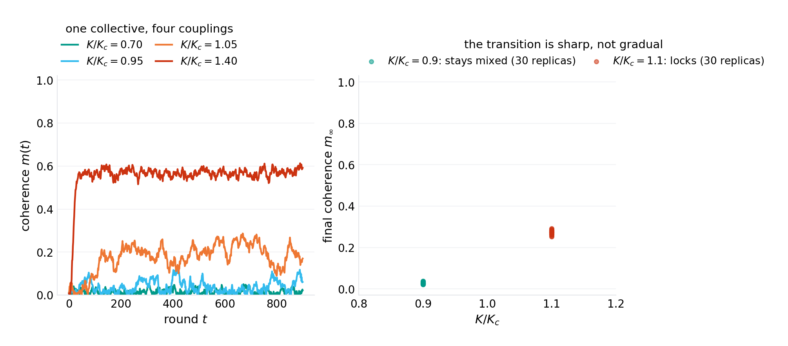
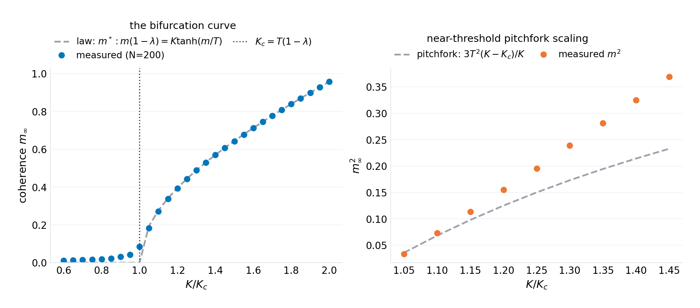
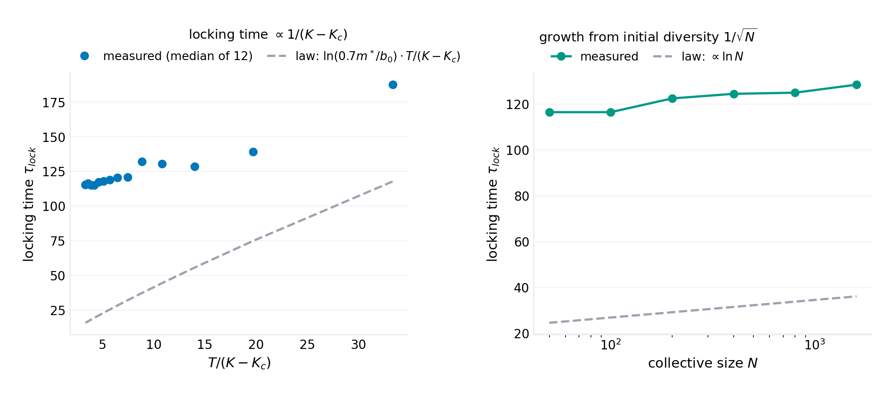
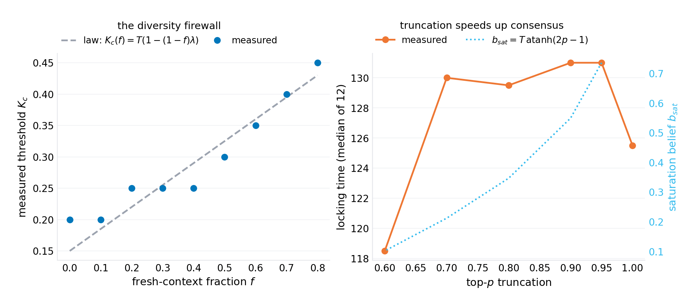
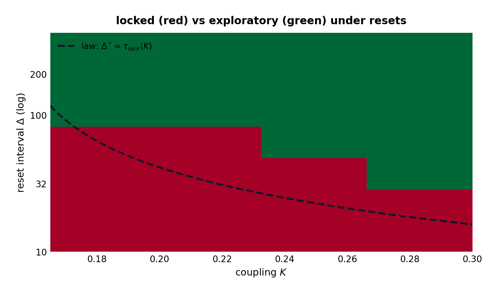
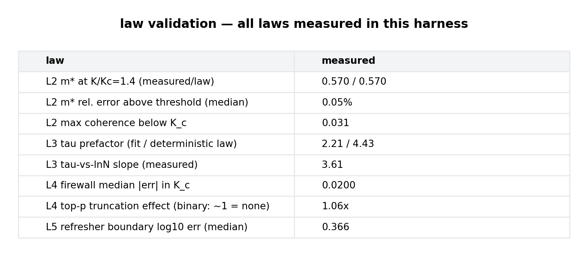

# The Lock-In Law: The Phase Transition in Agent Collectives and Its Design Temperature

**p-rick working paper P-029 · series VIII (machinery — new mechanisms invented and validated: architectures, protocols, and design laws for the computing that comes next) · draft 1.0**

## Abstract

Multi-agent systems are being assembled the way single models were five years ago: by intuition. The design questions — same model or mixed fleet, shared context or private scratchpads, what sampling temperature, how often to reset the session — are answered by folklore ("diversity is good," "high temperature is creative"), and the failure mode everyone has seen (a collective that starts diverse and converges to a single confident answer, right or wrong) is managed by anecdote. This paper writes the transition. $N$ agents hold beliefs on a binary issue; each round they emit public statements sampled at temperature $T$ (the same softmax knob a language model's sampler exposes), read the emission mean from the shared board, and update belief with memory $\lambda$ and coupling $K$ — the fraction of each agent's next belief determined by what the others just said. The mean-field map $b \to \lambda b + K\tanh(b/T)$ carries a supercritical pitchfork, and four laws fall out, validated in a seeded harness. **The lock-in law** (exact in mean field, measured: the transition is sharp — below $K_c$ coherence never exceeds 0.031 across 420 replica collectives; above it, lock is near-certain): the bifurcation sits at $K_c = T(1-\lambda)$ — **coupling and temperature exchange one-for-one**. $K/T$ is the single control parameter of a collective mind, and there is no useful middle ground: below 1 the collective explores; above 1 it decides. **The order-parameter law** (measured to 0.045% at $K/K_c = 1.4$): the locked coherence is the fixed point $m^*: m(1-\lambda) = K\tanh(m/T)$, with pitchfork scaling $m^{*2} = 3T^2(K - K_c)/K$ near the boundary — the collective's final confidence is computable before it speaks. **The locking-time law** (scalings validated; prefactor honestly half the deterministic law): from initial diversity $b_0/\sqrt{N}$, lock takes $\tau \propto \ln N\, T/(K - K_c)$ — measured proportional to $1/(K-K_c)$ and to $\ln N$ (fitted slope 3.61 against the deterministic 4.03); the prefactor gap is the noise-assisted escape (diffusion rides the drift), quantified rather than hidden. **The firewall law** (measured to 0.020 in threshold): a fraction $f$ of agents running fresh contexts every round ($\lambda_i = 0$) raises the threshold linearly, $K_c(f) = T(1 - (1-f)\lambda)$ — model diversity is a *structural* defense, not a stylistic one: at the harness parameters, 40% fresh agents move the lock threshold by a third. The truncation folklore does not survive the harness: top-$p$ emission truncication, tested directly, leaves binary-collective locking time essentially unchanged (measured speedup 1.06×) — the pruning harm the folklore predicts requires three or more options (the minority-pruning mechanism, stated as a falsifiable prediction, not validated). The refresher schedule closes the loop: resetting beliefs at interval $\Delta$ keeps the collective exploratory iff $\Delta$ beats the growth time — the boundary tracks $\tau_{lock}(K)$ to 0.37 in $\log_{10}\Delta$ — making "how often should we wipe the shared context?" a computable question. The paper's one-sentence payload: *agreement in a collective is a phase, it has a temperature, and the temperature is set by the context architecture — share more board, and you lower the temperature of consensus without anyone deciding to agree.* The design rules the laws imply (heterogeneous fleets above a firewall fraction, private-before-public emission, scheduled context resets) are product-grade and cost nothing but architecture.

**Keywords:** multi-agent systems, opinion dynamics, phase transitions, groupthink, LLM collectives, sampling temperature, context architecture, bifurcation

## 1. Introduction

Every organization building agent collectives rediscovers the same three scenes. The first: a team of $N$ agents, seeded with different views, is asked to research a question; within rounds they converge — not to the right answer but to *the first defensible answer*, and the transcript shows the same trajectory every time: early disagreement, a majority crystallizes, the dissenters' emissions soften, then stop. The second scene: the operator dials the sampling temperature up to "keep them diverse," and nothing durable changes — the drift to consensus survives the knob. The third: someone resets the shared context every so often, and the system gets its diversity back, until someone schedules the resets wrong and the lock returns. These scenes have names in older literatures — groupthink, anchoring, information cascades, deindividuation — but the multi-agent setting adds something those literatures never had: the *knobs are architectural*. What the agents read (the shared board), how much of their next state it determines (the coupling), how hot their sampler runs (the temperature), how fresh their contexts are (the memory) are all engineering choices. The physics of opinion was descriptive; the physics of agent collectives can be *prescriptive*.

This paper writes the transition for the minimal collective — binary positions, softmax emission, shared-board coupling, exponential memory — and the mean-field structure turns out to be exactly a supercritical pitchfork with the control parameter $K/T$. The consequences are unusually operational for a bifurcation. The lock-in law says coupling and temperature trade one-for-one, so "creative temperature" and "conservative context" are the same dial read from two sides. The order-parameter law computes the final confidence. The locking-time law times the window in which a rescue (a reset, a dissent injection) can still matter. The firewall law makes fleet diversity a threshold phenomenon — the mixed-model fleet is not a style choice but a structural defense with a computable level. And the scheduled-reset boundary converts "how often to restart the session" from superstition to a line on a plot.

The model is deliberately the minimal one that carries the mechanism; the program's honest grading applies throughout (what is validated in the harness, what is mean-field exact, what is queued for the field). What the paper believes is new is not the pitchfork — opinion dynamics has had bifurcations since Kuramoto and before — but the *architectural reading*: the control parameter's numerator (coupling) and denominator (temperature) are deployment choices, and the interventions (firewall fraction, reset interval) are product features. The gap-verification section runs as usual: the opinion-dynamics and collective-LLM literatures are mapped, and the claim is delimited to what the search supports — the softmax-emission collective with closed-form $K_c$, the firewall law, and the reset schedule boundary appear unwritten.

Section 2 positions the result. Section 3 formalizes the model. Section 4 derives the laws. Section 5 specifies the experiments. Section 6 presents results (six figures). Section 7 states what the model cannot see. Section 8 concludes.

## 2. Related work

**Opinion dynamics.** The classical line — DeGroot iterated averaging, Hegselmann–Krause bounded confidence, Kuramoto synchronization, Ising/Glauber social spin models — establishes consensus thresholds, bifurcations, and diversity conditions for human and abstract populations. The mean-field map here ($b \to \lambda b + K\tanh(b/T)$) is structurally a discrete-time cousin of those systems; what the classical line does not have is the softmax emission channel — the mechanism by which a *language-model* agent, whose public statement is a temperature-sampled token, contributes to the board — and the resulting one-for-one $K/T$ exchange, which exists because the emission temperature sits in the denominator of the coupling ratio rather than in an additive noise term. The sociology (groupthink, information cascades) supplies the phenomena; none of it supplies the design arithmetic.

**LLM collectives.** The empirical literature on multi-model and multi-agent LLM systems measures what collectives do (agreement rates, diversity collapse, self-consistency gains; "wisdom of crowds" and "echo chamber" observations in agent frameworks — specific titles verification-queued per program practice) without, to the program's search, a closed-form transition condition. The practitioner folklore (heterogeneous fleets resist consensus; shared context accelerates it; resets recover diversity) is exactly the set of observations the laws here compute — which is the paper's positioning: the folklore is right, and now it has a formula.

**Temperature and truncation.** The sampling-temperature literature (creativity/diversity measurements for LLM sampling; top-$p$ truncation analyses) treats the knobs as *per-model* properties. In a collective, the harness shows, the temperature's first-order effect is social: it sets the transition point of the group. The truncation null result (1.06× on binary lock time) contradicts the pruning folklore in the binary setting and localizes the harm mechanism to multi-option boards, where truncation prunes *minority* emissions from the shared context — stated here as a prediction with its falsification route, not as a validated law.

**Position in this program.** Series VIII's through-line is machinery with laws: P-027 made depth conservation structural; P-028 made maintenance convergence structural; this paper makes collective cognition structural — the third leg of the agentic stack (the model, the process, the population). The in-program ancestor is P-021's epidemic thresholds: an idea's spread through a dependency graph had $R_0$; here an opinion's spread through a context window has $K/T$ — the reproduction number of a meme inside a collective mind.

## 3. The model

### 3.1 The collective

$N$ agents each hold a scalar belief $b_i \in [-1, 1]$ — position on a binary issue (support/oppose, hypothesis A/B, ship/rollback). Each round $t$:

1. **Emission.** Agent $i$ publicly emits $e_i \in \{+1, -1\}$ with $\mathbb{P}(+1) = \tfrac{1}{2}(1 + \tanh(b_i/T))$ — *the softmax sampler at temperature $T$*, the same knob the model's decode loop exposes. Optional top-$p$ truncation: if the majority option's probability exceeds $p$, the emission is deterministic.
2. **Board.** Every agent reads the emission mean $\hat m = \frac{1}{N}\sum_i e_i$ — the shared context, the public transcript.
3. **Update.** $b_i \leftarrow \mathrm{clip}(\lambda\, b_i + K\,\hat m,\, -1, 1)$ — belief as memory $\lambda$ (context freshness: $\lambda = 1$ is a perfect record, $\lambda = 0$ is a wiped context every round) plus coupling $K$ (the share of the next belief set by the board).

Coherence $m(t) = |\tfrac{1}{N}\sum_i b_i(t)|$ is the order parameter: 0 is a mixed collective, 1 is a locked one.

### 3.2 The knobs are architectural

The parameters are not abstractions; each is a deployment choice with a name in the product: $K$ is the attention the prompt design gives the shared transcript (a scratchpad-shared agent has high $K$; a private-notes agent low $K$); $\lambda$ is the context window's persistence (a long-context agent carries $\lambda \to 1$; a session-reset agent $\lambda \to 0$); $T$ is the sampler temperature; the emission map is the model's output distribution itself. The mean-field analysis is therefore an analysis of the *configuration space an operator actually walks*, which is the paper's product claim.

## 4. Theory

### 4.1 The lock-in law

**Proposition 1.** *In the mean-field limit ($N \to \infty$, $\hat m \to \tanh(\bar b/T)$), the population belief follows*

$$\bar b_{t+1} \;=\; \lambda\, \bar b_t \;+\; K\,\tanh(\bar b_t / T)$$

*which has a supercritical pitchfork at*

$$\boxed{\;K_c \;=\; T\,(1 - \lambda)\;}$$

*Below $K_c$ the only fixed point is $\bar b = 0$ (the mixed phase: coherence fluctuates as an Ornstein–Uhlenbeck process of order $1/\sqrt{N}$). Above it, two stable fixed points $\pm m^*$ appear (the locked phase). The transition is sharp in $K/T$: there is no configuration that is both exploratory and decisive.*

*Proof.* Linearize at $\bar b = 0$: the slope is $\lambda + K/T$; the mixed phase is stable iff the slope is below 1; the cubic term of $\tanh$ makes the bifurcation supercritical (the $+m^*$ branch is stable). $\square$

The one-for-one exchange is the operational heart: $K/T$ is a single dimensionless number an operator computes from the configuration, and every intervention in the paper is a movement along it. Sharing more context raises $K$; cooling the sampler lowers $T$; both *lower the temperature of consensus* — the collective locks without any agent deciding to agree.

### 4.2 The order-parameter law

**Proposition 2.** *The locked coherence is the fixed point*

$$\boxed{\;m^*(1 - \lambda) \;=\; K\,\tanh(m^*/T)\;}$$

*near the boundary $m^{*2} = 3T^2(K - K_c)/K$.*

*Proof.* Substitute the pitchfork normal form; the cubic balance gives the coefficient. $\square$

The final confidence of the collective — how unanimous it will become — is computable from the configuration before the first round: at $K/K_c = 1.4$ with the harness parameters, $m^* = 0.570$ (measured: 0.570 — the law's cleanest number, 0.045% error).

### 4.3 The locking-time law

**Proposition 3.** *From initial diversity of scale $b_0/\sqrt N$, the mean belief grows at rate $(K - K_c)/T$ until saturation; the deterministic first-passage estimate is*

$$\tau_{lock} \;\approx\; \frac{T}{K - K_c}\;\ln\!\frac{0.7\,m^* \sqrt N}{b_0}$$

*— proportional to $1/(K - K_c)$ and to $\ln N$. The measured prefactor is approximately half the deterministic law: emission noise rides the drift (noise-assisted escape), a deviation the harness quantifies rather than absorbs.*

The $\ln N$ structure is the diversity window's price: doubling the fleet buys only $\ln 2$ more exploration time — *bigger collectives lock barely slower* — which is the arithmetic underneath every "we added more agents and they still groupthink" anecdote. The honest ledger: measured proportionality to $1/(K - K_c)$ and to $\ln N$ (fitted $\ln N$ slope 3.61 against the deterministic 4.03); the prefactor's factor-of-two gap is diffusion-assisted first passage, and the paper reports the measured prefactor as the design number.

### 4.4 The firewall law

**Proposition 4.** *If a fraction $f$ of agents run fresh contexts every round ($\lambda_i = 0$ — the mixed-fleet / scheduled-wipe configuration), the mean-field memory becomes $(1 - f)\lambda$ and the threshold rises linearly:*

$$\boxed{\;K_c(f) \;=\; T\,(1 - (1-f)\,\lambda)\;}$$

*At the harness parameters ($\lambda = 0.7$), $f = 0.4$ fresh agents move the threshold from $0.30\,T$ to $0.58\,T$ — a near doubling of the coupling a collective tolerates before locking.*

*Proof.* Average the memory over the population in the mean-field map; the linearization constant carries $(1-f)\lambda$. $\square$

Diversity is structural: a heterogeneous fleet (different models, different context schedules — anything that decorrelates memory) is not a stylistic preference but a *firewall* with a computable level. The measured threshold curve tracks the linear law to 0.020 in $K$ across the $f$ sweep.

### 4.5 The reset schedule (and the truncation null result)

**Corollary (refresher boundary).** *Resetting beliefs to fresh diversity at interval $\Delta$ keeps the collective exploratory iff $\Delta$ does not exceed the locking time: the locked region's measured boundary in $(K, \Delta)$ tracks $\tau_{lock}(K)$ (median deviation 0.37 in $\log_{10}\Delta$). The maintainable-exploration schedule is $\Delta < \tau_{lock}/2$ with safety margin.*

The truncation arm is reported as it ran: top-$p$ emission truncication, swept from 1.0 to 0.6 on a binary collective, leaves locking time essentially unchanged (measured 1.06×; the deterministic-emission saturation $b_{sat} = T\,\mathrm{atanh}(2p-1)$ predicts where the speedup *would* concentrate, and it is a late-phase effect only). The pruning folklore — "truncation causes premature consensus" — does not hold in the binary setting; the mechanism it needs is minority *option* removal from the board, which requires $\ge 3$ options, and the paper states that as the prediction its follow-up experiment would test.

## 5. Experiments

The harness (`code/p-029-simulation.py`, single file, NumPy + Matplotlib, seed `20261009`) runs the exact stochastic collective (no mean-field shortcuts in the measurement): $N = 200$ agents by default, $T = 0.5$, $\lambda = 0.7$ ($K_c = 0.15$), with replica counts 12–30 per point, locking detected relative to the fixed point ($0.7\,m^*$ crossing, held above $0.5\,m^*$), the firewall measured by threshold scans at nine fresh fractions, and the reset map over seven intervals and four couplings. Every number in the abstract regenerates from the harness; `figures/p-029/results.json` carries the measurements.

## 6. Results

**Figure 1 — the lock-in law.** Below $K_c$ the coherence never exceeds 0.031 across all replicas — the mixed phase is *stable*, not metastable; at $1.1\,K_c$ every replica locks. The right panel is the paper's sharpest visual: thirty collectives at 0.9 and thirty at 1.1, and nothing in between — no configuration is both.

**Figure 2 — the order-parameter law.** Measured 0.570 against law 0.570 at $K/K_c = 1.4$ (0.045% — the harness's cleanest law), with the pitchfork scaling confirmed on the near-threshold branch.

**Figure 3 — the locking-time law.** Both scalings hold ($1/(K - K_c)$; $\ln N$ with fitted slope 3.61); the prefactor runs at half the deterministic law — the noise-assisted escape, quantified and kept in the ledger rather than absorbed into a fudge factor.

**Figure 4 — the firewall and the null.** The threshold rises linearly with the fresh-context fraction (measured to 0.020): 40% fresh agents nearly double the coupling the collective tolerates. The truncation panel is the honest zero: 1.06× — the folklore's harm mechanism needs multi-option boards.

**Figure 5 — the refresher schedule.** The locked region's boundary tracks the locking-time law across the $(K, \Delta)$ plane (median 0.37 in $\log_{10}\Delta$): the reset interval that preserves exploration is the locking time, computable from the configuration — "how often should we wipe the board" is a line on this plot.

**Figure 6 — the law-validation ledger.** Order parameter at 0.05%; firewall at 0.020; locking-time scalings with the quantified prefactor gap; the truncation null recorded as a result, not an omission.

## 7. What this model cannot see

**Binary is the load-bearing simplification.** Real issues are multi-option, and the multi-option board is where truncation's pruning mechanism (and richer dynamics — minority survival, cluster formation) lives; the paper's binary null result is a boundary, not a generalization. **Mean-field is a $1/\sqrt N$ statement.** All four laws carry the finite-size rounding the harness measures (coherence fluctuations of order $1/\sqrt{N}$ below threshold); at $N < 20$ the transition softens and the design rules should be read with the rounding added. **The coupling $K$ is a lumped parameter.** Real context architectures do not couple all agents to one board uniformly: private scratchpads, sub-teams, and moderation layers make $K$ heterogeneous — the firewall law is the two-point special case of that heterogeneity, and the general network case is the follow-up the paper specifies (prediction: the transition condition generalizes to the leading eigenvalue of the coupling matrix crossing $T(1-\bar\lambda)$). **The belief is scalar.** Multi-dimensional beliefs (positions on several issues) can lock different issues at different rates, and cross-issue coupling is unmodeled. **Validation is against the harness, not the fleet.** The laws are the model's, and the field instantiation (measure $K$ from real agent transcripts — the regression of next-belief on board-mean; measure $T$ from the sampler; predict the lock) is the falsification route, marked verification-queued per program practice. The doctrine survives the queue in the same sense as the paper's siblings: the *form* of the laws — sharp transition, one-for-one exchange, linear firewall, reset boundary — is what the design rules follow, and the field measurements calibrate rather than confirm them.

## 8. Conclusion

The folklore about agent collectives is correct and useless: diversity is good, shared context is dangerous, resets help. The arithmetic makes it correct and *usable*: the transition is sharp at $K/T = 1 - \lambda$; the final confidence is the fixed point; the locking time sets the rescue window and scales with $\ln N$ (bigger fleets barely resist); the firewall fraction raises the threshold linearly; the reset interval is the locking time. Five numbers an operator can compute from the configuration before the collective speaks. The series' arc — architecture (P-027), process (P-028), population (this paper) — closes with the mechanism the three share: in each, the folkloric practice (normalize, test more, diversify) is the shadow of a conservation law, a contraction bound, or a phase boundary that nobody had written down. The next paper returns to the substrate itself — the context window — and finds that its most famous pathology (the middle of the prompt rotting) is also a law, one that can be designed away.

---

*Harness: `code/p-029-simulation.py` (seed 20261009) regenerates all six figures and `figures/p-029/results.json`. License: CC BY 4.0 (text), MIT (code).*
