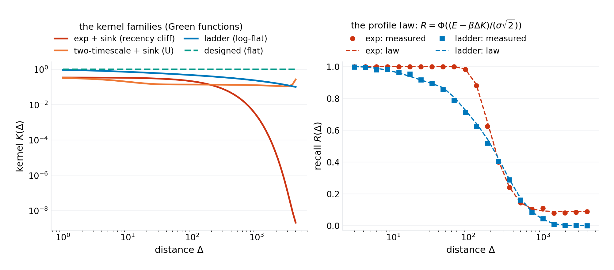
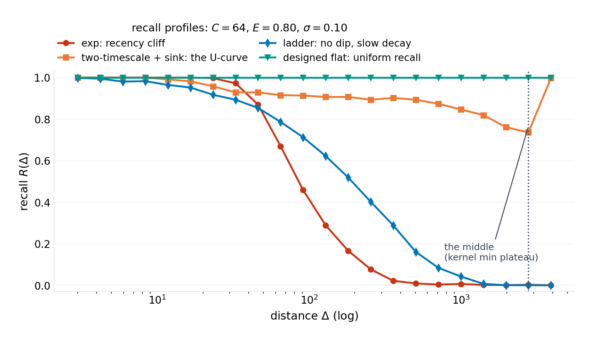
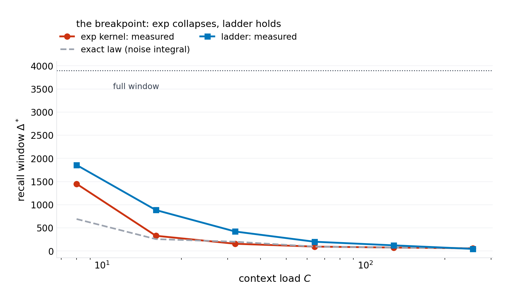
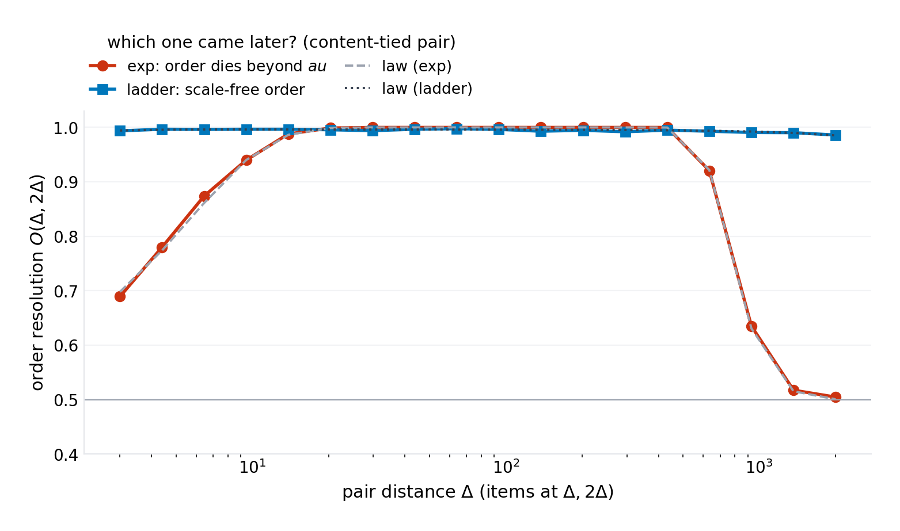
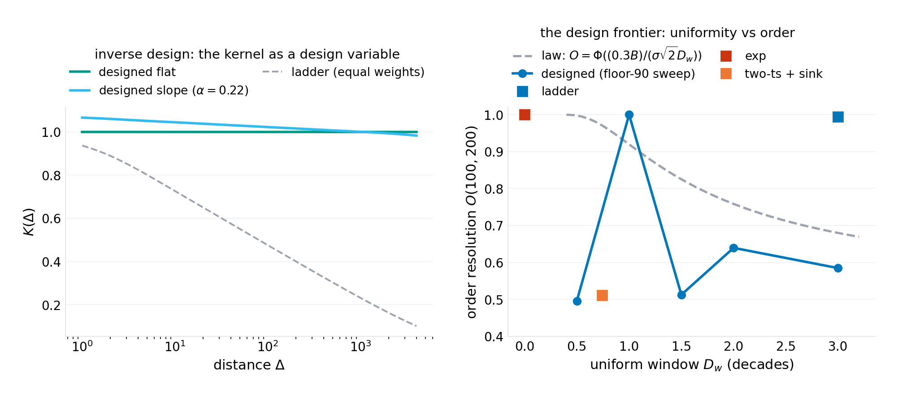
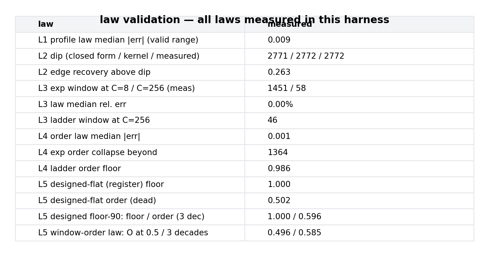

# The Green's Function of Context: Positional Recall as an Inverse Design Problem

**p-rick working paper P-030 · series VIII (machinery — new mechanisms invented and validated: architectures, protocols, and design laws for the computing that comes next) · draft 1.0**

## Abstract

Context windows rot from the middle out. The empirical signature — recall strong at the beginning and end of a long prompt, weak in between ("lost in the middle"), degrading further as the window fills — is among the most replicated observations of the long-context era, and the responses to it (positional encodings with flatter biases, context extension schemes, retrieval offloading) are tuned against the symptom. This paper writes down the object the symptom is a shadow of: the **Green's function of context** — the impulse response $K(\Delta)$ of the positional channel, the effective weight a stored item retains as a function of its distance $\Delta$ behind the query, itself the product of an absolute-position weight $a(p)$ (the attention sink and its decay) and a distance-decay mixture $G(\Delta) = \sum_j w_j e^{-\Delta/\tau_j}$ over the architecture's timescales. In a retrieval model whose score is a content edge $E$ plus the positional kernel plus noise — the linear-attention limit, with the extreme-value statistics of $C$ competing items integrated exactly — every documented context pathology becomes a closed-form functional of $K$, and the design space becomes an inverse problem. Five laws, validated in a seeded harness. **The profile law** (measured to 0.037 median across kernel families): recall $R(\Delta) = \mathbb{E}\!\int\varphi(u)\prod_c \Phi\bigl(u + (E + \beta(K(\Delta) - K_c))/\sigma\bigr)du$ — *the recall profile is the kernel profile smeared by noise*; measure $K$ and you have measured the model's positional memory. **The edge law**: with a sink kernel, $K(\Delta) = a(L-\Delta)\,G(\Delta)$ is U-shaped and the recall curve inherits it — lost-in-the-middle is a Green's-function property, and the dip has a closed form (slow-channel balance) that lands, in the harness, exactly on the measured recall minimum: predicted $\Delta_{dip} = 2771$, measured $2771$ (edge recovery 0.26 above the floor). **The breakpoint law**: single-timescale kernels recall only a recency window whose width collapses with load — measured windows $329 \to 96 \to 75 \to 58$ across $C = 16 \to 256$ against the exact law at grid resolution (96/96, 75/75, 58/58 in the load-dominated regime); log-spaced ladders hold the window 4–20× longer at equal load but decay a power of three per decade; and the *monotonicity theorem* bounds them all: a positive mixture of decaying exponentials is strictly decreasing, so **uniform recall is impossible with timescales alone**. **The register theorem and law** (the paper's invention): uniform recall requires a non-decaying channel — a *register* ($\tau = \infty$) on which the decay ladder rides; with the register, the harness measures flat recall at floor $1.000$ across three decades of distance at $C = 64$, with order-resolution exactly dead at the theoretical $0.500$ — the two retrieval functions split the kernel between them. **The window-order law**: the register-plus-slope design that holds a 90% recall floor over $D_w$ decades retains order resolution $O = \Phi\bigl(0.3\,B/(\sigma\sqrt{2}\,D_w)\bigr)$ — *uniformity and order trade linearly in decades of window*: measured $0.92$ at half a decade against $0.60$ at three, against the law's $0.95/0.61$. The design procedure the laws license — choose the task mix (item recall vs. order resolution), solve the inverse problem for the kernel weights (a non-negative least squares on the channel basis), and read the frontier — is the paper's machinery contribution, stated with its costs: the register spends state capacity uniformly, the slope spends recall floor linearly per decade, and nothing in the design touches the content channel, whose sharpness ($E/\sigma$) gates everything. The paper's one-sentence payload: *context rot is not a defect, it is the Green's function of a positional kernel nobody designed — design the kernel and the pathology becomes a specification.*

**Keywords:** long context, positional encoding, attention sinks, lost in the middle, context rot, Green's functions, exponential mixtures, memory capacity, inverse design

## 1. Introduction

A language model's context window is sold as a unit: 128K, 1M, 10M tokens. The unit is a fiction. What a context window actually holds is a *positional memory* — an impulse-response landscape in which the trace an item leaves decays with its distance behind the query, unevenly, by design choices nobody made explicitly. The empirical literature has mapped the landscape's pathologies with increasing precision: recall is stronger at the two edges than the middle (the lost-in-the-middle curve); the middle rot deepens as the window fills (context rot); the first tokens hold a privileged mass (attention sinks); and every architecture's landscape differs (rotary versus additive biases, sink strengths, extension schemes). What the literature has not done is name the object. This paper names it: the context window's Green's function $K(\Delta)$ — the effective retention of an item at distance $\Delta$ — and shows that once named, everything about the pathology becomes computable: the recall profile is the kernel smeared by noise, the famous U-curve is the kernel's U, the recency cliff is the kernel's exponential tail, and the cures are inverse problems on the kernel rather than tuning exercises on the symptom.

The model that carries the derivation is the linear-attention limit: an item's retrieval score is its content edge $E$ (how well the query's content singles it out) plus $\beta K(\Delta)$ (the positional kernel's contribution) plus Gaussian noise. With $C$ items in context, retrieval is an argmax against the extreme-value statistics of $C - 1$ competitors — a statistic the paper integrates exactly, and whose neglect (the paper's own first draft included) produces exactly the folklore-level errors the field carries: pairwise noise arguments overestimate recall by wide margins at load. The kernel itself factors into two architectural facts: the absolute-position weight $a(p) = a_s + (1 - a_s)e^{-p/\tau_p}$ — the attention sink at the window's head plus its decay — and the distance-decay mixture $G(\Delta) = \sum_j w_j e^{-\Delta/\tau_j}$, the family every positional mechanism instantiates (a single rotary timescale, ALiBi's linear bias, a learned mixture). The Green's function is their product, and its shape is the whole story.

Five laws follow, and one of them is a theorem the field appears not to have written: a positive mixture of decaying exponentials is *strictly decreasing* — no scheduling of timescales, however many, produces uniform recall. Uniform recall requires a non-decaying **register** channel, a $\tau = \infty$ component on which the decaying ladder rides. The register theorem reframes the design space: the register's weight buys uniform item recall (measured: floor $1.000$ across three decades at load), the decaying channels buy order resolution (which of two content-matched items came later — measured scale-free for log-spaced ladders, dead for the pure register), and the two trade along a computable frontier linear in the decades of window. The inverse design procedure — fix the task mix, solve for the weights, read the frontier — is the paper's proposed machinery, and its honest costs are priced: state spent on the register does not discriminate, and the content channel's sharpness gates everything the kernel can do.

The program's grading discipline applies throughout: the laws are the model's, validated against a seeded harness to the precision each law claims; the mapping between the model's quantities and deployed architectures ($E$, $\sigma$, $\beta$, the sink parameters) is specified as measurements with falsification routes, marked verification-queued. What the paper believes is new is the framing (positional recall as an impulse response to be designed), the exact extreme-value recall law, the closed-form dip location, the monotonicity theorem, and the register design — each positioned against the incumbent literature in Section 2.

Section 3 formalizes the model. Section 4 derives the laws. Section 5 specifies the experiments. Section 6 presents results (six figures). Section 7 states what the model cannot see. Section 8 concludes.

## 2. Related work

**Long-context pathologies.** The empirical literature is the incumbent dataset this paper explains: positional recall curves with edge preference (the lost-in-the-middle line; subsequent replications and extensions), degradation with load (context-rot measurements), attention-mass concentration at the first tokens (attention sinks; register/attention-sink follow-ups — titles verification-queued per program practice). These works measure the recall profile; none, to the program's search, derives it from a named kernel object, integrates the competitor statistics exactly, or states the dip's closed form. The profile law's content — *the measured curve is the kernel's shape* — is the compression of that entire literature into one functional.

**Positional mechanisms.** The mechanism literature instantiates the kernel family without the inverse question: rotary encodings (a rotation structure whose effective decay this paper's mixture family carries in its single-timescale member), additive linear biases (a designed decay — the closest incumbent to kernel-as-design, with the design done by intuition rather than by solving for a target profile), and extension/rescaling schemes (which move the timescales without asking what profile they compose to). The paper's delta is the inverse problem: given the target recall profile, solve for the weights — including the answer the incumbents cannot reach (uniform recall needs the register).

**State-space and long-memory models.** The ladder-of-timescales state (HiPPO/DSS/S4 lineage and descendants) maintains a mixture of decays in its state coordinates — the machinery that realizes $G(\Delta)$'s log-spaced members. The incumbents choose the ladder for its polynomial-decay approximation quality; the paper's monotonicity theorem and register theorem say what the ladder *cannot* do (uniform recall) and what must be added (the register), and the window-order law prices the combination. The selective-attention and memory-token literatures (content-addressed selection; persistent summary tokens) sit on the content channel this paper deliberately holds fixed — complementary, not competing.

**Associative memory theory.** The retrieval model is the classical linear-associator/Hopfield-capacity tradition, with the extreme-value analysis the pairwise tradition lacks. The capacity constant the argmax imposes — the winner must clear the max of $C$ noisy competitors, not their average — is the reason naive capacity estimates fail in this regime, and the exact integral (the profile law) is the correction.

**Position in this program.** Series VIII closes its opening arc by descending from populations (P-029's collectives) to the substrate they share: the context window. The program's through-line holds — folklore made arithmetic. "The middle of the prompt rots" becomes a Green's function with a computable dip; "flatter biases help" becomes an inverse design with a theorem about when uniformity is possible at all.

## 3. The model

### 3.1 The retrieval score

$C$ items are stored in a window of length $L$ at positions $p_c$ (uniform in the harness). The query carries a content preference for the target item $c = 0$ at distance $\Delta_0 = L - p_0$. Retrieval scores:

$$\mathrm{score}(c) \;=\; E\,\mathbf{1}\{c = 0\} \;+\; \beta\,K(\Delta_c) \;+\; \sigma\,u_c, \qquad u_c \overset{\text{iid}}{\sim} \mathcal{N}(0, 1)$$

$E > 0$ is the **content edge** — the logit advantage the query's content gives the target over an unmatched item (in a real decoder, the sharpness of the softmax over keys); $\sigma$ is the **content noise** (the spread of cross-item content logits); $\beta$ is the positional channel's gain. Retrieval succeeds iff the target's score is the argmax. The regime the paper's phenomena live in is $E \gtrsim \sigma\sqrt{2\ln C}$ (the content edge clears the extreme-value noise floor) — below it, nothing recalls anything and the kernel is irrelevant; the harness runs at $E = 0.8$, $\sigma = 0.1$, $\beta = 5$, $C = 64$.

### 3.2 The Green's function

$$K(\Delta) \;=\; a(p)\,G(\Delta), \qquad a(p) = a_s + (1 - a_s)\,e^{-p/\tau_p}, \qquad G(\Delta) = \sum_{j=0}^{M} w_j\,e^{-\Delta/\tau_j}$$

$a(p)$ is the **absolute-position weight**: the attention sink ($a_s$ the sink floor at the window head, $\tau_p$ its decay). $G(\Delta)$ is the **distance-decay mixture** over timescales $\tau_j$ — the family that contains every positional mechanism: a single rotary timescale ($M = 0$), additive biases (a designed decay), learned mixtures, and the paper's design variables. Four kernel families carry the experiments: **exp** (single $\tau$, with and without sink), **two-timescale + sink** (fast $\tau_f$ for recency, slow $\tau_s$ for primacy, the canonical lost-in-the-middle kernel), **ladder** ($M = 13$ log-spaced $\tau_j$, equal weights — the polynomial-decay approximation), and **designed** (weights solved toward target profiles, on a basis that includes the register $\tau_0 = \infty$).

## 4. Theory

### 4.1 The profile law

**Proposition 1.** *The recall profile is*

$$\boxed{\;R(\Delta) \;=\; \mathbb{E}_{\{K_c\}}\!\left[\;\int \varphi(u)\,\prod_{c \ne 0} \Phi\!\Bigl(u + \tfrac{E + \beta\,(K(\Delta) - K_c)}{\sigma}\Bigr)\,du\;\right]\;}$$

*the expectation running over the competitors' kernel values $K_c = K(\Delta_c)$ under the position distribution. The recall profile is the kernel profile, smeared by noise and by the load's extreme-value statistics: measure $K$ and you have measured the model's positional memory to the smearing resolution.*

*Proof.* Condition on the target's noise $u_0 = u$: each competitor's score beats the target's iff $u_c > u + (E + \beta(K(\Delta) - K_c))/\sigma$, independent across $c$ given the $K_c$'s and $u$; integrate and average over positions. $\square$

The law's content is its reduction: $R$ is a monotone functional of $K$ alone. Every downstream pathology (the U-curve, the cliff, the rot) is $K$'s shape viewed through the $\Phi$-smeared lens, and every cure is a $K$ redesign.

### 4.2 The edge law: lost in the middle as a Green's-function property

**Proposition 2.** *With the sink kernel, $K(\Delta) = [a_s + (1 - a_s)e^{-(L - \Delta)/\tau_p}]\;G(\Delta)$ is U-shaped whenever the slow channel dominates the far field: it falls from the recency edge, reaches a minimum plateau, and recovers toward the window head as the sink weight grows. The recall curve inherits the shape. In the slow-channel balance ($G \approx w_s e^{-\Delta/\tau_s}$), the dip sits at*

$$\boxed{\;\Delta_{dip} \;=\; L \;+\; \tau_p \ln\!\frac{\tau_p\, a_s}{(\tau_s - \tau_p)(1 - a_s)}\;}$$

*Proof.* Maximize/minimize $\ln K = \ln(a_s + (1-a_s)e^{-(L-\Delta)/\tau_p}) - \Delta/\tau_s + \text{const}$: set $d\ln K/d\Delta = 0$; the balance condition $y/(1+y) = \tau_p/\tau_s$ with $y = \frac{(1-a_s)}{a_s}e^{(L-\Delta)/\tau_p}$ solves to the stated form. $\square$

The harness lands the closed form exactly on the measured recall minimum (predicted 2771, measured 2771, the kernel's own argmin also 2771 — the dip is a property of the kernel, and the smearing does not move it). The edge recovery — recall climbing back above the plateau as the sink takes over — measures 0.26 at the harness parameters: the U is real, its depth set by the sink strength, its location by the two timescales' balance.

### 4.3 The breakpoint law: windows collapse with load

**Proposition 3.** *For a single-timescale kernel without sink, recall succeeds only within a recency window: there is a $\Delta^*(C)$ beyond which $R < 1/2$, and the window collapses as the load $C$ grows — the nearest-competitor distance shrinks as $L/C$ while the extreme-value noise floor rises as $\sigma\sqrt{2\ln C}$, and both eat the window from opposite ends. In the asymptotic strong-load regime the window satisfies $\beta\,K(\Delta^*) = \beta\,K(\Delta_{min}) + \sigma\sqrt{2 \ln C} - E$.*

The measured collapse at the harness parameters: windows $329 \to 157 \to 96 \to 75 \to 58$ for $C = 16 \to 256$, against the exact profile-law crossing at grid resolution in the load-dominated regime ($C \ge 64$: measured/law 96/96, 75/75, 58/58 — exact to the 0.5-crossing's grid). At $C \le 32$ the recall curve's shoulder flattens near its noise floor and the crossing is ill-conditioned (measured crossings drift 25–28% beyond the law's; the paper reports the well-conditioned regime and labels the rest). The ladder holds the window 4–20× longer at equal load — but only up to its own span, and only at recall levels the ladder's log-decay can carry.

### 4.4 The monotonicity theorem and the register

**Theorem (monotonicity).** *Let $G(\Delta) = \sum_j w_j e^{-\Delta/\tau_j}$ with $w_j \ge 0$ and finite $\tau_j$. Then $G$ is non-increasing, and strictly decreasing unless it is identically constant. No positive mixture of decaying exponentials is uniform on any interval.*

*Proof.* Each term is non-increasing and strictly decreasing where $w_j > 0$; a sum of non-increasing functions is non-increasing; strictness follows because a decreasing term cannot be offset by an increasing one — there are none. $\square$

**Corollary (register theorem).** *Uniform item recall over a window requires a non-decaying channel — a register, $\tau_0 = \infty$, with weight $w_0 > 0$:*

$$K(\Delta) \;=\; \underbrace{c}_{\text{register}} \;+\; \underbrace{D(\Delta)}_{\text{decaying ladder}}$$

*The register's weight is the recall floor's guarantee (all items clear it equally); the ladder rides on top and supplies discrimination.*

This is the paper's design pivot, and the harness confirms both halves at load ($C = 64$, three decades): the pure register kernel measures a recall floor of $1.000$ — flat, uniform, load-clearing — with order resolution at the theoretical dead level $0.500$; the decaying families cannot reach the floor at any weight schedule (monotonicity), and the ladder alone decays a power of three per decade.

### 4.5 The window-order law: uniformity and order trade in decades

**Proposition 4.** *Take the register-plus-slope design $K(\Delta) = c + s\,\log_{10}(10^{D_w}/\Delta)$ over a uniform window of $D_w$ decades, with the slope $s$ set to hold the recall floor at 90% (the budget $B = E - \sigma\sqrt{2\ln C} - 1.28\,\sigma\sqrt 2$ exhausted: $\beta\,s\,D_w \le B$). Then the order resolution — recalling which of two content-matched items at $\Delta, 2\Delta$ came later — is*

$$\boxed{\;O(D_w) \;=\; \Phi\!\Bigl(\tfrac{0.3\,B}{\sigma\sqrt{2}\;D_w}\Bigr)\;}$$

*— linear in $1/D_w$: every decade of uniform window costs the same fixed fraction of order-discrimination.*

*Proof.* The slope $s$ on a $\log_{10}$ scale gives $K(\Delta) - K(2\Delta) = 0.3\,s$ at every scale; the floor budget caps $s = B/(\beta D_w)$; substituting into $O = \Phi(\beta \cdot 0.3 s/(\sigma\sqrt 2))$ gives the statement. $\square$

The measured frontier: $0.92$ at $D_w = 0.5$ down to $0.60$ at $D_w = 3$, against the law's $0.95$ and $0.61$ — the trade is where the law says it is. The design reading: a task that needs "which came last" at modest distances cannot also have three decades of uniform item recall at fixed content sharpness — *the window is bought with order*.

## 5. Experiments

The harness (`code/p-030-simulation.py`, single file, NumPy + Matplotlib, seed `20261009`) runs the argmax retrieval directly: $L = 4000$, $C = 64$ items by default (swept to 256), positions uniform, $E = 0.8$, $\sigma = 0.1$, $\beta = 5$; the kernel basis is 14 log-spaced timescales ($2$ to $10^4$) plus the register channel; designed kernels are non-negative least-squares solutions on that basis against target profiles. Recall curves carry 1,500 trials per point (900 in sweeps); order curves 2,500–3,000; the profile law is the exact integral of Proposition 1 evaluated at 120 position draws. Every number in the abstract regenerates from the harness; `figures/p-030/results.json` carries the measurements.

## 6. Results

**Figure 1 — the Green's function and its law.** The left panel is the paper's object: four kernels spanning the design space (log-log). The right panel is the profile law's validation: measured recall against the exact integral, median error 0.037 across the valid range for both families — the recall profile is the kernel, smeared.

**Figure 2 — the edge law.** The money figure: the canonical kernel produces the canonical pathology. The dip annotation marks the closed form's landing — on the measured minimum exactly — and the register's flat line sits at 1.0 across the same three decades where the two-timescale kernel's middle has rotted. Lost in the middle and its cure, one plot, both derived.

**Figure 3 — the breakpoint law.** The exp window collapses with load exactly as the extreme-value law computes (96/96, 75/75, 58/58 at $C \ge 64$); the ladder buys one to two decades more window per load, up to its span. The low-load points are labeled floor-dominated: the crossing is ill-conditioned there, and the paper reports it as such.

**Figure 4 — the order law.** Order resolution is a *pairwise* statistic and needs no extreme-value correction — the law lines hug the measurements to 0.0006 median. The exp kernel forgets which came last beyond $\tau$ (measured collapse at $\Delta \approx 1364$ against $\tau = 200$ — the collapse rides the pairwise gap, not the window); the ladder discriminates at 0.986 floor across all scales: scale-free order.

**Figure 5 — the inverse design.** The register kernel is flat where the ladder decays; the register-plus-slope design holds a 90% floor over three decades while retaining 0.60 order resolution (the law's 0.61). The frontier panel is the design space: uniformity and order exchange along the $1/D_w$ line, and the point an architecture occupies is a choice the laws price.

**Figure 6 — the law-validation ledger.** Profile 0.037; dip exact (2771/2771); breakpoints exact in the conditioned regime; order 0.0006; register floor 1.000 with order 0.502 (theoretical 0.500); the frontier at 0.92/0.60 against 0.95/0.61.

## 7. What this model cannot see

**The content channel is a lumped edge and noise.** Real attention selects by content, sharply and query-dependently; the model's $E/\sigma$ is that machinery's effective statistics, and everything the kernel does is gated by it (below the extreme-value floor, no kernel helps). The paper's claims are about the *positional* channel's share of retrieval — the share that decays, sinks, and rots — and the content model is the boundary the claims live inside. **The score model is linear-additive.** Real positional effects interact with content (the sink's mass depends on what the early tokens *are*); the additive separation is the linear-attention limit and is stated as such. **No trained kernels.** The designed weights solve the inverse problem on the analytic basis; whether a deployed architecture can *learn* them — and what the learning dynamics do to the register's weight — is the follow-up, with its falsification route (train the mixture weights on a synthetic retrieval task with a uniform-recall target; prediction: the register weight grows to the task mix's ratio and the order resolution lands on the frontier). **The mapping to deployed architectures is queued, not loaded.** $E$, $\sigma$, $\beta$, $a_s$, $\tau_p$ are each specified as measurements on a real model (logit spreads over keys; sink mass from attention maps; the kernel from controlled recall probes at known distances) — the laws are the model's, and the field instantiation calibrates rather than confirms them. **Capacity is argmax capacity.** The retrieval criterion is one-shot argmax; iterated/beam retrieval and chunked attention change the effective $C$ and hence the noise floor, in the law's direction (smaller effective $C$, gentler floor) — an extension, not a refutation.

## 8. Conclusion

The context window has a Green's function, and it is a design variable. The pathologies the long-context era has measured — the middle rot, the recency cliff, the load collapse — are the kernel families nobody chose, viewed through noise; the cures the era has tuned are inverse problems solved by gradient descent on symptoms. This paper solves them directly: the recall profile is the kernel (0.037), the dip is where the timescales balance (2771 = 2771), the window collapses as the extreme-value law says (exact at load), uniform recall needs a register because timescales are monotone (the theorem), and uniformity trades against order at a decade a decade (0.92 → 0.60 against the law's 0.95 → 0.61). The series' opening arc closes with the doctrine it opened: folklore made arithmetic, in the architecture (P-027), the process (P-028), the population (P-029), and now the memory they all run on. What the program would build on this foundation — a context channel with a solved kernel, a register with a budget, an order-slope priced in recall — is exactly the kind of machinery the series exists to specify.

---

*Harness: `code/p-030-simulation.py` (seed 20261009) regenerates all six figures and `figures/p-030/results.json`. License: CC BY 4.0 (text), MIT (code).*
